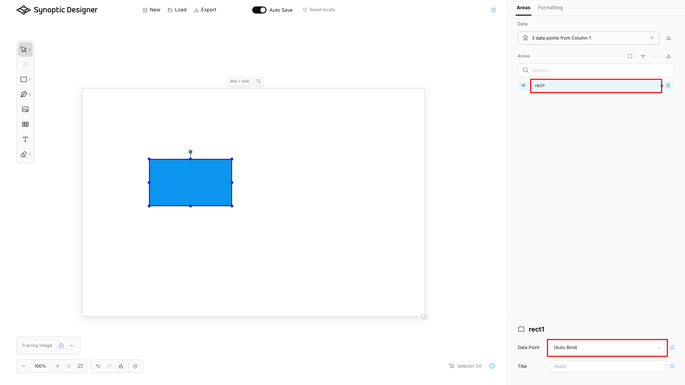

The ***Areas*** tab connects SVG structure to Synoptic Panel behavior and data binding. It shows editable map areas, optional imported data points, and the selected area's type and binding metadata.

<video src="images/areas-data-binding.mp4" autoplay loop muted></video>

## Areas Tree

The ***Areas*** section shows the current SVG hierarchy. Shapes, compatible groups, and generated Grid cells appear as map area candidates.

The tree supports:

- canvas-to-tree and tree-to-canvas selection sync;
- hierarchy expand and collapse;
- search by area name, ID, title, and associated datapoint;
- selected-only filtering;
- strong-binding filtering;
- ***Link*** and ***Decoration*** type indicators;
- rename;
- visibility;
- lock;
- drag and drop for ordering and compatible grouping;
- context menu commands shared with canvas right-click commands.

Dragging rows changes the real SVG DOM order, so it can affect what appears in front of or behind other elements on the canvas.

## Area IDs

Area IDs are important because Synoptic Panel can automatically bind an area when the area ID matches a value in the ***Categories*** field well.

Synoptic Designer keeps IDs visible and editable in the ***Areas*** tree. It also normalizes generated SVGCanvas IDs into user-facing IDs such as `path1`, `rect1`, or similar generated names before export.

Spaces entered in area IDs are stored as `_x20_` for Synoptic Panel compatibility and shown as spaces in the editor. IDs that start with a number are stored with a hidden leading underscore and shown without that underscore.

## Data Import

The ***Data*** section lets you import a local datapoint list for binding assistance. Supported files are CSV, JSON, and XLSX.

For tabular files, Synoptic Designer asks which column should be used as the datapoint list. For XLSX workbooks, it uses visible non-empty worksheets and asks for a worksheet when more than one usable worksheet exists.

Imported data is optional. It helps Synoptic Designer show which area IDs currently match data points, but it is not a live Power BI dataset connection.

You can replace, remove, or download the current imported data list. Removing the list does not delete existing explicit area mappings.

## Area Types

The selected-area details include a type selector next to the area name. It controls how Synoptic Panel treats the element and offers three choices: ***Area***, ***Link***, and ***Decoration***.

### Area

***Area*** is the default type. It displays the ***Data Point*** and ***Title*** controls and allows the element to participate in data binding, formatting, labels, and interactions in Synoptic Panel.

### Link

***Link*** replaces the binding controls with a ***URL*** field. Enter the external URL that Synoptic Panel should open when a report user clicks the element. Synoptic Designer stores and exports the URL with the JSVG map.

> **NOTE:** Use an HTTP or HTTPS URL. Synoptic Designer rejects other explicit URL schemes before saving or exporting the link and never navigates to it from the editor.

When ***Link*** is applied to a group, its child elements inherit the link behavior. The ***Areas*** tree shows a link icon for both direct and inherited links instead of a binding-status indicator.

### Decoration

***Decoration*** is for an SVG element that should remain purely visual. Synoptic Panel excludes it from data binding and visual formatting and always renders it with its original SVG appearance.

When ***Decoration*** is applied to a group, all child elements inherit the decoration behavior. An inherited decoration cannot be overridden from the child while the parent remains a decoration. ***Decoration*** takes priority when it is nested inside a ***Link*** group.

The ***Areas*** tree shows a decoration icon instead of a binding-status indicator. See [Decoration in Synoptic Panel](../visuals/synoptic-panel/features/map-editor/edit-map.md#decoration) for the corresponding visual behavior.

Synoptic Designer retains inactive binding, title, and link URL metadata when you switch types. If you switch the element back to a previous type, its earlier values are restored.

## Binding States

The binding controls below apply only to elements whose type is ***Area***. The selected-area details show a ***Data Point*** dropdown with these choices:

- ***(Auto Bind)*** keeps the default Synoptic Panel behavior, where the area ID is matched to data values.
- ***(Do Not Bind)*** marks the area as intentionally unbound.
- an imported datapoint value creates an explicit binding.

The ***Areas*** tree shows binding indicators derived from the current area metadata and imported datapoint list. ***Link*** and ***Decoration*** elements use their type icons instead and are excluded from the strong-binding filter.

|State|Meaning|
|---|---|
|Auto Bind|The area relies on ID-based matching.|
|Auto Bind match|The current area ID matches an imported datapoint according to Synoptic Panel matching rules.|
|Explicit binding|The area is manually bound to a specific datapoint.|
|Do Not Bind|The area is intentionally excluded from binding.|
|Inherited state|A child area inherits binding behavior from a matched or unbound group.|

Automatic matching follows Synoptic Panel rules such as case-insensitive comparison, trimming, hidden numeric-prefix underscores, and decoding escaped characters such as `_x20_`.

## Area Titles

The ***Title*** field stores optional display metadata for the selected area. Synoptic Panel can use this title when label options are configured to display area titles.

The title is saved with the project and exported in the JSVG mapping metadata.

## Groups and Binding

SVG groups can act as areas. When an ***Area*** group matches a datapoint or is marked unbound, child areas can inherit that state unless they have stronger explicit metadata.

***Link*** and ***Decoration*** groups also pass their behavior to child elements. ***Decoration*** has priority over ***Link*** when both behaviors occur in the same inherited path.

Use groups carefully when your Power BI data has hierarchy. The SVG hierarchy can affect how Synoptic Panel interprets automatic binding.
