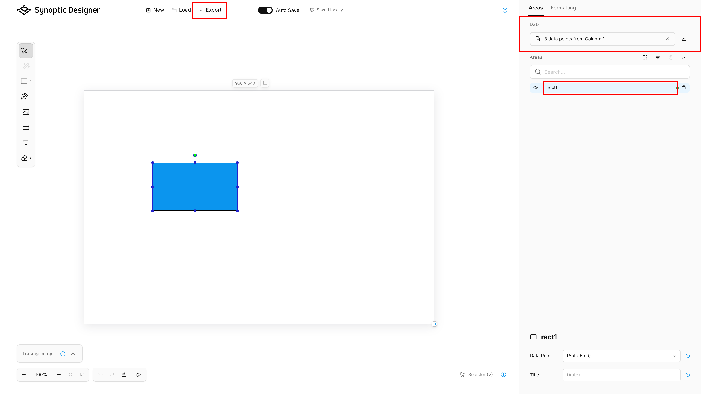

These practices help produce maps that remain easy to maintain in Synoptic Designer and reliable in Synoptic Panel.

## Name Areas Deliberately

Use area IDs that match the values in the Power BI ***Categories*** field whenever possible. This keeps the map usable with automatic binding and reduces manual mapping work.

Avoid duplicate IDs. Synoptic Designer blocks or resolves duplicates where it can, but a clear naming strategy is easier to maintain.

## Keep Data Binding Reviewable

Use ***(Auto Bind)*** when the area ID should match a category value. Use explicit datapoint binding only when the SVG ID cannot or should not match the category value. Use ***(Do Not Bind)*** for decorative or static areas that should not react to data.

Import a datapoint list before final review so Synoptic Designer can show auto-bind matches and inherited binding states.

## Use Groups for Real Structure

Groups are part of the SVG hierarchy and can affect both rendering order and binding inheritance. Use groups when objects should behave together or when your map needs hierarchy.

Do not group unrelated decorative content with bindable map areas unless you want the group to affect selection, ordering, or binding behavior.

## Prefer Simple Editable Geometry

Synoptic Designer is optimized for practical map authoring. Simple paths, shapes, and groups are easier to bind, format, split, trace, and maintain.

After using Magic Wand or Freehand, review the generated points. Simplify or edit dense geometry when it makes selection or formatting harder.

## Treat Imported Files as Untrusted

Synoptic Designer sanitizes SVG and validates supported local files before loading them. Even so, use trusted sources when possible and review imported maps before export.

Avoid relying on unsupported SVG features such as scripts, event handlers, foreign objects, or remote active content. These can be stripped or rejected for security and compatibility.

## Export Portable Work

Use browser-local save for continuing work in the same browser. Use JSVG export for portable files, sharing, backup, or import into Synoptic Panel.

Before exporting, check:

- all intended areas have stable IDs;
- imported datapoints show expected matches;
- explicit bindings are intentional;
- decorative areas are marked ***Do Not Bind*** when needed;
- the tracing image is still needed in the exported file;
- the map name, author, and attribution are correct.
