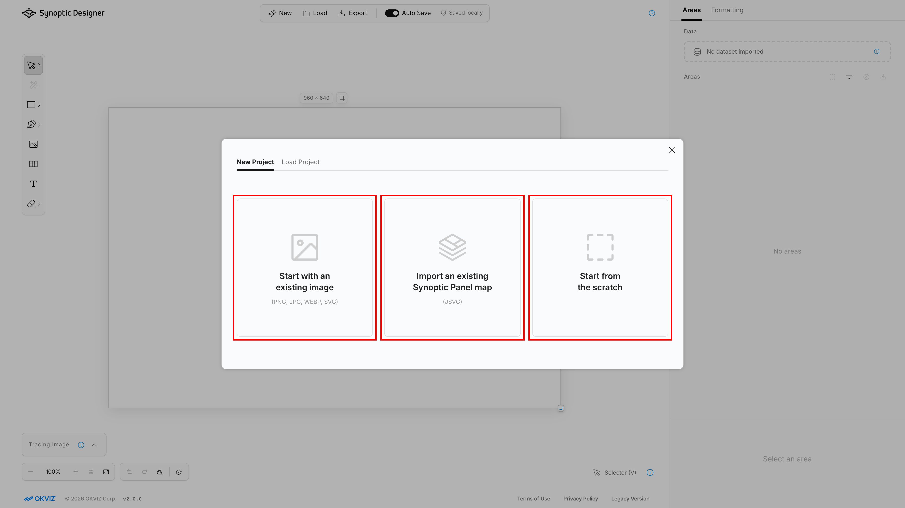
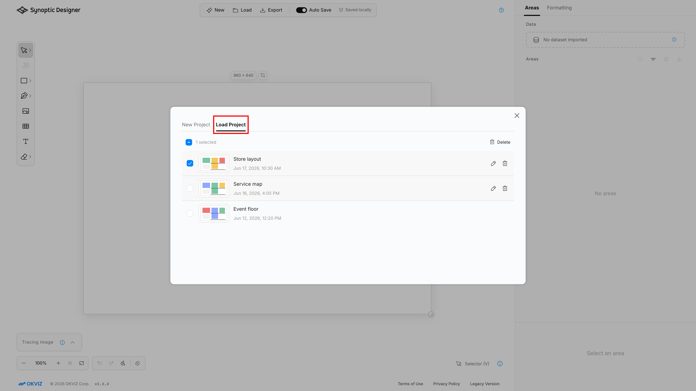

Synoptic Designer starts from the ***Synoptic Designer*** welcome dialog. Use ***Start*** to open the project options.

If ***Don't show again*** is selected, Synoptic Designer opens the project options directly the next time. You can reopen the welcome dialog from the header resources menu with ***Show Welcome***.

After the welcome dialog, the project dialog has two tabs: ***New Project*** and ***Load Project***.

## New Project

Use ***New Project*** to create a new editing session from one of these sources.

|Source|Use it when|Result|
|---|---|---|
|Image or SVG|You have a bitmap tracing image or an existing SVG map.|Bitmap files become tracing images. SVG files become editable vector content.|
|JSVG|You have a map exported from Synoptic Panel or Synoptic Designer.|SVG content and mapping metadata are loaded together.|
|Start from the scratch|You want to draw the map directly in Synoptic Designer.|A blank SVG document opens.|

Supported bitmap inputs are PNG, JPEG, and WebP. Supported vector inputs are SVG files. JSVG input can use the `.jsvg` or `.json` extension.

## Starting from a Bitmap

When you start from a bitmap, Synoptic Designer creates an SVG document and places the bitmap as a tracing reference. The bitmap does not become a bindable foreground object.

Use this workflow when you have a floor plan, diagram, layout, or image that you want to trace into interactive vector areas.

After loading the bitmap:

- the artboard is sized from the image;
- the tracing image is visible on the canvas;
- the ***Tracing Image*** panel is expanded;
- the ***Magic Wand*** tool can create editable areas from enclosed regions.

## Starting from an SVG

When you start from an SVG, Synoptic Designer sanitizes the markup before loading it into the editor. Scripts, event handlers, hostile URLs, and unsupported active content are removed or rejected before the document is edited.

If the SVG is loaded as the initial document, its supported shapes become editable canvas content. If an SVG is inserted later into a non-empty document, supported child areas are exposed immediately and source IDs are kept unique with sequential suffixes when needed.

## Starting from a JSVG File

Use a JSVG file when you need to keep Synoptic Panel mapping metadata. Synoptic Designer imports the SVG content and reads supported mapping information from the file.

This is the preferred workflow when you need to update a map that already has manual bindings, unbound areas, or area titles.

## Load Project

Use ***Load Project*** to reopen browser-local projects saved by Synoptic Designer on the same browser profile.

The local project list can show previews, rename saved projects, delete one project, or delete multiple selected projects.

Browser-local projects are subject to the save modes and browser storage limits described in [Save and Export](save-export.md#browser-local-save).

> **NOTE:** Loading a browser-local project does not contact Synoptic Panel or Power BI. It only reads data stored by the browser.
