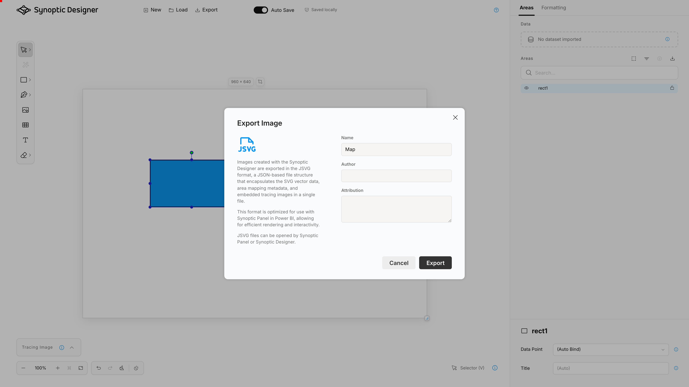

Synoptic Designer has two different persistence concepts: browser-local save and file export.

<video src="images/save-export.mp4" autoplay loop muted></video>

## Browser-Local Save

Browser-local save stores the current project in the browser profile by using IndexedDB. It is designed for continuing work later on the same device, browser, and profile.

When ***Auto Save*** is enabled, Synoptic Designer saves changes locally and shows the current save state. When ***Auto Save*** is disabled, use ***Save*** in the header to save manually.

### Save Modes

***Auto Save*** is enabled by default. After a project changes, Synoptic Designer waits briefly, saves a browser-local snapshot, and updates the header status to ***Saving***, ***Saved locally***, ***Unsaved***, or ***Save failed***.

When ***Auto Save*** is disabled, Synoptic Designer does not save each change automatically. The ***Save*** button appears in the header and saves the current project snapshot on demand.

Browser-local save is separate from export. A saved browser-local project is only available from the ***Load Project*** tab in the same browser profile. Use ***Export*** when you need a portable JSVG file for backup, sharing, or import into Synoptic Panel.

### Browser Storage Limits

Synoptic Designer does not set a fixed number of saved projects or a fixed total storage size. The effective limit depends on the browser, available disk space, site storage quota, private browsing mode, and organization policies.

Large SVG content, embedded images, and tracing images increase the project size. If the browser storage quota is reached, IndexedDB is unavailable, or site storage is blocked, the browser-local save can fail and the header shows ***Save failed***.

Saved project names are required, must be unique in the local project list, and can contain up to 120 characters. Empty projects are not kept as saved projects.

Browser-local projects can preserve:

- SVG content;
- mapping metadata;
- ***Area***, ***Link***, and ***Decoration*** types;
- external URLs assigned to ***Link*** elements;
- area titles;
- tracing image metadata;
- formatting;
- saved viewport zoom.

> **NOTE:** Browser-local save is not a backup. Clear browser storage, private browsing modes, profile changes, or browser policies can remove local projects.

## Clear Canvas

***Clear Canvas*** removes the current document content through an undoable command. If the current browser-local project was saved, clearing it removes the previous snapshot and keeps the project name for the next blank save.

## Export JSVG

Use ***Export*** to download a Synoptic Panel-compatible JSVG file.

The export dialog asks for:

- map name;
- author;
- attribution;
- ***Tracing Image***, which controls whether the tracing image is included when one is present;
- ***Image Quality*** when a tracing image is present.

The map name is required.

Export is a local download action. It does not publish directly to Power BI and does not require network access.

When ***Tracing Image*** is turned off, the tracing bitmap is omitted from the exported map and the ***Image Quality*** controls are disabled.

## What Export Preserves

JSVG export preserves supported SVG content and Synoptic Panel mapping metadata, including:

- area IDs shown in Synoptic Designer;
- ***Area***, ***Link***, and ***Decoration*** types;
- external URLs assigned to ***Link*** elements;
- explicit datapoint bindings;
- Do Not Bind state;
- area titles;
- groups and hierarchy;
- generated Grid groups and cells;
- visible styling changes;
- supported embedded images;
- tracing image content embedded as exportable SVG image data when included in the export.

Generated area IDs in the exported SVG match the IDs shown in the ***Areas*** tree, not internal SVGCanvas IDs.

## Importing into Synoptic Panel

After exporting, use the JSVG file as a map with binding metadata in Synoptic Panel. In existing Synoptic Panel documentation, this corresponds to the map-with-binding JSON export/import concept.

If you only need an SVG without mapping metadata, use the SVG content from the JSVG payload only when you understand the loss of binding metadata.
