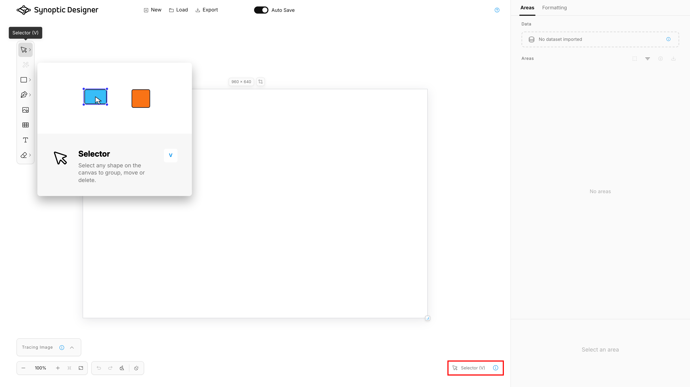

Synoptic Designer supports keyboard shortcuts for tool activation, editing commands, viewport navigation, and object manipulation.

On macOS, use Command where the table says Cmd/Ctrl. On Windows, use Ctrl.

## Tool Shortcuts

|Shortcut|Action|
|---|---|
|`V`|Selector|
|`A`|Node Selector|
|`H`|Pan|
|`Y`|Magic Wand|
|Backslash|Line|
|`R`|Rectangle|
|`L`|Ellipse|
|`P`|Freehand|
|`G`|Grid|
|`T`|Text|
|`E`|Eraser|
|`Shift+E`|Erase Node|
|`K`|Toggle Keep after Use when available|

Some tools, such as Pen, Split, Image/SVG insertion, Triangle, Diamond, Pentagon, Hexagon, and Scallop, are selected from toolbar groups and do not have a dedicated keyboard shortcut in the current shortcut map.

## Selection and Editing

|Shortcut or gesture|Action|
|---|---|
|Click object|Select object|
|Drag empty canvas with Selector|Lasso select|
|Arrow keys|Move selected objects by a small step|
|Shift+Arrow keys|Move selected objects by a larger step|
|Delete or Backspace|Delete the current selection|
|Escape|Release selection or finish/cancel active editing state depending on the current tool|
|Double-click text|Edit text|
|Double-click grouped content|Drill into a child element where supported|
|Click canvas with a Magic Wand preview|Insert the previewed area|
|Enter or Space with a Magic Wand preview|Insert the previewed area|
|Escape with a Magic Wand preview|Cancel the preview|

## Object Commands

|Shortcut|Action|
|---|---|
|`Cmd/Ctrl`+`C`|Copy selected areas to the internal editor clipboard|
|`Cmd/Ctrl`+`V`|Paste copied areas with fresh IDs|
|`Cmd/Ctrl`+`D`|Duplicate selection|
|`Cmd/Ctrl`+`R`|Rename selected area|
|`Cmd/Ctrl`+`G`|Group|
|`Cmd/Ctrl`+`U`|Ungroup|
|`Cmd/Ctrl`+`H`|Hide or show|
|`Cmd/Ctrl`+`L`|Lock or unlock|
|`Cmd/Ctrl`+`]`|Bring forward|
|`Cmd/Ctrl`+`[`|Send backward|
|`Shift`+`Cmd/Ctrl`+`]`|Bring to front|
|`Shift`+`Cmd/Ctrl`+`[`|Send to back|

Copy and paste use Synoptic Designer's internal clipboard. They do not require browser clipboard permissions and do not copy SVG payloads to the operating system clipboard.

## History and Zoom

|Shortcut or gesture|Action|
|---|---|
|`Cmd/Ctrl`+`Z`|Undo|
|`Cmd/Ctrl`+`Shift`+`Z`|Redo|
|`Ctrl`+`Y`|Redo on supported platforms|
|`Shift`+`Cmd/Ctrl`+Plus|Zoom in|
|`Shift`+`Cmd/Ctrl`+Minus|Zoom out|
|Mouse wheel|Zoom the viewport|
|Horizontal wheel|Pan horizontally|

Unshifted browser zoom shortcuts are left to the browser or operating system.

## Temporary Modifiers

|Modifier|Action|
|---|---|
|Space|Temporarily pan the viewport|
|Middle mouse button|Temporarily pan the viewport|
|Shift while placing Pen anchors|Constrain the next segment to horizontal, vertical, or 45 degrees|
|Shift while drawing supported preset shapes|Keep a square aspect ratio|
|`Alt/Option` while transforming|Bypass smart-guide snapping|
|`Alt/Option` while resizing where supported|Resize from the center|
|`Alt/Option` while dragging a curve handle|Move one handle independently|
|`Alt/Option` near the first Pen anchor|Bypass close snapping|

## Node Editing

|Shortcut or gesture|Action|
|---|---|
|Insert|Add a node in Node Selector context|
|Delete|Remove selected or targeted node when geometry remains valid|
|Right-click path in Node Selector|Open node commands|
|Right-click visible node|Open add and remove node commands|
|Drag visible node|Move the point|
|Drag visible curve handle|Adjust the curve|
