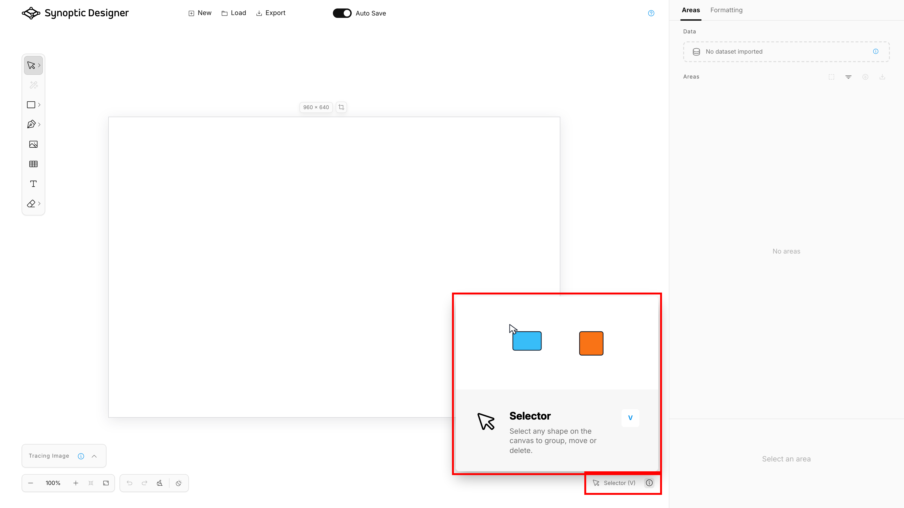

Use ***Image*** to choose a local SVG or bitmap file while already editing.

If you choose a supported bitmap, it replaces the active tracing image. If you choose an SVG in an empty document, it becomes the editable document source. If you choose an SVG in a non-empty document, it is inserted as one placed asset, centered on the artboard, and protected from direct child editing.

Imported SVG markup is sanitized before it reaches the canvas.
