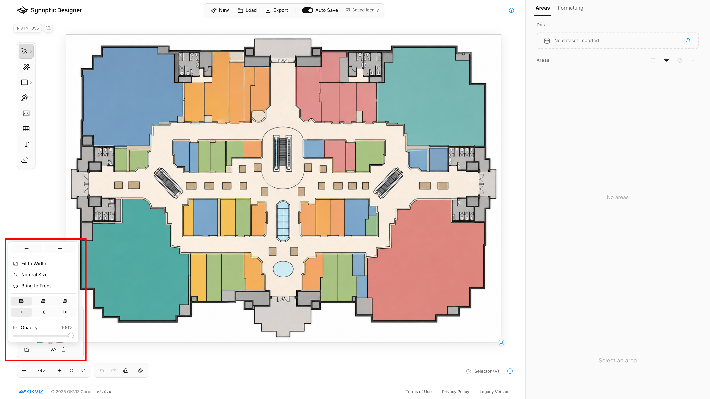

The tracing workflow lets you use a bitmap as a visual reference while building editable SVG map areas.

## Tracing Image Panel

A tracing image is a single bitmap reference attached to the current project. It cannot be selected or transformed like a normal vector object.

Use the ***Tracing Image*** panel to:

- replace the image;
- show or hide it;
- remove it;
- fit it to the artboard width;
- restore actual size;
- adjust scale;
- adjust opacity;
- bring the image in front of editable SVG content or send it behind;
- align it horizontally or vertically.

Only one tracing image can be active at a time. Replacing the tracing image does not delete vector areas already created from it.

Use front placement when you need to inspect the bitmap above existing areas. Send the image behind before selecting or reviewing foreground SVG areas.

## Starting from a Bitmap

When a project starts from a bitmap, the image becomes the tracing image and the panel starts expanded. Synoptic Designer sizes the empty artboard from the bitmap and fits the tracing reference for immediate use.

This is the typical workflow for floor plans, venue diagrams, seating layouts, building maps, process diagrams, and other non-vector sources.

## Creating Areas from a Tracing Image

After loading a tracing image, you can create editable SVG areas manually with drawing tools such as ***Pen***, or automatically with ***Magic Wand***.

For automatic tracing behavior, options, and limitations, see [Magic Wand](tools/magic-wand.md).
