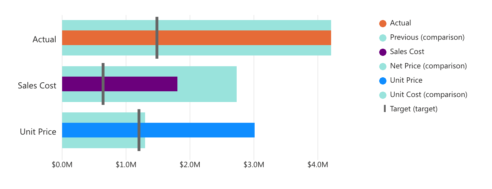

**Bullet Chart** is a custom visual that allows you to show data values, saving precious space on your reports. It can render single or multiple values in a series and show comparison values, different targets, and includes several advanced features.

The original bullet chart was created by **Stephen Few**; he designed it to solve common business intelligence problems in a elegant and meaningful way - we just brought these concepts into Power BI, see [Bullet Design](features/bullet-design.md).

> [Download and try Bullet Chart](https://okviz.com/bullet-chart/) from our website.