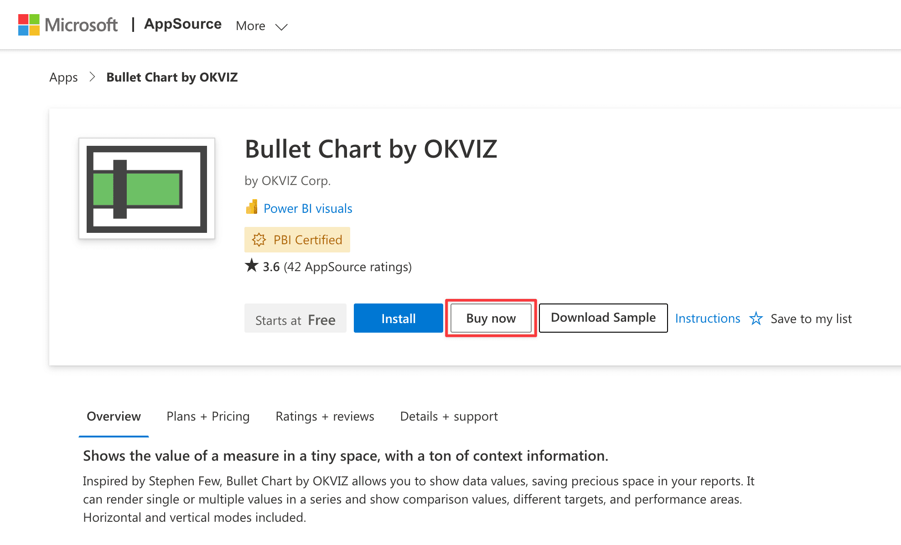
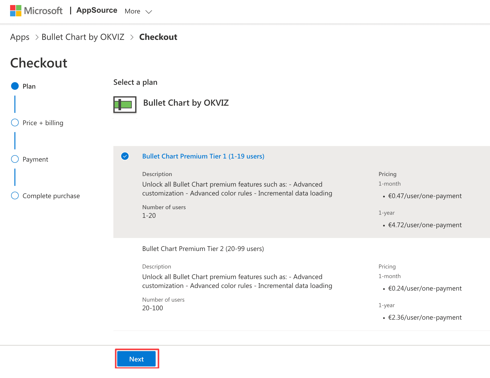
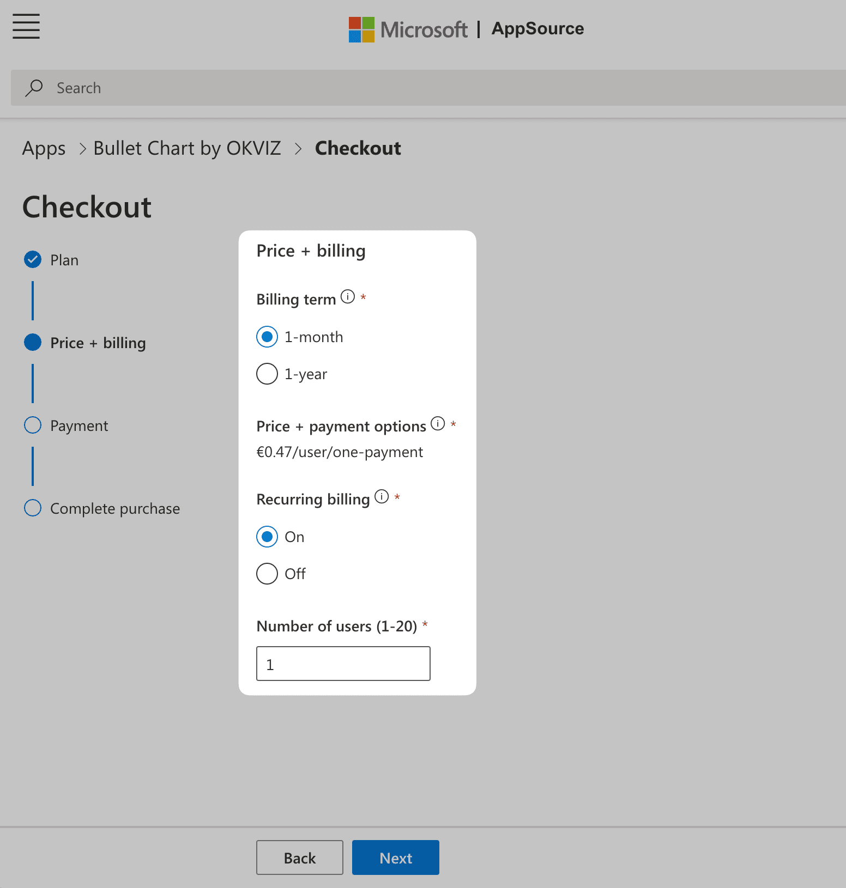
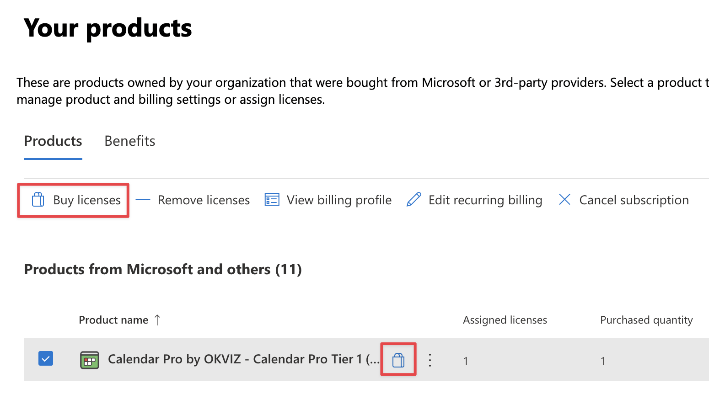
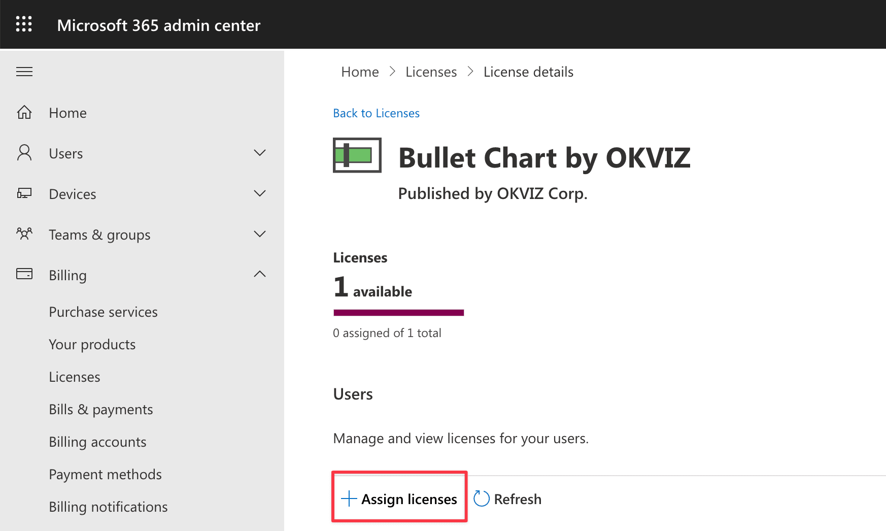
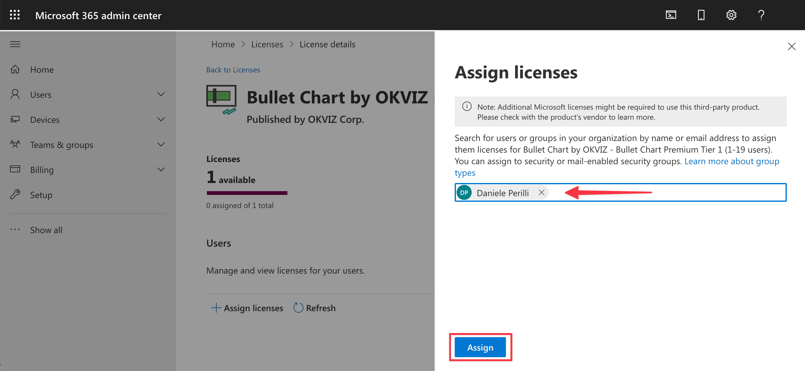
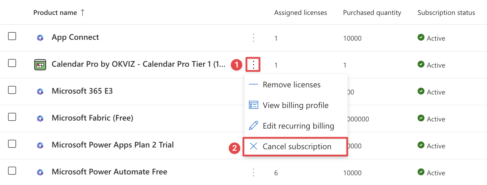

<todo visible>
We are developing an updated version of this page to outline the new licensing system, which was published in February 2025.
</todo>

Bullet Chart is a free visual but [some features](options/premium/index.md) require a valid license to be used. We adhere to the ***ISV app licensing system*** provided by Microsoft to allow users to purchase and manage licenses easily.

## Purchase Licenses

Here is an overview of the process required to obtain licenses for Bullet Chart:

1. Estimate the number of users who will use Bullet Chart and, therefore, the number of licenses required. You can do this simply by **adding up** the number of people designing reports containing the visual with who will view them. For example:

    | Designers | Viewers | Licenses Required |
    | --- | --- | --- |
    | 1 | 0 | 1 |
    | 10 | 50 | 60|
    | 10 | 10,000 | 10,010 |

    > If you don't get enough licenses, some of your users will see an [unlicensed notification](#unlicensed-notifications).

2. Visit the [Bullet Chart page on AppSource](https://appsource.microsoft.com/en-us/product/power-bi-visuals/WA104380953) and press the ***Buy now*** button.

    

3. Choose the plan that bets fits you requirements and press ***Next***.

    

4. Choose the billing terms, recurring option and the exact number of users to license.

    

5. Complete the checkout by providing a valid payment method and confirming the purchase.

### Purchase additional licenses

If you need to purchase additional licenses, you can do it from the admin center page:

1. Sign in to your [Microsoft 365 admin center](https://admin.microsoft.com/Adminportal/Home#/subscriptions).

2. On the navigation menu, select ***Billing*** > ***Your products***.

3. Find the row related to Bullet Chart OKVIZ, click on the ***Buy licenses*** button.

    

## Assign Licenses

After you have purchased one or more licenses, you need to assign them to your users or Active Directory groups.

> Anyone purchasing gets permissions to assign purchased licenses. If you are not the purchaser, you must be a Global, License, or User admin to assign licenses. To use group-based licensing, see [Assign licenses to users by group membership in Azure Active Directory](https://learn.microsoft.com/en-us/entra/identity/users/licensing-admin-center)  
If you purchased the license for yourself or other users, you can still assign it with the following procedure.

Follow these steps to proceed:

1. Sign in to your [Microsoft 365 admin center](https://admin.microsoft.com/Adminportal/Home#/licenses)

2. On the navigation menu, select ***Billing*** > ***Licenses***.

3. Click on ***Assign License*** and select the users or groups to assign the license to.

    

    

4. Press ***Assign*** and you are done.

At this point the users you have selected will be able to use all the features of Bullet Chart.

## Unassign Licenses

You can unassign licenses in the same way you assigned them:

1. Sign in to your [Microsoft 365 admin center](https://admin.microsoft.com/Adminportal/Home#/licenses)

2. Click on the product license to manage.

3. Select the users or groups you want to unassign the license from and press ***Unassign licenses***.

## Cancel Subscription

You can cancel the subscription from the Microsoft 365 admin page:

1. Sign in to your [Microsoft 365 admin center](https://admin.microsoft.com/Adminportal/Home#/subscriptions).

2. On the navigation menu, select ***Billing*** > ***Your products***.

3. Find the row related to Bullet Chart by OKVIZ, click on the **ellipsis button**, then choose ***Cancel subscription***.

    

> Refund policy is available on the [Refund policies for Microsoft AppSource and Azure Marketplace](https://learn.microsoft.com/en-us/marketplace/refund-policies) page.
