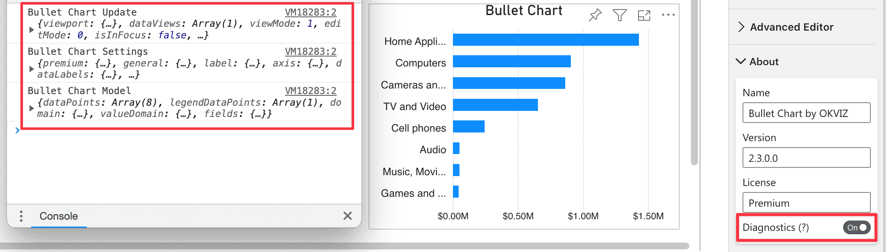

This section displays basic information of Bullet Chart.

## Name
The name of the visual.

## Version
The current version of visual.

## Diagnostics
**Default value:** Off

If selected, this option logs significant information and errors in the script console of the browser. This could affect the performance of your report. This option is especially useful when you need to provide additional information on [bug reports](../../../issues/support.md#diagnostic-data).

> **NOTE**: This could affect the performance of your report.