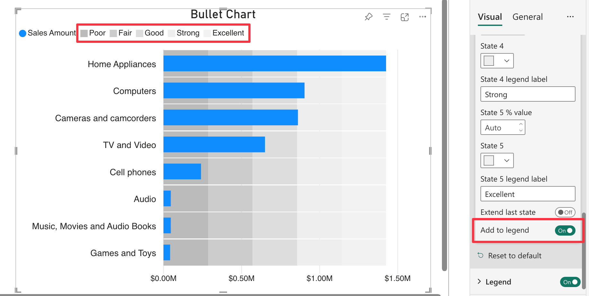

**Default value:** Off

When enabled, this option adds [States](index.md) to the legend. 
This is particularly useful when there are multiple states defined, as it provides a clear reference for interpreting the chart. 

When states are connected to the ***States*** field well, they will be automatically added to the legend with their measure name.
When state are manually defined, you can specify a custom label for each state in the text box that appears below every single state color picker.

