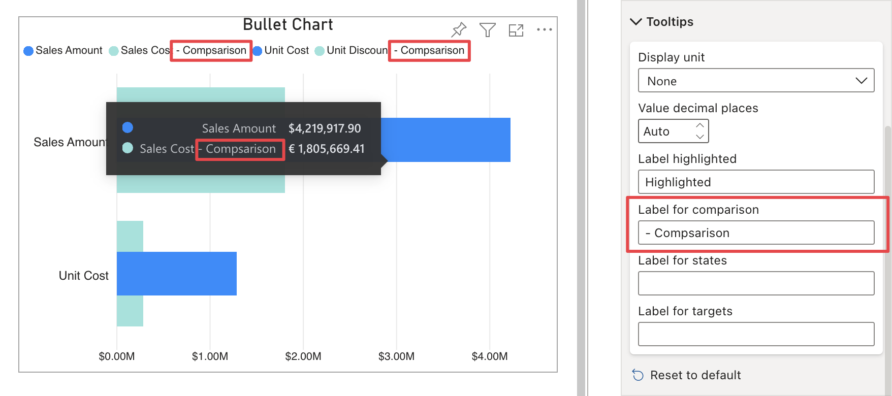

**Default value:** (Empty)

This option allows you to define a custom label in the tooltips for measures connected to the ***Comparison Value*** field. Note that the custom label will also be reflected in the related legend data points.

