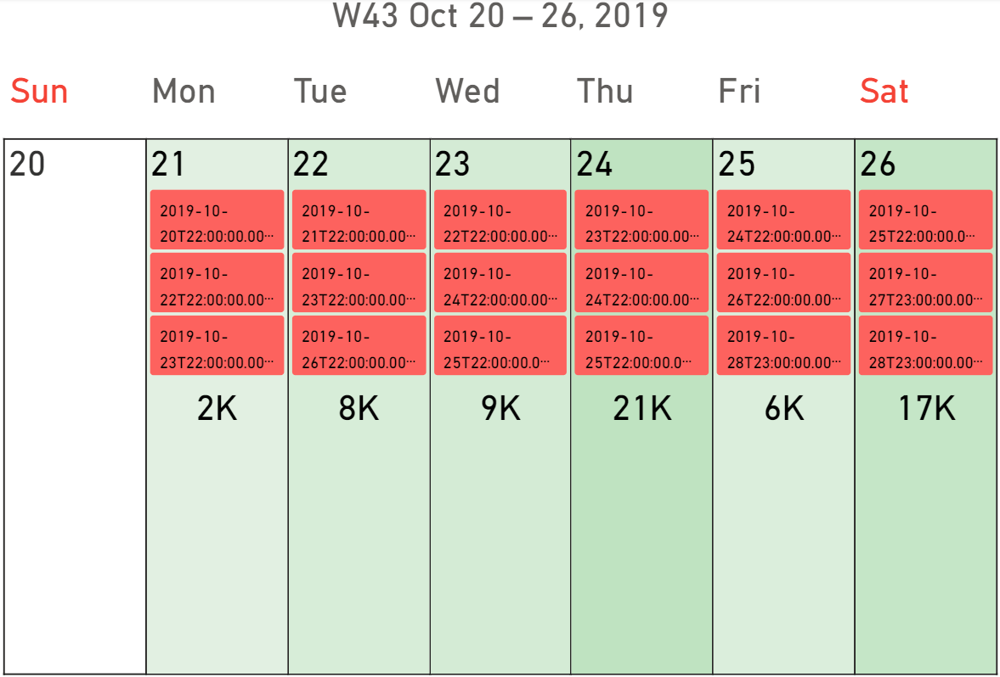
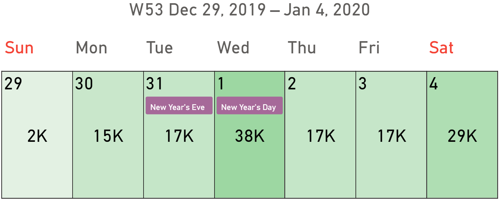

Calendar Pro supports events and holidays.

## Events

The idea behind the use of events is that they may be useful to intercept relations or correlations with the data you are analyzing.

To display events in the visual, you need to bind either a single column or one or more measures to the [Events](../fields/events.md) field well. When events are bound through a column, they are associated with the corresponding date row. There is also a [dedicated option](../options/events/join.md) to merge adjacent events with the same name when applicable.

This way, you can display any kind of data as events, not just the typical events like meetings or appointments. 

<todo>Use different example - we need to prepare a specific dataset</todo>

Learn more about how events can be managed in the [Events section](../options/events/index.md).

## Holidays
By using a [third-party library](https://commenthol.github.io/date-holidays/), Calendar Pro retrieves the existing holidays in all the countries of the world.

Like the events, the idea behind the use of holidays is that they may be useful to intercept relations; for example, you could investigate if the sales amount of a product is influenced by the holidays in a particular country:

<todo>Use a chart mode screenshot with 1 year of events (include the legend).</todo>

Calendar Pro is able to display holidays from different countries at the same time. You have two ways to manage this:
- From the options (see below), you can select up to 3 countries whose holidays you want to display.
- By binding a column containing the country codes you want to display to the [Holidays Countries](../fields/holidays-countries.md) field well of the visual.

Learn more about how holidays can be managed in the [Holidays section](../options/holidays/index.md).

> If you find a holiday missing or incorrect, you can contribute to the **date-holiday** library by [submitting a pull request](https://github.com/commenthol/date-holidays/blob/master/CONTRIBUTING.md).
