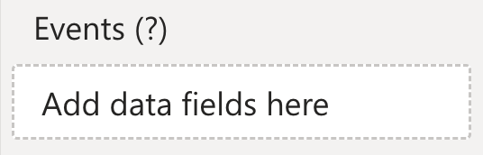

The ***Events*** field well is used to bind event data to the visual.

You can bind:

- a single column containing the event names
- one or more measures that define the event values

Calendar Pro displays the events on the calendar according to the corresponding date row.

