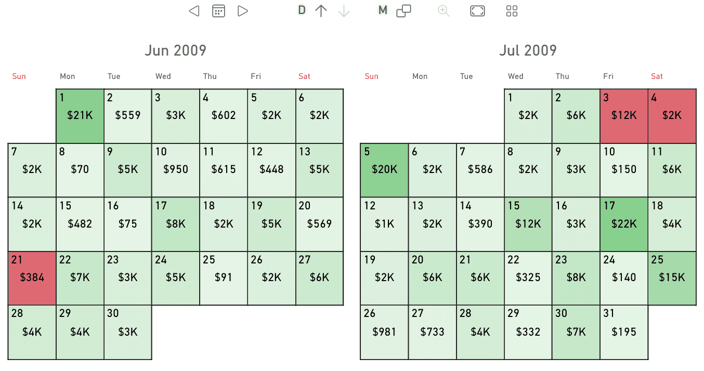

**Calendar Pro** is a powerful calendar visual for Power BI.

> Ask an AI assistant how to configure and use this visual with the official OKVIZ documentation. [Learn how](../get-started/ai).

It includes unique features like:
- Granularity drilldown and dynamic grouping.
- Different calendar systems such as Gregorian, Weekly, Fiscal, built-in holidays, events support
- Advanced color rules

> [Download and try Calendar Pro](https://okviz.com/calendar-pro/) from our website.
