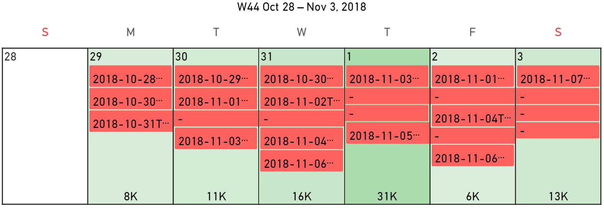
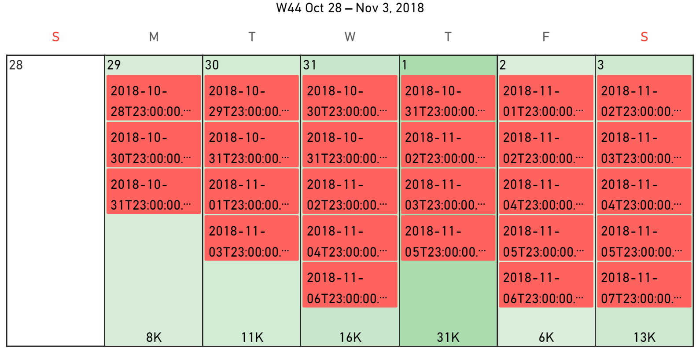

**Default value:** On

This option allows you to join adjacent events in the calendar as a single event. This is useful when you have a series of events that are related to each other and you want to show them as a single event in the calendar.

> If the **Event Colors** field well is bound, this option is turned off automatically because adjacent events can have different colors.

These examples show an event (the delivery date) with joined (first) and not joined (second) events:

<todo>Retake screenshots</todo>
