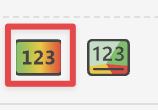
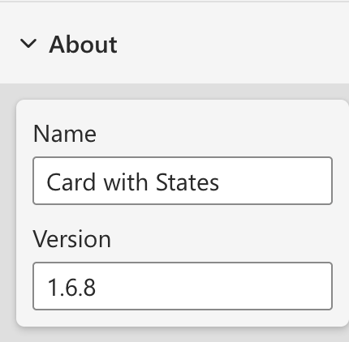

Card with States Legacy is the previous generation of the visual. It is based on older Power BI Custom Visuals APIs and remains temporarily available on AppSource to support existing reports. For new reports and ongoing maintenance, we recommend using the latest version of the visual, [Card with States v2](../index.md).

>> **IMPORTANT**: The documentation on this site refers to Card with States v2 unless otherwise specified. Card with States Legacy will remain available on AppSource for a limited time under the name **Card with States Legacy**, but it will not receive further updates.

## Why Move to v2

Card with States v2 has been updated to use the latest Power BI APIs and supports the modern Power BI feature set.

Compared to the legacy version, v2:

- supports the latest Power BI Custom Visuals APIs
- supports all modern Power BI features available in the current visual
- includes the advanced Color Rules manager used across other OKVIZ premium visuals
- is free and does not require a license key

## Compatibility

Card with States Legacy and Card with States v2 are not fully compatible.

In particular, the **Color Rules** configuration is different and should be recreated manually in v2. Because of these differences, you should not expect to simply replace the old visual with the new one and keep the same behavior.

When migrating, review the fields, formatting options, and final rendering in your report before removing the legacy visual.

## How to Identify Legacy

You are using the legacy version if one of the following applies:

- the visual uses the old icon

    

- the visual is versioned **1.6.8** or earlier in the About section

    

- the visual depends on the previous license model

    

## How to Migrate to v2

To migrate your reports from Card with States Legacy to Card with States v2, follow these steps:

1. Install the latest version of Card with States in Power BI.
2. Replace the legacy visual with the new one in your report - no reconfiguration is needed regarding the fields, but you will need to reapply the formatting settings.
3. Recreate the **Color Rules** in the v2 Color Rules manager, because the legacy configuration is not fully compatible.
4. Remove the legacy visual from the report and save the changes.

## Legacy Availability

The previous version remains available for a limited time on AppSource under the name **Card with States Legacy**. This temporary availability is intended to give existing reports time to migrate. The legacy version will not be updated.
