OKVIZ visual allow you to change the color of the visual elements dynamically based on the data values through the **Color Rules** editor. This feature is available in many OKVIZ visuals and is useful when Power BI conditional formatting is not available or when the visual needs more advanced rules than the built-in formatting options.

When supported by a visual, you can open the Color Rules editor from the visual canvas:

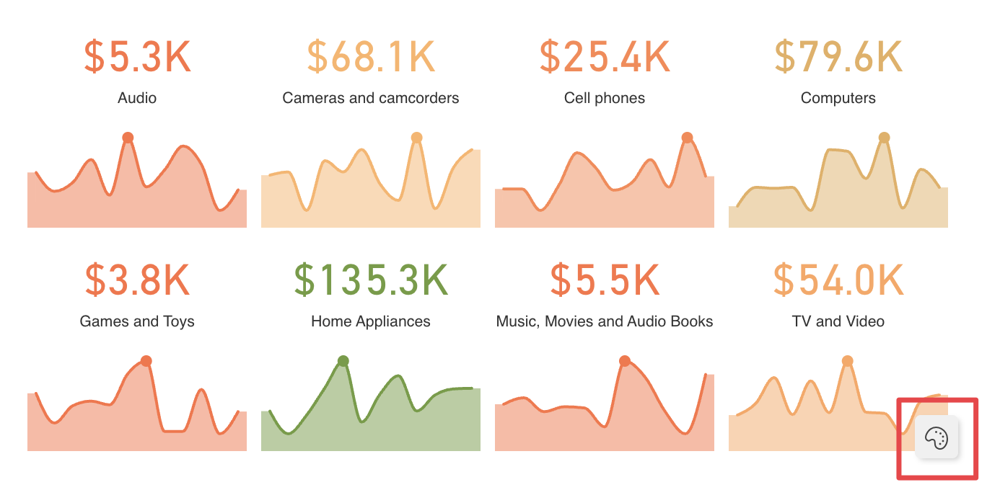

The editor can create two types of rules:
- **Color Scale**
- **Conditions**

The available rule types depend on the visual. Some visuals allow both rule types, while others expose only **Color Scale** or only **Conditions**.

## Rule Settings

Every rule starts with these settings:

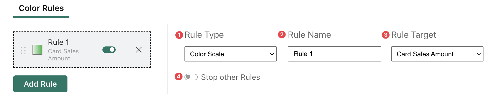

1 **Rule Type** selects the type of rule. When the visual supports only one type, this option may be unavailable or limited to the supported rule type.

2 **Rule Name** defines the display name shown in the rules list.

3 **Rule Target** selects the target affected by the rule. Some visuals have a single target, while others expose multiple targets. For example, when Card with States contains multiple cards based on different measures, the rule can be assigned to the card target it should affect.

4 **Stop other Rules** stops the evaluation of the following rules when the current rule matches. This is useful when the rule order matters and a matching rule should prevent later rules from changing the same result.

Rules are evaluated in the order shown in the rules list.

## Color Scale Rules
Use a color scale rule when you want to map a numeric field to a gradient.

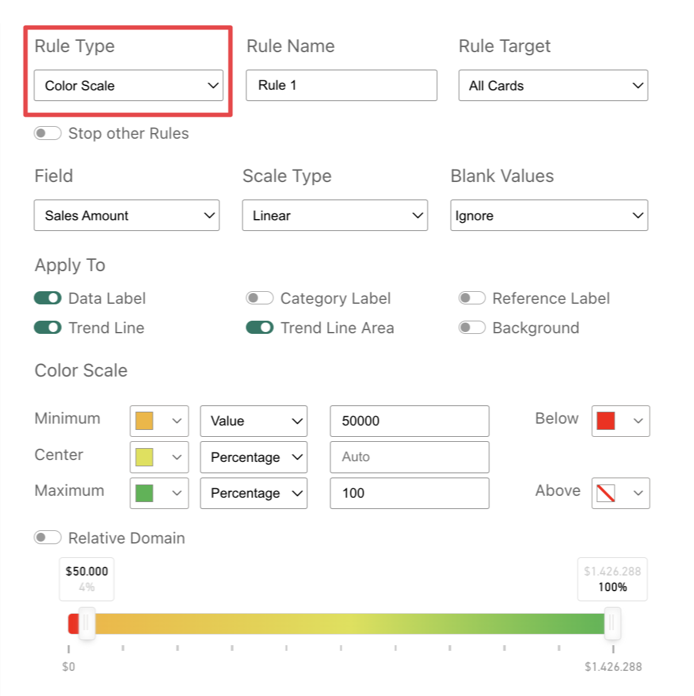

Color scale rules include these options:
- **Field** selects the numeric field used by the scale.
- **Scale Type** lets you choose between **Linear** and **Logarithmic**. Linear scales distribute the color transition evenly across the value range. Logarithmic scales use a logarithmic distribution, which can make differences easier to see when values have a wide range.
- **Blank Values** defines how blanks are handled. **Ignore** leaves blank values unchanged by the rule, **Treat as Zero** applies the color corresponding to zero, and **Set Color** applies a specific color to blank values.
- **Apply To** selects the visual elements affected by the scale. At least one element must be selected. When the visual exposes only one element, that element is preselected and cannot be changed.
- **Multiple Scales** lets you define different scales for different levels or granularities when the visual supports them.

When **Multiple Scales** is not available, or when it is turned off, the rule uses a single scale for every supported level. In the editor this shared scale is shown as **Color Scale** or **Any Level**, depending on the visual.

When **Multiple Scales** is turned on, the editor shows one tab for each supported level. Each tab has its own **Minimum**, **Center**, **Maximum**, **Below**, and **Above** settings. This is useful when the same visual can display data at different granularities and each granularity needs its own color range. For example, [Calendar Pro](../calendar-pro/index.md) can use one scale for months and another scale for quarters.

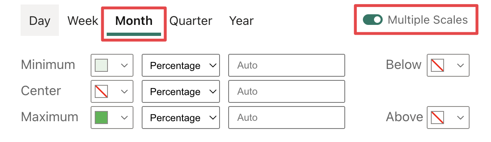

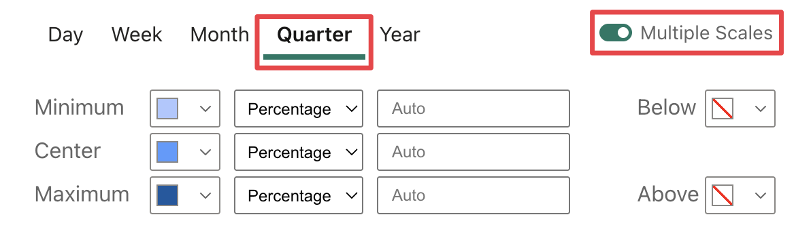

So the result will show different color formatting for months and quarters based on the configured scales.

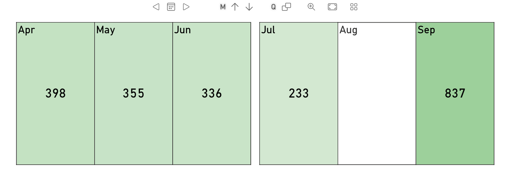

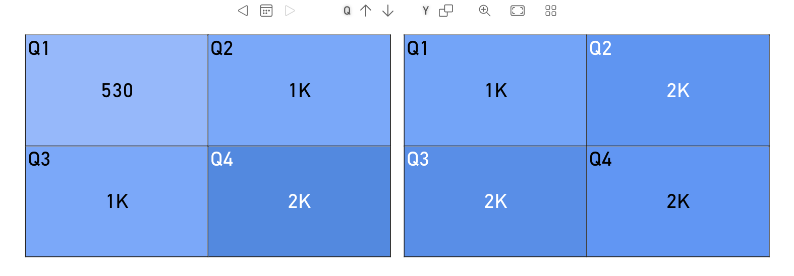

The **Color Scale** section defines the colors and thresholds used by the gradient.

You can configure three scale points:
- **Minimum** sets the lower bound of the gradient.
- **Center** sets the optional middle point of the gradient.
- **Maximum** sets the upper bound of the gradient.

Each scale point can be defined in one of these modes:
- **Percentage** uses a percentage of the selected field domain.
- **Value** uses a fixed numeric value.
- **Field** uses another field as the threshold reference.
- **Calculation** uses a calculation based on a field and a numeric value.

Each point can use its own mode, so you can combine fixed values, percentages, field-based thresholds, and calculated thresholds in the same scale.

The **Below** and **Above** colors let you define the formatting used outside the configured minimum and maximum range. You can also choose a transparent color when you want values outside the range, or overlapping rules, to leave the existing visual formatting visible.

Percentages and values are evaluated against the data currently available to the visual, so report filters, slicers, and visual-level filters can change the resulting domain.

**Relative Domain** changes the domain used to calculate the scale. When enabled, the scale uses the actual minimum and maximum values of the selected field. When disabled, the domain is adjusted to include zero: positive ranges start from zero, and negative ranges end at zero. This option is disabled for measures.

The slider previews the resulting scale across the absolute value range of the selected field. Dragging the handles changes the **Minimum** and **Maximum** thresholds. If the corresponding threshold uses **Percentage**, the slider updates the percentage value; if it uses **Value**, the slider updates the absolute numeric value. Handles are disabled when the threshold is based on **Field** or **Calculation**.

For example, consider the following rule:

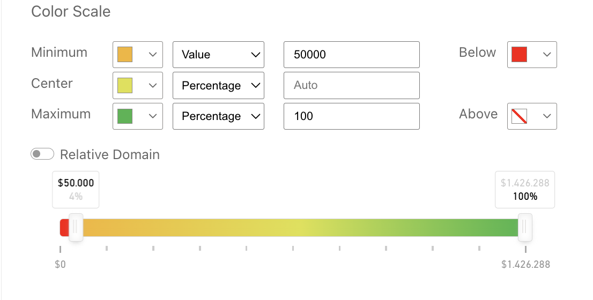

This results in:

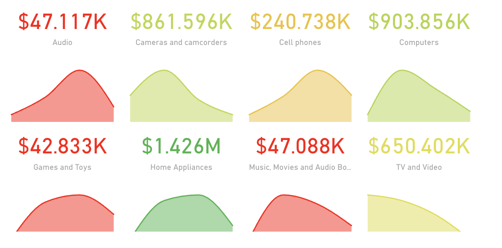

## Conditional Rules
Use a conditional rule when you want to apply formatting only when one or more conditions are met.

In the **Conditions** section, each condition follows an **If** flow. Select the field to evaluate, then select the comparison to apply.

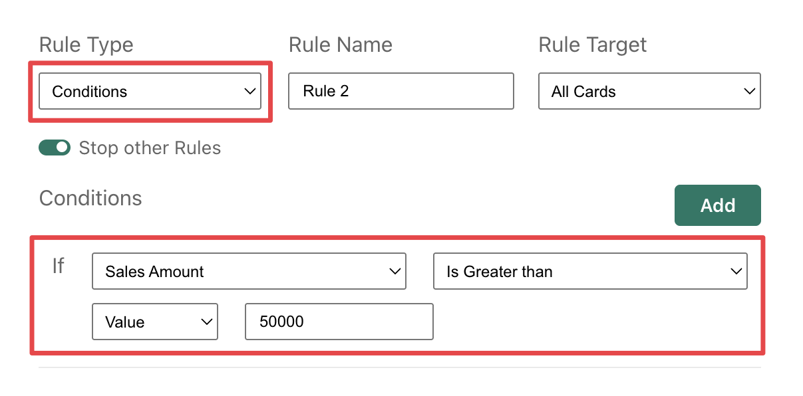

For numeric fields, the available comparisons include:
- **Is Less than**
- **Is Less than or Equal to**
- **Is Equal to**
- **Is Different from**
- **Is Greater than**
- **Is Greater than or Equal to**
- **Is Between**
- **Is Blank**
- **Is Not Blank**

For text fields, the available comparisons include:
- **Contains**
- **Does Not Contain**
- **Starts With**
- **Does Not Start With**
- **Is**
- **Is Not**
- **Is Empty**
- **Is Not Empty**
- **Is Blank**
- **Is Not Blank**

When a comparison requires a value, the value can be defined as:
- **Value** uses a static value entered in the rule.
- **Field** compares the selected field with another field.
- **Calculation** compares the selected field with the result of a calculation based on another field and a static value.

For text fields, comparisons that require a text value show a text box. **Is Blank** and **Is Not Blank** do not require a comparison value.

You can add more than one condition to the same rule by clicking the **Add** button. Additional conditions can be combined with **And** or **Or**.

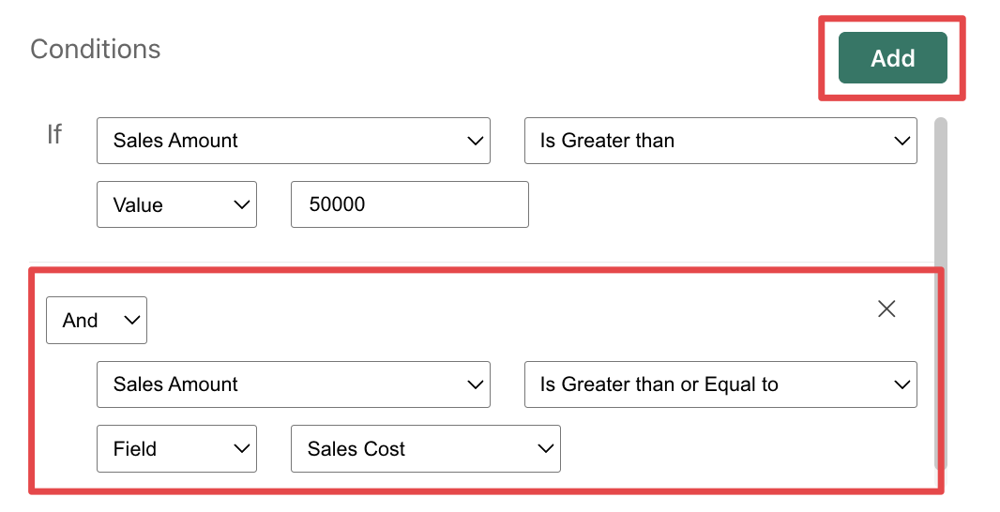

The **Then** section defines what happens when the rule matches.

The editor shows the visual elements that can change color according to the rule. The available elements depend on the visual. Some visuals expose only one color target; others, such as [Card With States](../visuals/card-with-states.md), can expose multiple targets such as labels, trendline and background.

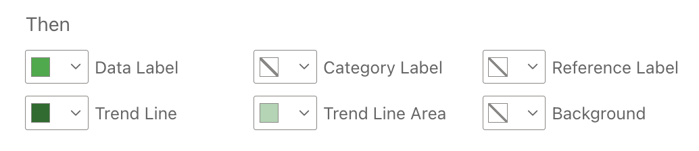

For each available element, you can choose:
- **Default Fill** to keep the color defined by the visual settings.
- **No Fill** to remove the fill when the rule matches.
- A custom color to apply when the rule matches.

For example, in Card With States the result will be:

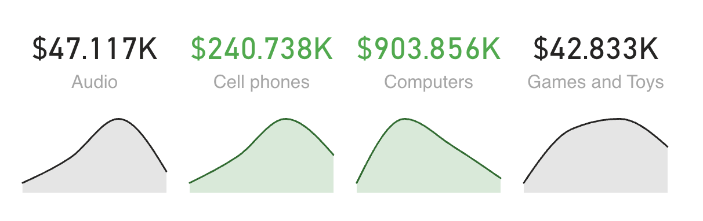

When the visual supports messages, the rule can also define a custom **Message** to show when the rule matches:
- **None** does not show a message.
- **Static** shows a fixed text entered in the rule.
- **Field** shows the value from a selected field.

When a message is enabled, you can also select the message color.

When the visual supports icons, the rule can define an **Icon** to show when the condition matches. If an icon is selected, you can also select its color. For example, [Card With States](../visuals/card-with-states.md) can show a conditional message and icon in addition to colors.

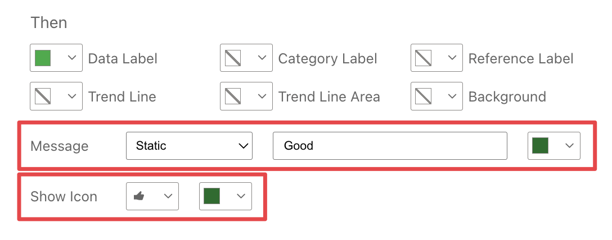

The result will look like this:

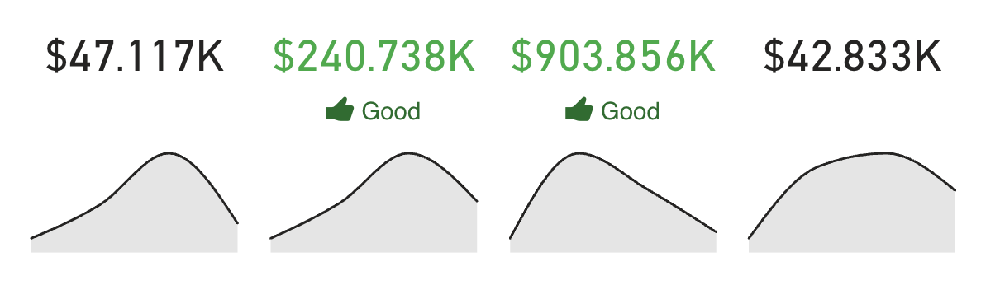

## Color Rules Field Well

When you need additional measures or columns to define custom rules, supported visuals expose a **Color Rules** field well. 

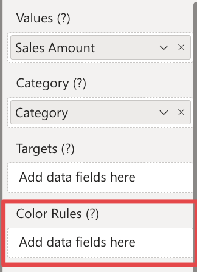

Data fields added here are not rendered directly by the visual; they become available in the Color Rules editor so you can use them in conditions, field-based comparisons, calculations, or messages, depending on the visual and rule type. For example, you can add a measure that calculates the percentage difference between the current value and the same value from the previous year, then use that measure in a conditional rule to apply formatting when the percentage difference is above or below a certain threshold.
