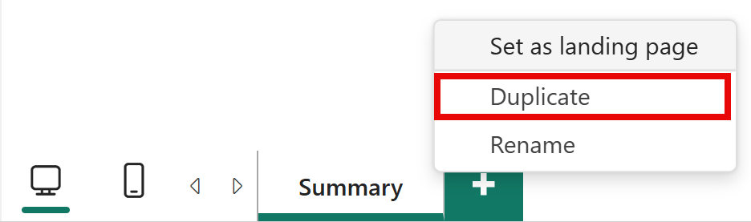
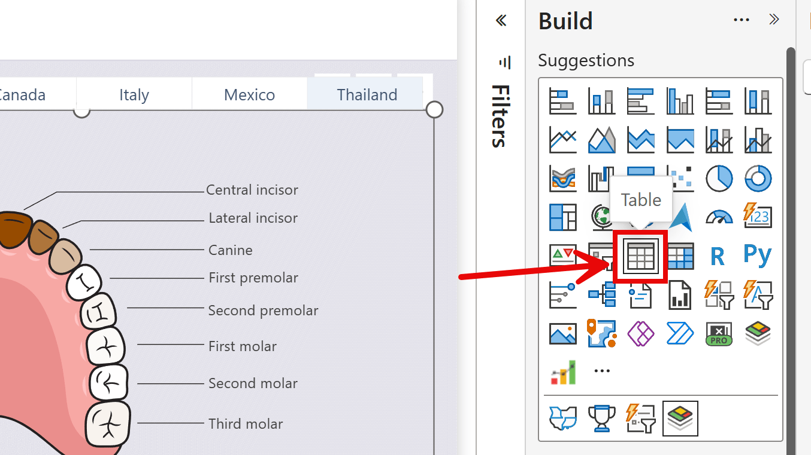

When data is not displayed as expected in a custom visual, the root cause can be either in the **visual configuration** (properties, colors, display options) or in the **underlying data** (model structure, DAX measures, filter context). Before adjusting visual settings, it is essential to confirm whether the visual is actually receiving the right data in the first place.

This page describes a technique for replacing the custom visual with a standard **Table** visual on a duplicate page, so you can inspect the exact data the visual sees and decide where to focus your troubleshooting.

## When to Use This Technique

Use this approach when:

- Areas, categories, or data points are not highlighted or colored as expected.
- Interacting with slicers or other visuals does not produce the expected change in the visual.
- Some categories appear to be missing even though they exist in the data model.
- You are unsure whether the problem is caused by the visual settings or by the data itself.

## How It Works

The idea is simple: a standard Table visual reads the same data query as any other visual on the page. By replacing the custom visual with a Table — on a copy of the page so nothing is changed on the original — you can see exactly what rows, columns, and values the visual receives. From there, two outcomes are possible:

- **Data looks correct in the table** → the problem is in the visual configuration.
- **Data is missing or wrong in the table** → the problem is in the data model or DAX, not in the visual.

## Step 1 — Duplicate the Report Page

Create a copy of the page so you can freely modify it without touching the original report.

1. Right-click the report page tab at the bottom of the Power BI Desktop window.
2. Select **Duplicate Page** from the context menu.

A new tab named **Duplicate of [page name]** appears. Make sure you are working on that duplicate page for the rest of this procedure.

## Step 2 — Convert the Custom Visual to a Table

On the duplicated page, change the visual type to a standard Table:

1. Click the custom visual to select it.
2. In the **Visualizations** pane, click the **Table** visual icon.

Power BI replaces the visual with a Table, keeping the fields that were already in the field well. The visual area now shows a plain table with rows and columns.

>> **Note**: Some fields specific to the custom visual (for example, map URL fields) may be removed automatically during the conversion because they are not compatible with the Table visual. If a field you need disappears, re-add it manually from the **Fields** pane.

## Step 3 — Examine the Table Content

Inspect the table and check the following aspects:

### Are the expected columns present?

If a column you expected is missing, verify that the corresponding field is present in the **Visualizations > Fields** pane. If the field is listed but the column is empty, the issue may be in a DAX measure or in a relationship in the data model.

### Is the granularity correct?

Check whether the table has the right number of rows and the right level of detail. For example, if you expected one row per region but the table shows one row per city, the category field has finer granularity than intended. Too few rows may indicate that data is being filtered out or over-aggregated.

### Are the values correct?

Verify that numeric values, text labels, and measure results are what you expect. Compare them with the original data source or with other trusted visuals in the same report.

## Step 4 — Interpret the Results

### Data is correct in the table

If the table shows the expected columns, granularity, and values, **the data is fine — the problem is in how the visual is configured**. The custom visual is receiving the right data but not displaying it as expected.

In this case, focus on the visual properties:

- Check display options, color rules, and thresholds in the **Visualizations** pane.
- For **Synoptic Panel**, review the [data binding](../synoptic-panel/concepts/data-binding.md) setup and the [areas options](../synoptic-panel/options/areas/index.md).
- Refer to the visual's documentation for the specific feature you are working with.

### Data is missing or wrong in the table

If the table is missing rows, shows unexpected values, or has empty columns, **the issue is not in the visual — it is in the data model or the active filter context**. Changing visual properties will not fix this.

In this case:

- Review the DAX measures and calculated columns involved.
- Check table relationships and verify that filters propagate correctly through the model.
- Examine whether active slicers, report-level filters, or page-level filters are excluding data.
- Remove all slicers from the duplicate page temporarily to see if the missing data reappears.
- Use **Performance Analyzer** and the **DAX Query View** to inspect the query sent to the model and the rows returned.

## Step 5 — Clean Up

Once you have gathered enough information, delete the duplicate page — no changes were made to the original. Right-click the duplicate page tab and select **Delete Page**.

If you have identified the problem and need further help, see the [Support](support.md) page.
