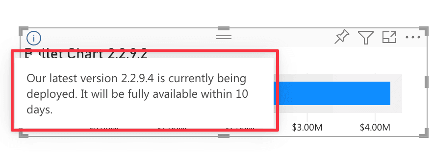

At OKVIZ we strive to produce good code, but we are human beings and unfortunately bugs do occur. 

When we find a bug in our visuals we usually fix it as soon as possible, but depending on how the visuals were distributed and installed, the update may you take days or weeks to reach you:

## Resolution Time (Visuals from AppSource)

Visuals installed from AppSource are updated automatically in all reports that use them when a new version is available. 

**The internal process for reviewing, approving, and deploying new versions typically spans several weeks.** The duration depends on factors such as whether the visual is certified—in which case it is initially pre-released to a select group of tenants for regression testing—and the complexity of changes made to the underlying code. For certified visuals, the Microsoft team checks the source code to ensure it does not contain any malicious or unsafe content:

- **Uncertified Visuals:** 3 weeks
- **Certified Visuals:** 4 weeks

During the deployment period the following message may appear on the visual:

This message means that the vendor (OKVIZ) has released a new version of the visuals that has been approved, but it will available to you only after the specified number of days.

### Rollback

When a regression occurs, we have the option of requesting a rollback to the previous version, but this causes other problems if:

- the regression is discovered after a few days/weeks and users have started using new features introduced by the defective version;
- users have paid for these new features that the rollback will make disappear for another 3 weeks;
- the regression affects the appearance of the visual and users have manually fixed broken reports by changing size, position or layout of the visual instances.

**The rollback requires up to 1 week.**

### Preview Versions

In some cases we may provide a preview fixed version of the visual to mitigate the impact on users. **This version can be released as soon as we fix the bug**, but it has some limitations (e.g. it's not certified) and requires multiple user actions on each report using the visual. See more on [Preview Versions](previews.md).

## Resolution Time (Visuals from OKVIZ.com)

Visuals installed from OKVIZ must be updated manually by the user in every report that use them (or just once via [Org Store](../get-started/org-store.md)). In this case, **we are able to provide a corrected version of the visual as soon as we fix the bug**.

### Rollback

Users can download a previous version (without regression bugs) of the visual directly from the their [account dashboard](https://okvz.com/account/) and install it manually in their reports.
