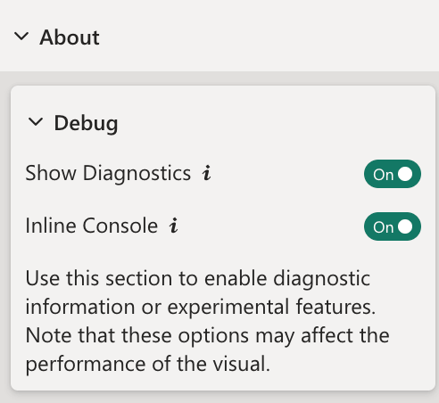
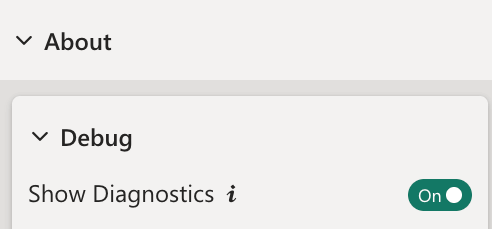
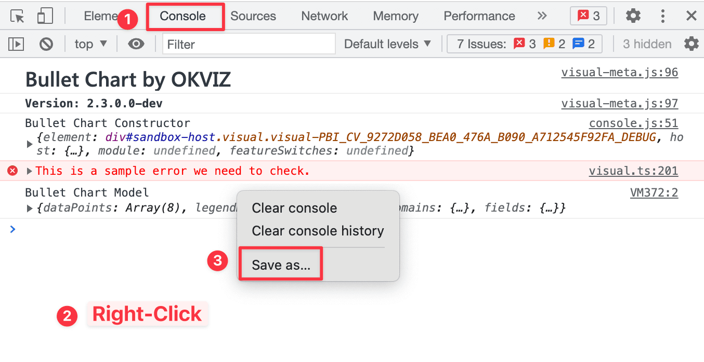

OKVIZ offers direct support to users who have problems with premium visuals and provides a dedicated forum for assistance with free visuals.

## Technical Issues

To report a bug with OKVIZ visuals, please follow the directions below:

1. Check if your problem already exists in the dedicated [Issues page](#issues-pages).

2. If you don't find anything relevant, insert a new issue including as much details as possible.

3. Include a sample report file that reproduces the issue. If your report contains private data or you cannot share it publicly for any reason, please **recreate it with dummy data**.

>> **IMPORTANT**: We cannot guarantee bug fixes without a sample file!

### Issues Pages

For issues with **free visuals**, use this repository on Github:
- Candlestick, Card with States, Dot Plot, Smart Filter (Free), and Sparkline:  
[github.com/okviz/free-visuals/issues](https://github.com/okviz/free-visuals/issues)

For issues with **premium visuals**, use a dedicated repository on Github:
- Bullet Chart: [github.com/okviz/bullet-chart-issues](https://github.com/okviz/bullet-chart-issues)
- Calendar Pro: [github.com/okviz/calendar-pro-issues](https://github.com/okviz/calendar-pro-issues)
- Smart Filter Pro: [github.com/okviz/smart-filter-pro-issues](https://github.com/okviz/smart-filter-pro-issues)
- Synoptic Panel: [github.com/okviz/synoptic-panel-issues](https://github.com/okviz/synoptic-panel-issues)

### Diagnostic Data

In certain situations, such as when you are unable to share reports with us and cannot replicate the issue locally using dummy data, we may request visual diagnostic data from you.

You can collect this data in two ways:

- **Using the inline console** (available in some visuals)

    1. Open the visual settings, navigate to the ***About*** section, and activate the ***Show Diagnostics*** toggle. If the visual has an ***Inline Console*** option, activate it too.

        

    2. Reproduce the issue in your report.

    3. Click the ***Export*** button in the inline console to save the log to a file.

        

    4. [Send the file to us](mailto:support@okviz.com) along with a detailed description of the issue.

- **Using the browser console**

    1. Open your report with [Power BI service](https://app.powerbi.com)

    2. Open the visual settings, navigate to the ***About*** section, and activate the ***Show Diagnostics*** toggle.

    

    3. Open the browser console panel - With Chrome you can just press Ctrl + Shift + J (Cmd + Option + J on Mac);  alternatively, you can use the top right menu in the browser window, select the option ***More Tools***, then ***Developer Tools*** and click the ***Console*** tab.

    4. Be sure to clear all filters from the console by clicking the drop-down menu next to the filter input box.

    5. Right-click on the empty space of the console panel and choose **Save as...**

        

    6. Take a screenshot of the console and [send it us](mailto:support@okviz.com) along with the file you just saved on your system.

### Microsoft Support

Sometimes the issue you want to report is not related to our code or affects custom visuals from other vendors too.  
In such cases, it is best to open a support ticket with Microsoft:

- If you are a tenant administrator, you can use the following link:  
    [https://admin.powerplatform.microsoft.com/newsupportticket/powerbipro](https://admin.powerplatform.microsoft.com/newsupportticket/powerbipro)

- If you are not a tenant administrator, you can start at this link and follow the on-screen instructions:  
    [https://powerbi.microsoft.com/en-us/support/pro/](https://powerbi.microsoft.com/en-us/support/pro/)

## Non-Technical Issues

For non-technical issues, please contact us at [support@okviz.com](mailto:support@okviz.com)