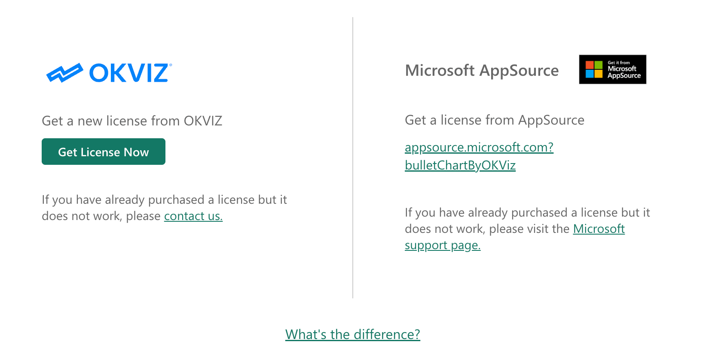

This page explains in detail how the licensing system for OKVIZ visuals works. 

We offer a dual licensing system so that you can choose the option that best fits your needs. Both licensing options follow a subscription model, on a monthly or yearly basis:

- **AppSource Licensing**  
- **OKVIZ Licensing**

Each model has its unique management and operational features, as detailed below.

|  | **AppSource Licensing** | **OKVIZ Licensing**|
|---|---|---|
| **License Management** | Managed by Microsoft | Managed directly by OKVIZ |
| **Licensing Options**  | Per-user | Per-user, per-capacity, per-site |
| **Assignment**         | Per-user assignment | No assignment needed |
| **Power BI Platforms**   | Desktop, Mobile, powerbi.com  |  All platforms |
| **Version Control**    | Auto-updates (always latest version, no rollback) | Full control over updates and rollback |
| **Microsoft Certification**      | Eligible for certification | Cannot be certified |
| **Offline**           | Offline not supported   | Supports offline use                       |

## AppSource Licensing

When you purchase a license from [AppSource](https://appsource.microsoft.com/en-us/marketplace/apps?search=okviz):

- **License Management**  
    The license is managed entirely by Microsoft. As a result, any administrative issues related to license assignment must be handled by Microsoft support. If you experience problems, you will need to contact Microsoft and open a support ticket with them.

- **Per-User Licensing**  
    Licenses are sold on a per-user basis. This means that after purchasing a set number of licenses, your organization’s administrator must assign each license individually to every user who will access the reports containing the visual.  

- **Assignment Procedure**  
    License assignment is performed through the Microsoft Office 365 admin portal. Once assigned, the user can access the visual in any report without further action. [Licenses can be also assigned to groups](https://learn.microsoft.com/en-us/entra/identity/users/licensing-admin-center), which simplifies the process for large organizations.

- **Platform Compatibility**  
    Because the assignment is user-specific, this licensing option does not support platforms where users are not publicly authenticated. 
    This means that **Power BI Report Server, Power BI Embedded, Publish to Web, and National Clouds are NOT supported**.

- **No Version Control**  
    AppSource licensed visuals are always updated to the latest version for every user. This means that you cannot roll back to a previous version in case of regressions.

> For more information about Microsoft AppSource licensing, see their [licensing FAQ](https://learn.microsoft.com/en-us/power-bi/developer/visuals/licensing-faq).

## OKVIZ Licensing

When you purchase a license directly from the [OKVIZ website](https://okviz.com/our-visuals/):

- **Direct License Management**  
    We manage the licensing directly. This allows us to offer you timely and direct support for any licensing issues.

- **Flexible Licensing Options**  
    We offer different licensing options:

    - **Per User:** Similar to the AppSource model, but managed by OKVIZ.
    - **Per Capacity:** Align the license with your current Power BI subscription capacity (for example, if you have a P1 node, you would purchase a P1 node license).
    - **Per Site:** Ideal for embedded scenarios, enabling use across an entire site.

- **No Assignment Procedure**  
    Unlike AppSource licensing, there is no need for a per-user assignment. We provide you with a package containing the visual with the hardcoded license, which can be used in any report. If you install the visual in your [Organizational Store](../get-started/org-store.md), the process is even simpler.

- **Platform Compatibility**  
    OKVIZ licenses **can be used with any Power BI platform**, including Power BI Report Server, Power BI Embedded, Publish to Web, and National Clouds.

- **Version Control**  
    With OKVIZ licensing, you have full control over version updates. You can choose when to update the visual in your reports, and you can roll back to a previous version if necessary.

- **Uncertified Visuals**  
    Visuals licensed via OKVIZ cannot be certified by Microsoft. This is because they need to connect to our licensing servers to validate the license. 
    > For more information, see our [certification page](../get-started/certification).

- **Offline Usage**  
    Visuals licensed via OKVIZ can operate offline, provided the next payment date is still in the future. Here's how it works:

    - When the subscription is renewed, we send you an updated visual package containing the new license information.  
    - By replacing the visual package in your reports (especially if using the Organizational Store), you can continue to work offline.  
    - Alternatively, the visual will automatically connect to our licensing servers to verify the license expiration.

    > **NOTE:** If you are not operating offline or if you choose not to replace the visual package at every renewal and your organization uses a firewall, you must allow traffic to `api.okviz.com` for licensing validation.

- **Discounts and Custom Deals**  
    We offer special pricing for nonprofit organizations, educational institutions, and custom licensing deals. These options are not available when purchasing through AppSource.

## A Third Option: Hybrid Licensing

For our visuals **Smart Filter Pro** and **Synoptic Panel** (excluding legacy or Lite versions), we offer a hybrid licensing model that combines the convenience of AppSource distribution with the flexibility of OKVIZ license management. In this model:

- **Installation and Management**  
  - The visual is installed via AppSource, meaning users benefit from the familiar AppSource interface and distribution channels.
  - However, the licensing is managed directly by OKVIZ. This allows you to leverage features such as flexible licensing options and direct support.

- **Trade-offs**  

  - **Version Control Issues**  
    Visual updates are automatically managed by AppSource. This means that you lose control over the visual version and cannot roll back to a previous version in case of regressions.

  - **Certification**  
    Similar to standard OKVIZ licensing, hybrid licensed visuals cannot be certified by Microsoft because they require connection to our licensing servers for validation.

  - **Platform Limitations**  
    While the licensing itself is managed by OKVIZ, the hybrid model still inherits some of the platform limitations of AppSource licensing. This means it does not support scenarios that require non-authenticated access or offline use.

This hybrid approach can be a compelling option for users who appreciate the convenience of obtaining visuals through AppSource while still enjoying the direct license management and support provided by OKVIZ. However, it is important to weigh these benefits against the version control and platforms limitations.

## What License Should I Get?

Choosing the right license depends on your specific needs:

- **AppSource Licensing**  
  Use this option if you prefer a Microsoft-managed system with per-user assignment via Office 365. It’s best if you’re comfortable with automatic updates (with no rollback option) and need Microsoft certification. Note that this option is limited to authenticated scenarios and doesn’t support offline use.

- **OKVIZ Licensing**  
  This is ideal if you want direct support from OKVIZ and full control over visual version updates (including the ability to roll back). It works across all Power BI platforms and supports offline use. However, visuals licensed via OKVIZ are not certified by Microsoft.

- **Hybrid Licensing (Smart Filter Pro/Synoptic Panel only)**  
  Choose this option if you want the ease of AppSource distribution combined with OKVIZ’s direct license management. While it offers a convenient installation process, keep in mind that it inherits AppSource’s limitations in platform support and version control.

If you need further guidance or have additional questions, please [contact our support team](mailto:support@okviz.com).

## Purchasing and Activating Your License

To purchase and activate your license, follow the instructions provided in the respective licensing pages:
- [AppSource Licensing](appsource.md)
- [OKVIZ Licensing](okviz/index.md)