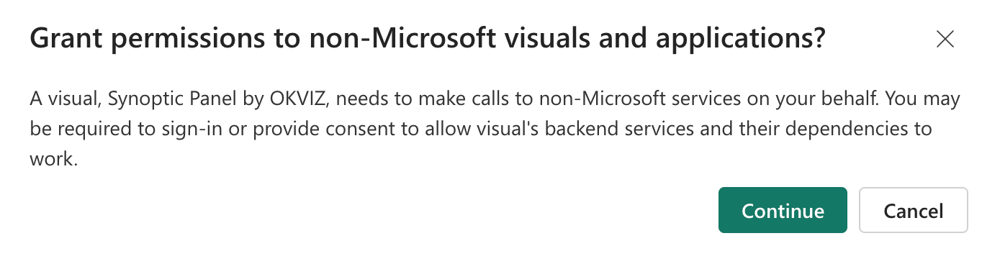

If you are using one of our visuals from AppSource with a [hybrid licensing](../index.md#a-third-option-hybrid-licensing) model, you must manually activate the OKVIZ license by granting access to your Microsoft Entra ID (formerly known as Azure Active Directory).

> **NOTE:** Smart Filter Pro doesn't support this activation method. If you use Smart Filter Pro from AppSource, you need to use the [Licensee Activation](licensee-activation.md) method.

## Activation Steps

1. Add the visual to your report from the AppSource marketplace.

2. When prompted, grant the visual access to your Entra ID. This authorization is necessary for tenant-level activation.

    

    

3. Click the ***Activate License*** button in the visual properties to open the license activation dialog.

4. Enter the ***Activation Key*** you received from OKVIZ and click ***Activate***.

    

5. The visual will now be activated and ready to use in any report of your Power BI tenant.

## Troubleshooting

The Entra token could be disabled in your organization, in which case you could see the following error message or the activation dialog may not appear at all.

If you encounter this issue, please ask your administrator to follow these steps:

1. Enable [AppSource Custom Visuals SSO](https://learn.microsoft.com/en-us/fabric/admin/organizational-visuals#appsource-custom-visuals-sso) option in the Power BI Admin Portal.

    

2. Allow users to consent permissions for apps from verified publisher in the [Microsoft Entra admin center](https://entra.microsoft.com/), under ***Identity > Applications > Enterprise Applications > User consent settings***.

    

3. At this point, you can either:

    - Allow users to consent to the permissions required by the application the first time they use it - [see above](#activation-steps).

    - Or you can grant admin consent for the application. To do that:

        1. Browse to ***Identity > Applications > Enterprise Applications > All Applications*** of the Entra admin center.
        2. Enter "OKVIZ" in the search box, and then select this application from the results:

            **App Name:** OKVIZ Licensing  
            **App (client) ID:** 0b9efea2-367e-45ec-bb42-6842d57039c9  
            **Directory (tenant) ID:** b41a4344-0bf1-4b4b-80d6-fd0f0ccb0613
            
            >> **IMPORTANT:** If the application does not appear in the list, it means that no user in your organization has authorized the visual to access Entra ID yet. This authorization is required at least once. To complete it, follow the instructions in the [Activation Steps](#activation-steps) section. Once authorized, the OKVIZ licensing application will be visible in the list.
        
        3. Go to ***Security > Permissions*** and review the permissions that the application requires. If you agree, select ***Grant admin consent***.

        For more information, see [Grant tenant-wide admin consent to an application](https://learn.microsoft.com/en-us/entra/identity/enterprise-apps/grant-admin-consent).
