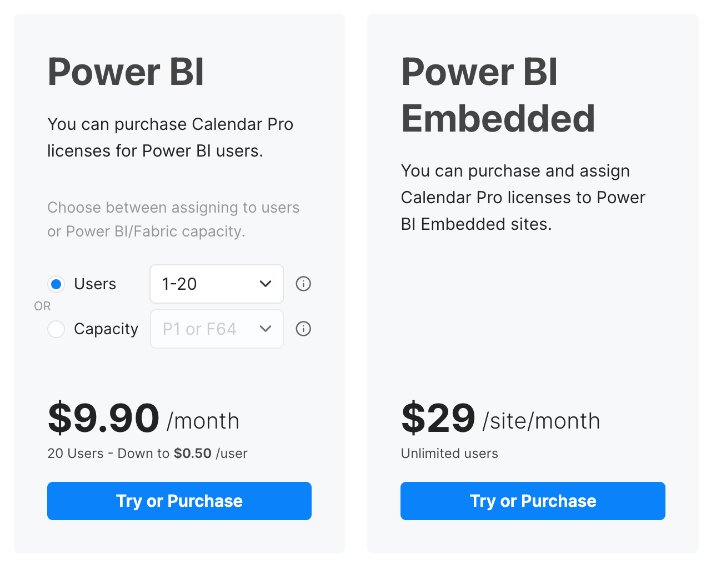
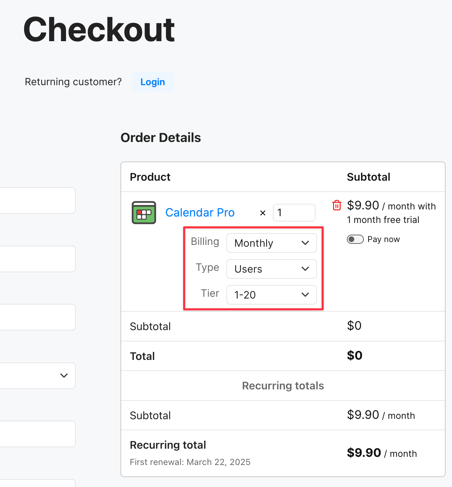
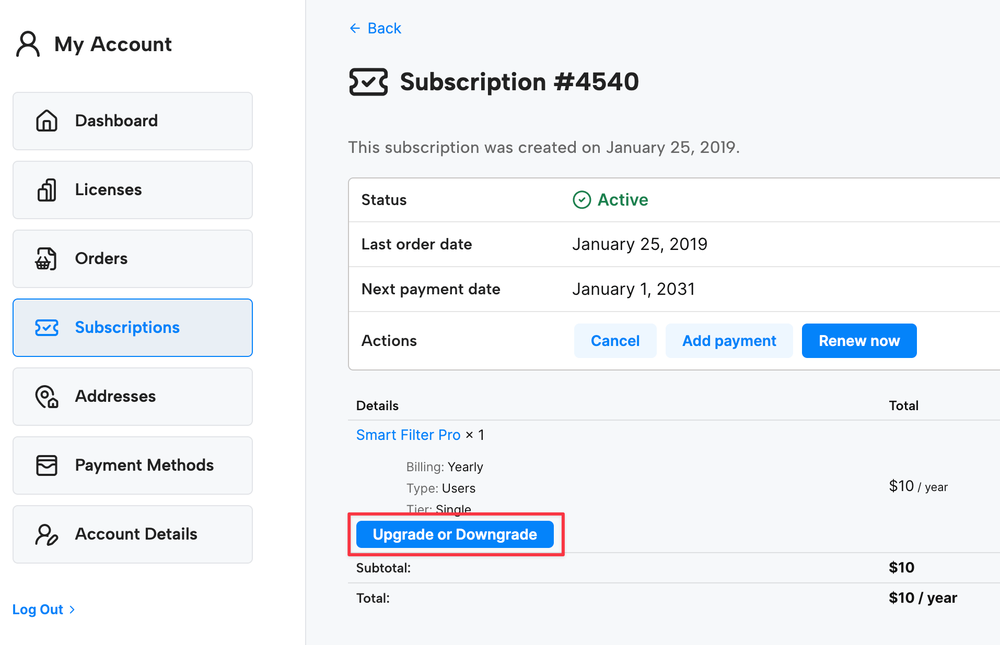
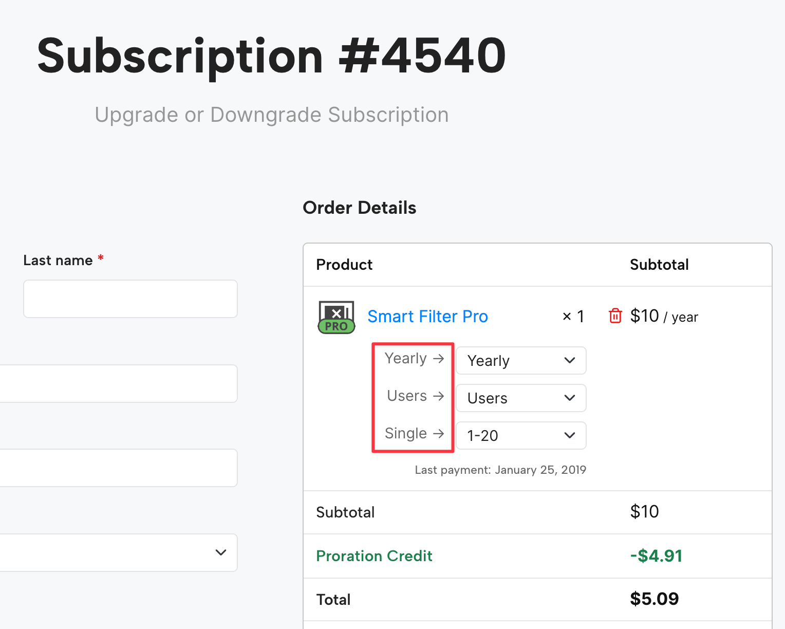
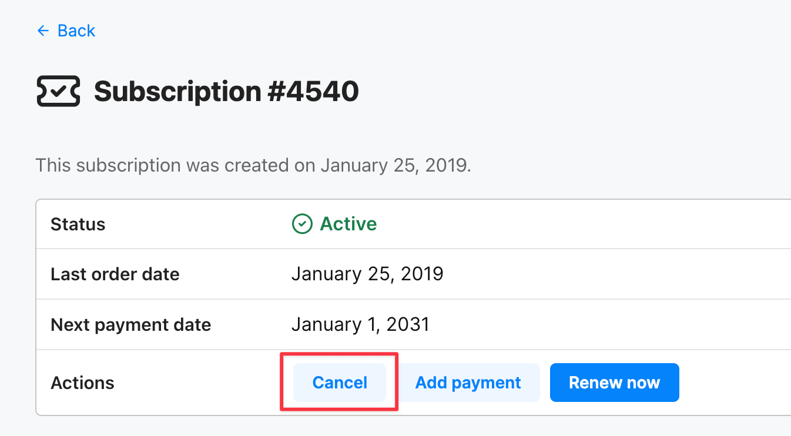

OKVIZ Licensing is a new licensing system available for all OKVIZ premium visuals from February 2025. This system is designed to provide a more flexible and user-friendly experience for our customers.

> **NOTE:** OKVIZ premium visuals also support the AppSource Licensing. See the [Licensing page](index.md) for more information.

This licensing is based on a subscription model, which allows you to purchase a license for a specific period of time (e.g., monthly or yearly).

We provide three different licensing models to fit your needs:

- **Per User**  
    This model is based on the number of users who will use reports containing the visual. To calculate the number of licenses required, simply **add up the number of people designing reports with those who will view them**. For example:

    | Designers  | Viewers  | Licenses Required |
    | ---        | ---      | ---               |
    | 1          | 0        | **1**             |
    | 10         | 40       | **50**            |
    | 10         | 750      | **760**           |

- **Per Capacity**  
    This model is design to mirror your current Power BI subscription capacity (for example, if you have a P1 node, you would purchase a P1 node license). This is ideal for organizations with a large number of users who do not want to manage individual licenses.

- **Per Site**  
    This model must be used with Power BI Embedded (not with regular Power BI reports published on Power BI Report Server or powerbi.com). It allows you to use the visual with an unlimited number of reports and users for a specific site.

## Purchase Licenses

You can purchase OKVIZ licenses directly from the [OKVIZ website](https://okviz.com/our-visuals/).

1. Visit the page of the OKVIZ visual you want to purchase a license for (e.g. [Calendar Pro](https://okviz.com/calendar-pro/)), choose the options the best fit your needs, and press the ***Try or Purchase*** button.

    

2. At the checkout page, choose the billing terms, confirm the selected options, and fill in the required information.

    

3. Complete the checkout by providing a valid payment method and confirming the purchase.

4. You will receive an email with the licensed visual file and instructions on how to import it in your Power BI reports.

## Activate Licenses

**For the majority of OKVIZ visuals, activation is not required.** The visual file you receive (via email or from your account dashboard) is already licensed and ready to use.

For specific visuals that support a [hybrid licensing](index.md#a-third-option-hybrid-licensing) model, the visual can installed from AppSource, but the OKVIZ license must be activated manually:

- [Smart Filter Pro Manual Activation](smart-filter-pro-manual-activation.md)
- [Synoptic Panel Manual Activation](synoptic-panel-manual-activation.md)

## Upgrade Licenses

Upgrading your OKVIZ licenses is a straightforward process:

1. Visit your [OKVIZ account dashboard](https://okviz.com/account), go to the ***Subscriptions*** section, select the subscription for the license you want to upgrade, and press the ***Upgrade or Downgrade*** button.

    

2. At the checkout, select new licensing options or increased capacity that meets your evolving needs. Confirm your selection and proceed to the payment (if applicable).

    

    > **NOTE:** the upgrade process is immediate and the new subscription period starts from the date of the upgrade. The remaining days of the previous period will be prorated and added as credit to your new subscription.

3. After the upgrade, you will receive an email with the updated visual file and instructions on how to import it in your Power BI reports. 
    >  **NOTE:** you do not need to re-import the visual in your reports if the visual can access the Internet to verify the license (no firewall restrictions).

## Cancel Subscription

If you wish to cancel your OKVIZ licensing subscription, please follow these steps:

1. Visit your [OKVIZ account dashboard](https://okviz.com/account), go to the ***Subscriptions*** section, select the subscription you want to cancel, and press the ***Cancel*** button.

    

The subscription will be cancelled at the end of the current billing period. The visual will continue to work until the end of the billing period, after which it will be disabled in your reports.