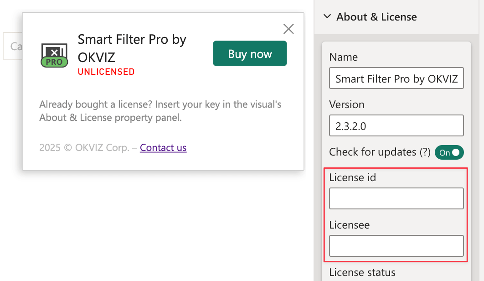

If you use Smart Filter Pro from AppSource, you have opted for a [hybrid licensing](../index.md#a-third-option-hybrid-licensing) model which requires manual activation of the OKVIZ license with the licensee information.

## Activation Steps

1. Add the visual to your report from the AppSource marketplace.

2. Open the visual properties by navigating to the **About & License** section, and set the following values:

   - **License Id:** Enter the license id you received from OKVIZ.
   - **Licensee:** Enter the licensee name provided by OKVIZ (this will include your email address).

    

>> **NOTE:** You must add the license details to the visual properties each time you add it to a new report. The visual will not function if the license is not activated.