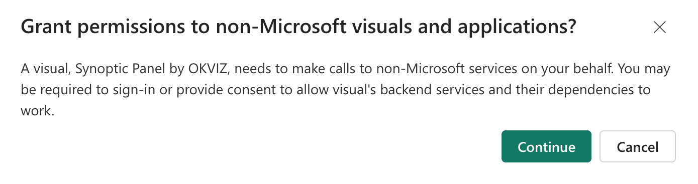
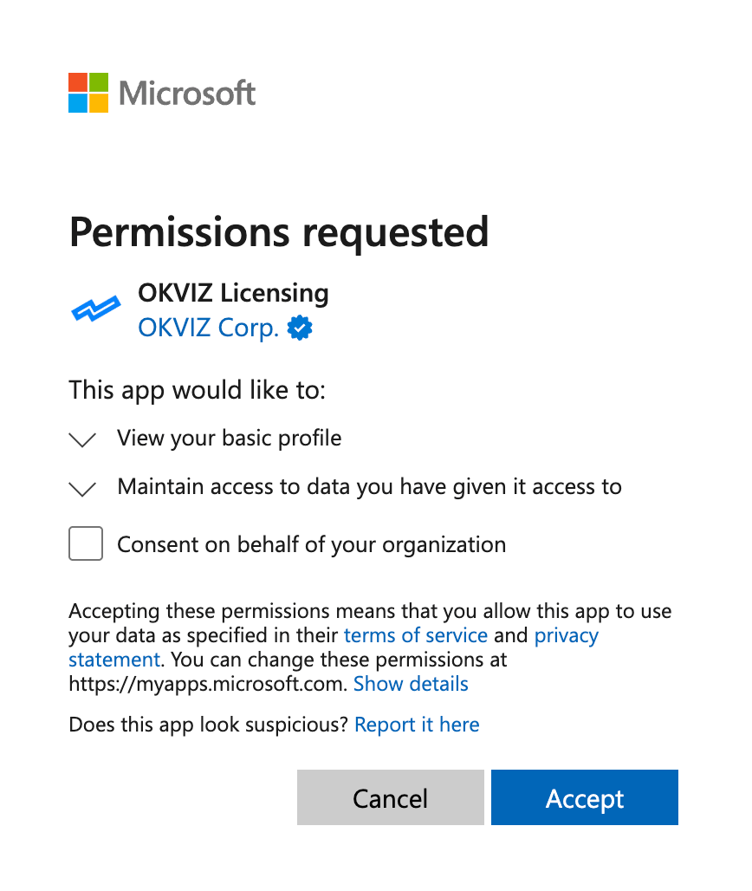
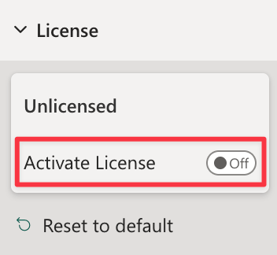
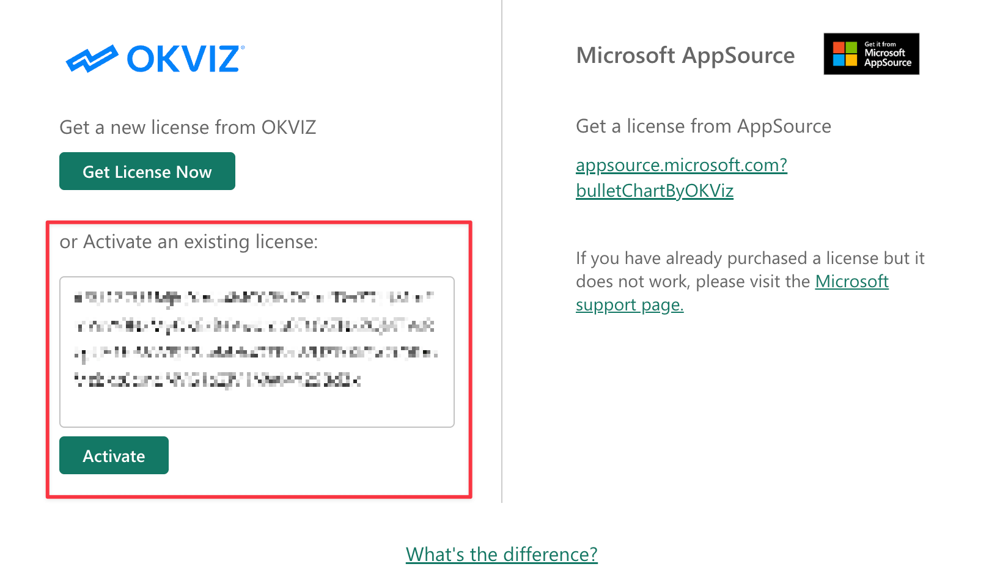

If you use Synoptic Panel from AppSource, you have opted for a [hybrid licensing](../index.md#a-third-option-hybrid-licensing) model which requires manual activation of the OKVIZ license.

## Activation Steps

1. Add the visual to your report from the AppSource marketplace.

2. When prompted, grant the visual access to your Entra token. This authorization is necessary for tenant-level activation.

    

    

    >> The Entra token could be disabled in your organization. If you encounter issues with the authorization or you don't see the dialog, please contact your tenant administrator.

3. Click the **Activate License** button in the visual properties to open the license activation dialog.

    

4. Enter the ***Activation Key*** you received from OKVIZ and click **Activate**.

    

5. The visual will now be activated and ready to use in any report of your Power BI tenant.