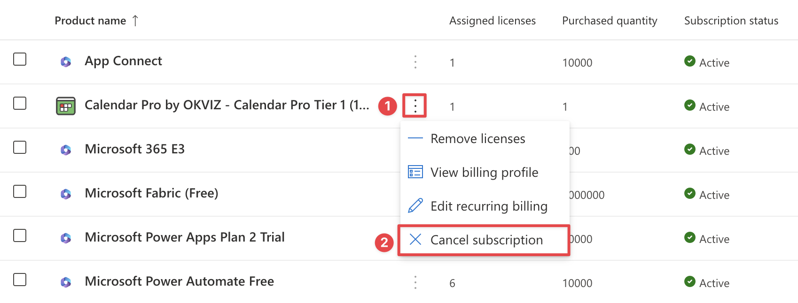
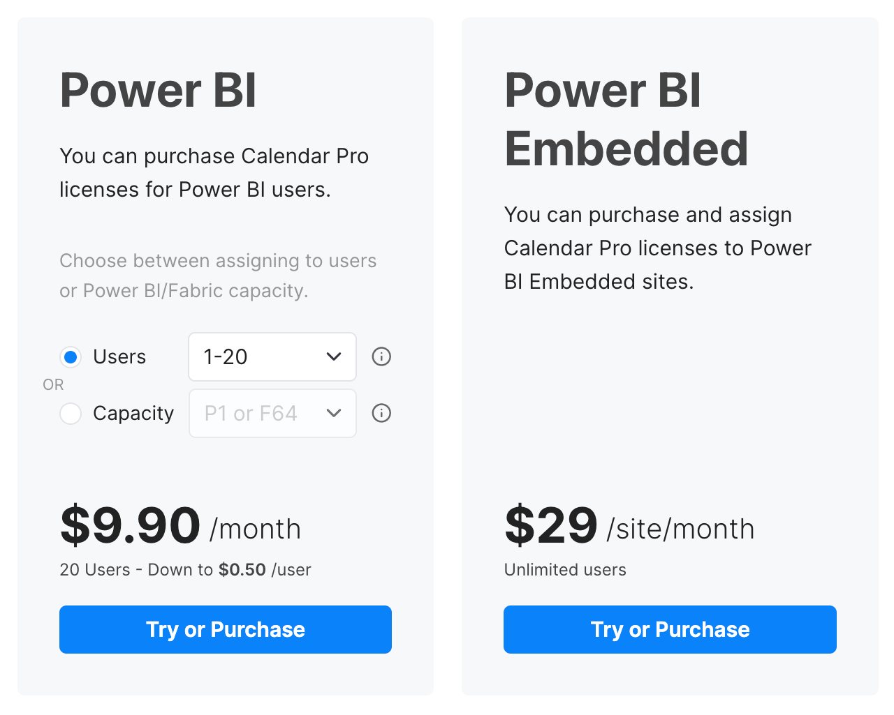

If you want to move from AppSource Licensing to OKVIZ Licensing, there is **no direct migration path**.
The two subscriptions are managed separately and cannot be converted automatically.

To switch licensing systems, you must:

1. Cancel the current AppSource subscription in Microsoft 365.
2. Create a new OKVIZ subscription for the same visual.

## 1. Cancel the AppSource Subscription

Follow these steps in the Microsoft 365 admin center:

1. Sign in to your [Microsoft 365 admin center](https://admin.microsoft.com/Adminportal/Home#/subscriptions).

2. On the navigation menu, select ***Billing*** > ***Your products***.

3. Find the row related to the OKVIZ visual you want to migrate, click the **ellipsis button**, then choose ***Cancel subscription***.

    

4. Follow the Microsoft flow to confirm the cancellation. Depending on your Microsoft billing account type and subscription status, Microsoft may either let you cancel immediately or only turn off recurring billing for the next renewal.

> For the current Microsoft guidance, see [Cancel your subscription in the Microsoft 365 admin center](https://learn.microsoft.com/en-us/microsoft-365/commerce/subscriptions/cancel-your-subscription?view=o365-worldwide).

## 2. Create the New OKVIZ Subscription

After you have cancelled the AppSource subscription, create a new subscription directly with OKVIZ:

1. Visit the [OKVIZ website](https://okviz.com/our-visuals/) and open the page of the visual you want to license.

2. Click ***Try or Purchase*** and complete the checkout with the licensing model that fits your scenario.

    

3. After the purchase, follow the instructions sent by OKVIZ to start using the licensed visual.

> For the full OKVIZ purchase flow, see [OKVIZ Licensing](../okviz/index.md).

## Important Notes

- The AppSource subscription and the OKVIZ subscription are independent. Billing history, assignments, and subscription state are not transferred between the two systems.
- If you still need uninterrupted access, plan the switch around the end of the current AppSource billing period.
- For visuals that use a hybrid OKVIZ activation flow, follow the activation instructions linked from the [OKVIZ Licensing](../okviz/index.md) page.
