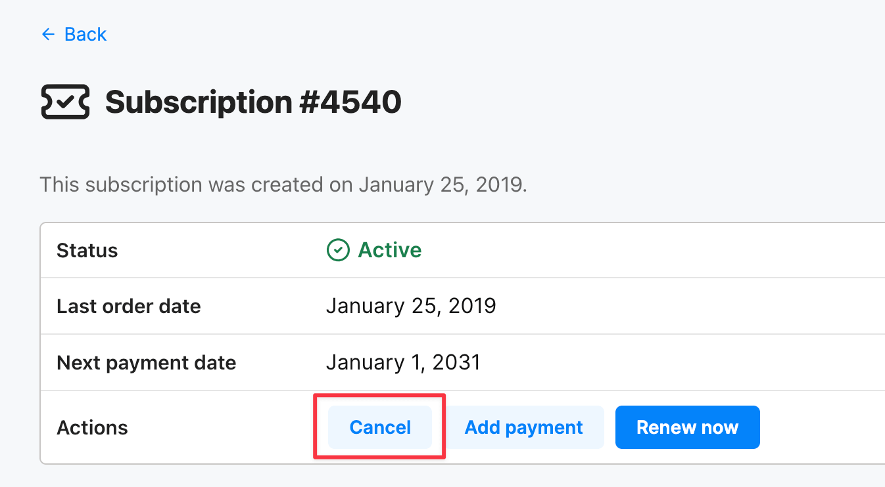
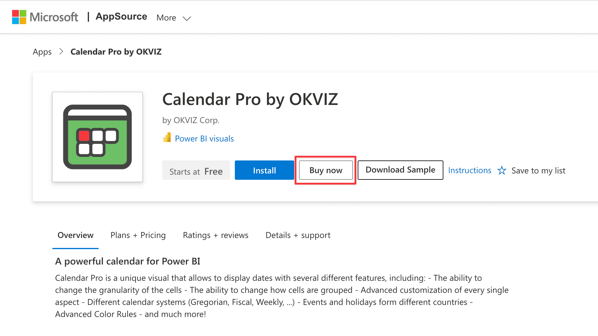
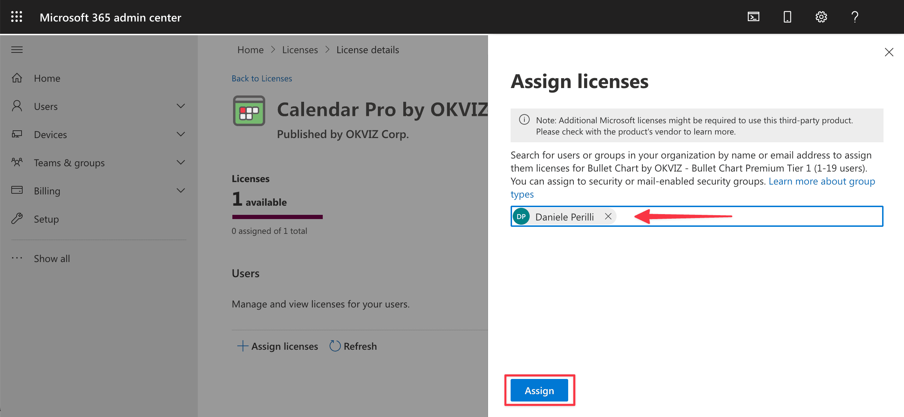

If you want to move from OKVIZ Licensing to AppSource Licensing, there is **no direct migration path**.
The two subscriptions are managed separately and cannot be converted automatically.

To switch licensing systems, you must:

1. Cancel the current OKVIZ subscription.
2. Create a new AppSource subscription for the same visual.

## 1. Cancel the OKVIZ Subscription

Follow these steps in your OKVIZ account:

1. Visit your [OKVIZ account dashboard](https://okviz.com/account), go to the ***Subscriptions*** section, select the subscription you want to cancel, and press the ***Cancel*** button.

> The subscription will be cancelled at the end of the current billing period.

## 2. Create the New AppSource Subscription

After you have cancelled the OKVIZ subscription, create a new subscription from AppSource:

1. Visit the AppSource page of the OKVIZ visual you want to license and click ***Buy now***.

    

2. Choose the billing terms and the number of users to license, then complete the Microsoft checkout.

3. After the purchase, assign the licenses to your users or groups from the Microsoft 365 admin center.

    

> For the detailed purchase and assignment steps, see [AppSource Licensing](../appsource.md).

## Important Notes

- The OKVIZ subscription and the AppSource subscription are independent. Existing OKVIZ subscription data is not transferred to Microsoft.
- AppSource Licensing is per-user, so users or groups must be assigned after the purchase.
- If you still need uninterrupted access, plan the switch around the end of the current OKVIZ billing period.
