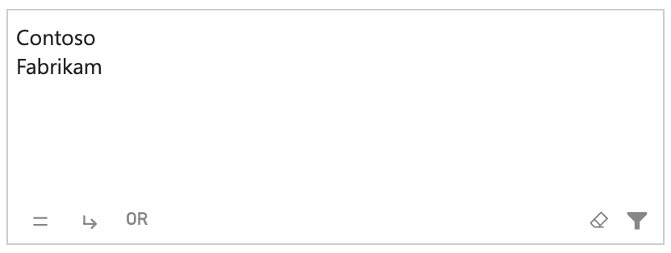

Search mode is the simplified version of the [Filter mode](filter.md). This working mode is faster and easier to use. It allows entering or pasting a long list of values and dynamic searching without sacrificing the overall performance. The Search mode allows to apply filters even automatically on typing.

The Search mode supports multiple fields, like the other modes, but only allows you to search for one field at a time. In case you connect multiple fields, a drop-down menu appears at the top of the visual from which you can select the field to search for.

<video src="images/search-mode-multiple.mp4" width="750" autoplay loop muted></video>

## How to Search

When [Matching](../options/mode/search-matching.md) is set to ***Advanced Query*** or ***Interactive***, Search mode uses the same core syntax described in [Filter mode](filter.md#how-to-search). The other matching modes intentionally restrict the syntax to a simpler behavior, such as case-insensitive exact match, contains, or starts-with searches.

## Differences between Search and Filter Modes

The Search and Filter modes share the same filter engine, the same query syntax and both allow you to change the logical operators/matching behavior either statically or interactively - the main differences concern the user interface. 

The unique features of the Search mode are:

- Makes it easy to enter **multi-line text** thanks to its large text area.
- Supports **pasting of thousands of values** simultaneously without sacrificing overall performance.
- **Does not transform the entered text into keywords** that you can only remove, but leaves it as is allowing for quick editing.
- Can **search as you type**, speeding up the whole process (see [Search on Typing](../options/mode/search-on-typing.md)).
