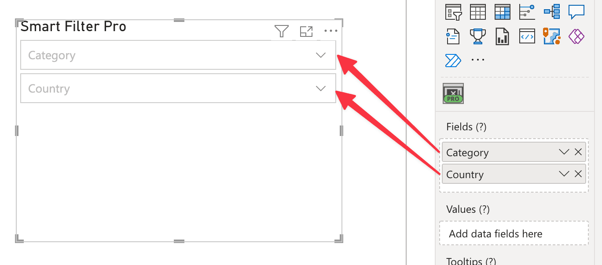
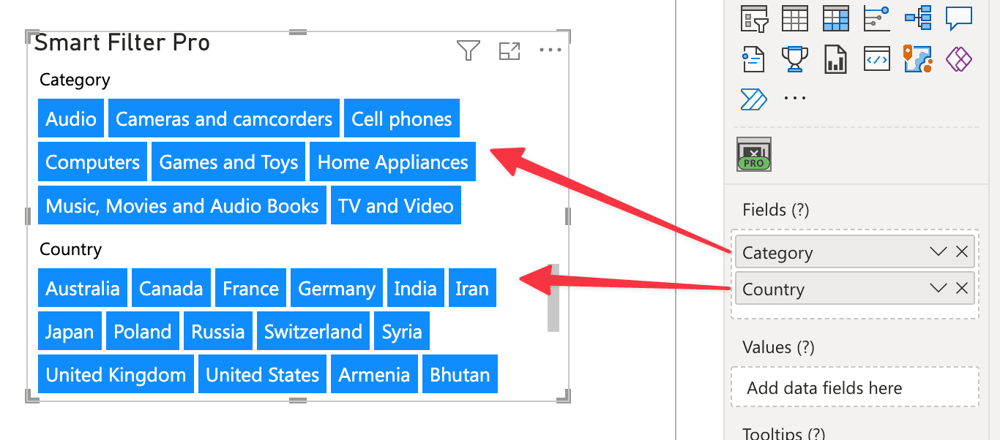
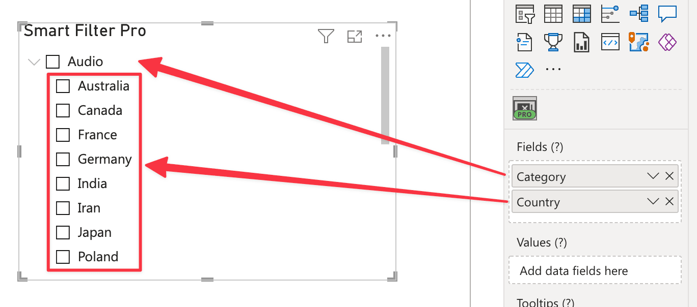

The ***Fields*** field is the main place where data fields need to be connected.

Each connected column is represented differently depending on the current mode:

- In **Dropdown** and **Filter** modes, each column is rendered as a separate input box.
- In **Search** mode, you can connect multiple fields, but the visual searches **one field at a time**. If more than one field is connected, a selector appears at the top of the visual.
- In **Observer** mode, each column is rendered as a separate set of items.
- In **Hierarchy** mode, each column becomes a hierarchy level/node.

