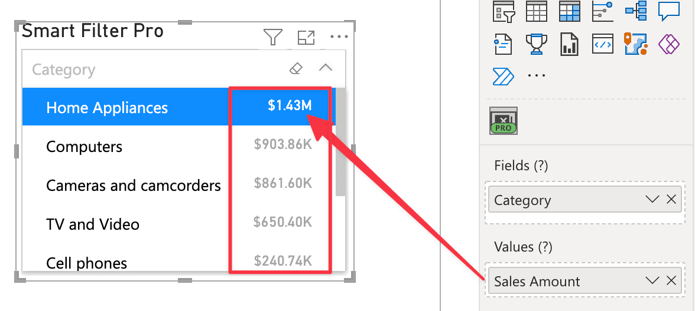

The ***Values*** field allows you to connect a measure to the visual that will be displayed along with the category fields.

This role is used only in **Dropdown**, **Observer**, and **Hierarchy** modes. It is ignored in **Filter** and **Search** modes.

For more information, see the [Values options section](../options/values/index.md).
