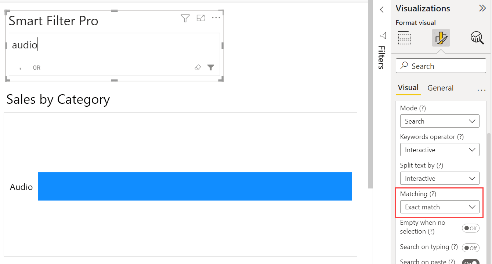
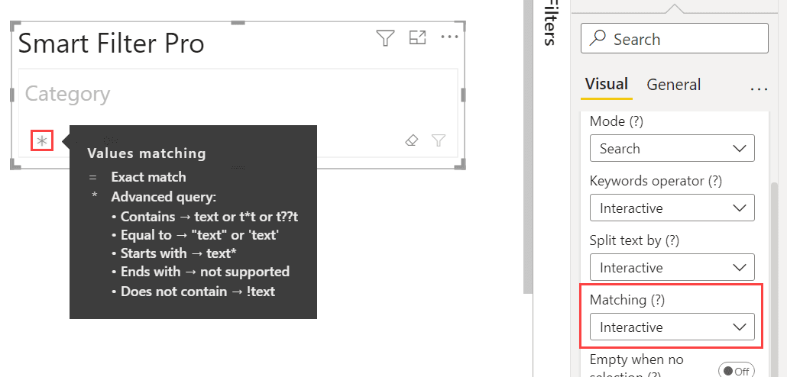

**Default value:** Interactive

This option allows you to define how the search is performed with the Search mode.

You can choose between: 
- [Exact Match](#exact-match)
- [Advanced Query](#advanced-query)
- [Contains](#contains-text-only)
- [Starts With](#starts-with-text-only)
- [Interactive](#interactive)

This feature is similar to the [Default Condition for Text](default-text-condition.md) of Filter mode, but introduces fundamental differences. 

## Exact Match

Let us say you want to filter with the Audio category. If you type `audio` and the Matching value is chosen as ***Exact Match***, then the results will be filtered displaying category that is exactly equal to ***audio***.

> Note that the search is always case insensitive.

## Advanced Query

If you choose ***Advanced Query*** as the matching value, then you can provide any keyword with wildcards to have more advanced search capabilities.

By default, Advanced Query behaves like a contains search: entering `audio` will match any item that contains the term `audio`. You can refine results with quotes for exact phrases, use ***!*** to exclude terms, and include wildcard characters to broaden matches.

> To learn the supported syntax, see: [How to Search in Search Mode](../../features/search.md#how-to-search)

Note that after activating this mode, you will be able to disallow the use of wildcards by unchecking the option [Allow Wildcards](./allow-wildcards.md) available in the same section.

## Contains (text only)

This options allows you to search for any keyword contained in the items. **No wildcards are supported in this mode.**

>> 2025-20-11: This is a deprecated option and will be removed in future versions. Please use ***Advanced Query*** mode with the option [Allow Wildcards](./allow-wildcards.md) disabled instead.

## Starts With (text only)

If you choose ***Starts With*** as the matching value, then you can specify any keyword to have items starting with that keyword.

> This works only for text fields.

## Interactive

If you choose ***Interactive*** as matching method, a toggle is displayed in the search box to switch from one mode to another even in [Reading View](../../../glossary.md#reading-and-editing-view). This means that not only the report designer can change the matching but also the end users.  
Moreover, the toggle shows a hover tooltip with a summary of the syntax you can use in both modes.

