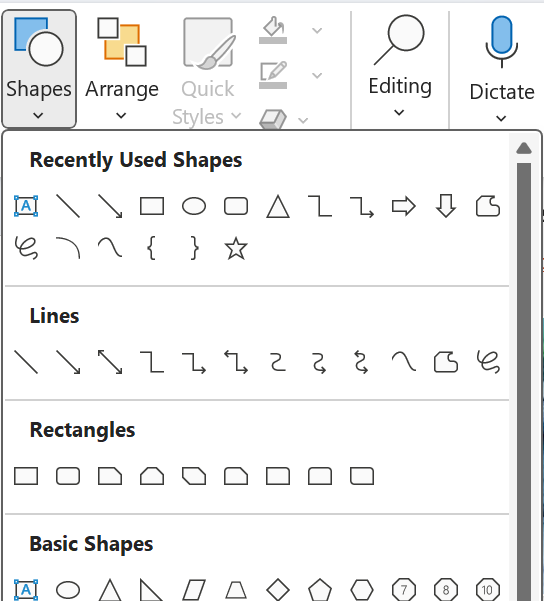
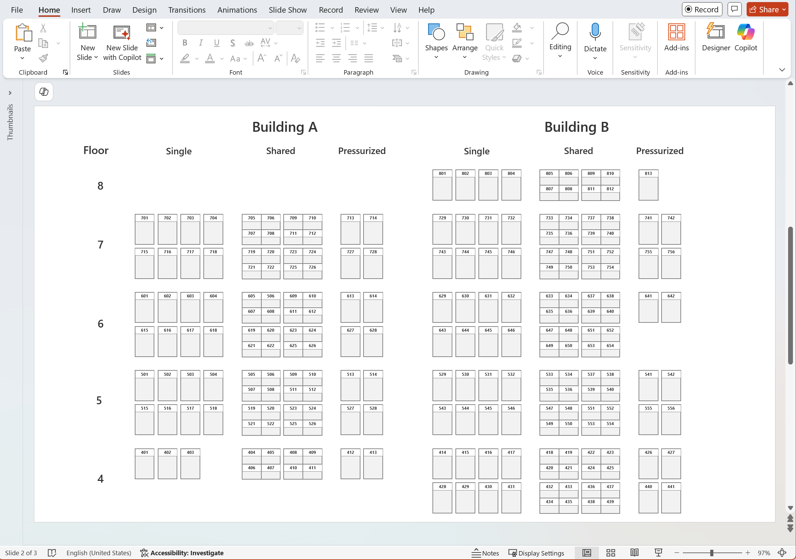
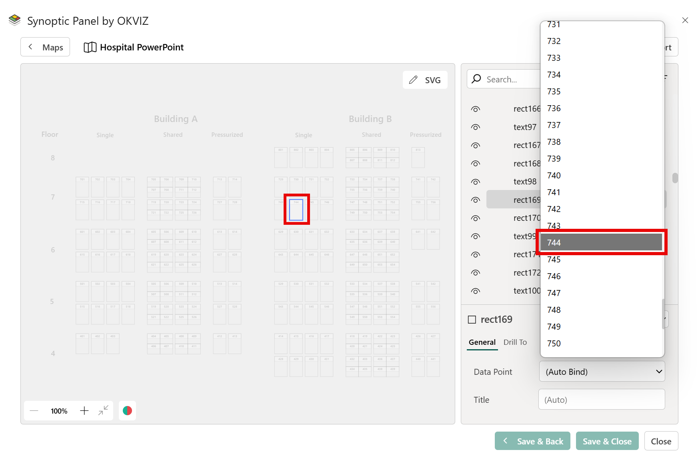

[PowerPoint](https://www.microsoft.com/en-us/microsoft-365/powerpoint?market=en) is primarily a presentation tool, but it includes a capable vector drawing engine. For simple layouts such as floor plans, rack diagrams, or schematic maps, you can draw shapes on a slide and export the slide as an SVG file that Synoptic Panel can render as a map.

This method is a good fit when you need a quick map and you plan to complete data binding inside Synoptic Panel. If the map has many areas, or if you want precise control over SVG identifiers for automatic binding, consider Figma or a dedicated vector editor instead.

## Build the map in PowerPoint

1. Create a new presentation and work on a single slide.
2. Set the slide size to match the aspect ratio you want in the report. This reduces extra whitespace and helps the map fill the visual.
3. Draw each interactive area as its own shape. Basic shapes such as rectangles, lines, and polygons export predictably.

As for demonstration purposes, the following ward floor-plan map was created using rectangles and text boxes.

Avoid overlapping areas whenever possible. Overlaps make selection harder and can produce unexpected click behavior in an interactive map.

Use a temporary fill color for each area shape. This does not affect the final coloring in Synoptic Panel, but it makes it much easier to see and select areas in the Map Editor

## Export the slide as SVG

Use PowerPoint’s Save As export, not “Save as Picture”.

1. Select **File**, then **Save As**.
2. In **Save as type**, choose **Scalable Vector Graphics Format (.svg)**.
3. Save the file. If PowerPoint prompts you to export one slide or all slides, select the single slide you used for the map.

Do not export by selecting all objects, then right clicking and using **Save as Picture**. That method can change coordinates and cause elements to shift, which can break alignment and selection in Synoptic Panel

## Bind shapes to data in Synoptic Panel

Synoptic Panel links your data to map areas. An area is an SVG shape, or a group of shapes, that you connect to a data point. Synoptic Panel can bind areas automatically when the SVG `id` matches your category values, or you can bind them manually in the Map Editor.

When you export from PowerPoint, the SVG usually does not keep the names you assigned to shapes, even if you renamed them in the Selection Pane. PowerPoint generates its own identifiers in the SVG, so automatic binding rarely works. In most cases, you will bind areas manually in the Map Editor.

Recommended steps:

1. Import the SVG into Synoptic Panel as a map.
2. Open the **Map Editor** and select an area either on the map canvas or from the Selection Tree. The Selection Tree lists SVG areas by their identifiers.
3. In the Interaction Pane, use the **Data Point** dropdown to assign the selected area to a specific value from your Categories column.
    

    
4. Repeat for each area you want to make interactive.
5. Select **Save and Close** to apply changes.

Tip: After completing manual binding, you can export the map with its binding configuration so you can re import it later without repeating the work.

## When to use Figma or other designing tool instead

PowerPoint is workable, but it becomes time consuming when you have many areas and you want automatic binding. Figma and other vector editors let you control layer and object names, which map directly to SVG ids when exported, making it easier to align ids with your Power BI category values.

For that workflow, follow the [OKVIZ guide for creating SVGs with Figma](./creating-svg-with-figma.md)
