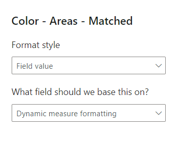

When creating interactive maps in Power BI using the Synoptic Panel, you might want users to switch between different metrics—such as sales, profit margins, or efficiency ratios—without changing the map itself. Achieving this can enhance user experience and simplify report maintenance. 

Below are two methods to accomplish this, along with their advantages and limitations.

## Method 1: Using Bookmarks

One common approach is to utilize [bookmarks](https://learn.microsoft.com/en-us/power-bi/create-reports/desktop-bookmarks?tabs=powerbi-desktop) in Power BI. This method involves creating separate maps for each metric you want to display. For instance, if you have metrics like "Margin USD," "Margin %," and "Efficiency Ratio," you would create a distinct map for each one. You then set up bookmarks to capture the state of each map, including its visual settings and filters.

Users interact with these bookmarks through buttons. When a user selects a metric, the corresponding bookmark is activated, and the map updates to display that metric. This gives the illusion of switching metrics on a single map, although, behind the scenes, different maps are being displayed.

While this method is relatively straightforward to implement for a small number of metrics, it has significant drawbacks. Each new metric requires creating an additional map and bookmark, which increases the maintenance workload. Any changes to the map's design or data require updating each individual map, as there is no synchronization between them. As the number of metrics grows, this approach becomes increasingly cumbersome and time-consuming.


## Method 2: Using Field Parameters

You can use [Field Parameters](https://learn.microsoft.com/en-us/power-bi/create-reports/power-bi-field-parameters) to let users switch between different measures (or columns) on a single Synoptic Panel. This approach avoids managing multiple maps or bookmarks. You create one parameter that holds all the metrics you want to show.

### How It Works

First, create a Field Parameter in your model that includes all the desired measures. Add a slicer to the report page using this new parameter.

On Synoptic Panel, use the Field Parameter to drive the data. When a user selects a metric from the slicer, the map updates to show data for that metric.

This method has clear benefits. You only need one map, which simplifies maintenance. Changes to the map design apply to all metrics at once. Users can quickly switch between different data views on the same chart.


### The Challenge of Conditional Formatting

There is one main challenge: conditional formatting.

Power BI's conditional formatting rules cannot be applied directly to a Field Parameter. **The rules bind to a specific column or measure name, not to the dynamic *result* of the parameter**.


### Solving for Conditional Formatting

You can solve this by creating a separate DAX measure that "wraps" the Field Parameter's selection. This new measure will check which metric (or column) is currently selected in the slicer and return its value.

Use a `SWITCH` function to do this:

```dax
Dynamic measure = 
SWITCH(MAX('Measure to choose'[Measure to choose]),
    "Margin USD", [Margin USD],
    "Margin %", [Margin %],
    [Efficiency Ratio]
)
```

This dynamic measure now holds the value of the selected metric. You can apply standard conditional formatting rules to this measure.


This works well, but it has one limitation: the same formatting rules (e.g., "color red if value < 25%") will apply to all metrics. This may not work if "Margin USD" and "Margin %" need different thresholds.

### Creating Dynamic Formatting Rules

If each metric needs its own unique formatting logic, you must create a second measure. This measure will contain the formatting logic itself. It will also use `SWITCH` to return the correct color based on the slicer selection.

Here is an example measure that returns a specific color code:

```dax
Dynamic measure formatting = 
VAR _MarginUSDFormatting = IF( [Margin USD] > 1e4, "#3CB44A", "#E6194B")
VAR _MarginPercFormatting = IF( [Margin %]> 0.3, "#3CB44A", "#E6194B")
VAR _EffRatFormatting = IF( [Efficiency Ratio]> 150, "#3CB44A", "#E6194B")
Return
SWITCH(max('Measure to choose'[Measure to choose]),
    "Margin USD", _MarginUSDFormatting,
    "Margin %", _MarginPercFormatting,
    _EffRatFormatting
)
```

This measure works in steps:

- **Variables (`VAR`)** define the color logic for each specific metric.
- The **`IF`** function checks that metric's value against its unique threshold and assigns a color.
- The **`RETURN`** statement uses `SWITCH` to check the slicer selection and return the correct color variable

To use this, go to Synoptic Panel's conditional formatting settings. Set the *Format style* to **Field value**. For the *Field* setting, select your `Dynamic measure formatting` measure.

Synoptic Panel will now use the color code returned by this measure.



### Benefits of This Approach

This method keeps all the logic in one place. Both the selected metric and its formatting logic are controlled by DAX measures.

Any changes to the map visual are applied to all metrics automatically. This makes the report easier to build, maintain, and expand with new metrics.
