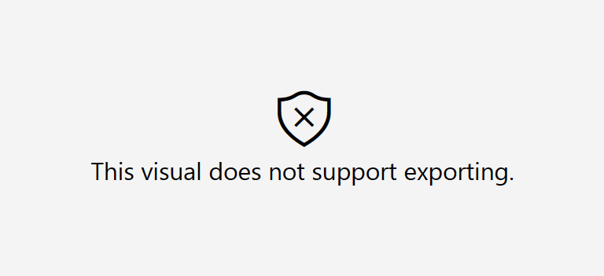
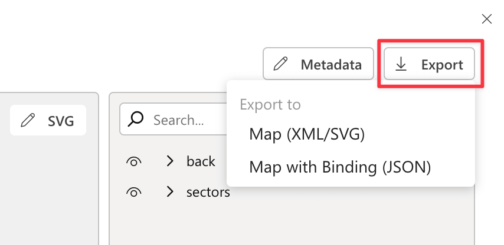
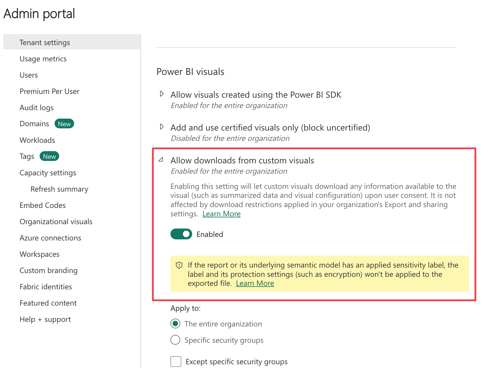

There are different exporting concepts in Power BI and Synoptic Panel.

## Exporting Reports to PDF or Power Point file

This is a feature of Power BI that allows you to export your report to a PDF or Power Point file. 

Unfortunately, **this feature is supported only by Synoptic Panel Lite**, since it's certified by Microsoft. If you try to export a report containing Synoptic Panel to a PDF or Power Point file, you will get a placeholder error where the visual was placed.

> Learn more in the [Microsoft Certification](../../certification.md) section.

## Exporting Maps to SVG or JSON

You can export maps and data from Synoptic Panel from the ***Export*** button of the [Map Editor](../features/map-editor/index.md). 

You can choose between two options:

- **Map (XML/SVG)**: you can export the map as an XML file. This file contains the original SVG code of the image, but you must rename the result file to **.svg** to open it in a browser or a graphic editor.
- **Map with Binding**: you can export the map as a JSON file. This file contains the SVG code of the image along with data binding information, such as the manually assigned IDs or any custom configurations you made in the Map Editor. **This file can be used to import the map back into Synoptic Panel.**

> **NOTE:** Exporting may be disabled in your organization. In this case, Power BI will not allow you to export the map and return an error message. To enable exporting, you need to go to the Power BI Admin Portal and change the setting **Tenant settings \ Power BI visuals \ Allow downloads from custom visuals**.

