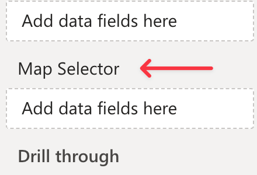
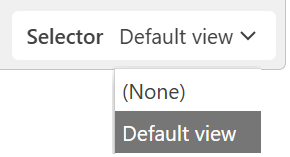
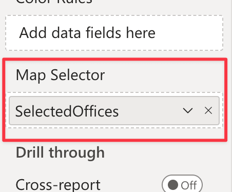
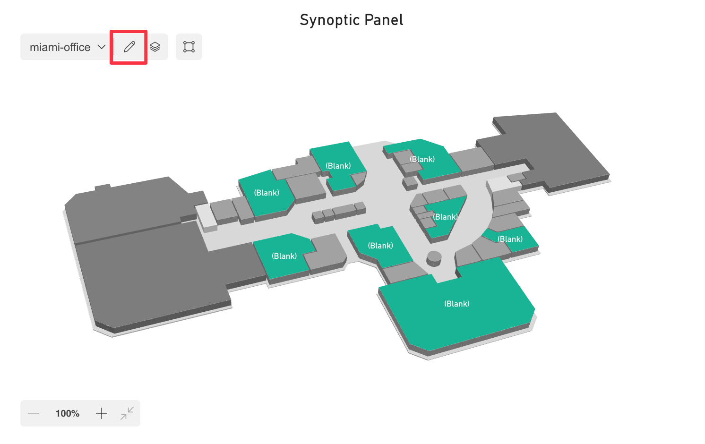
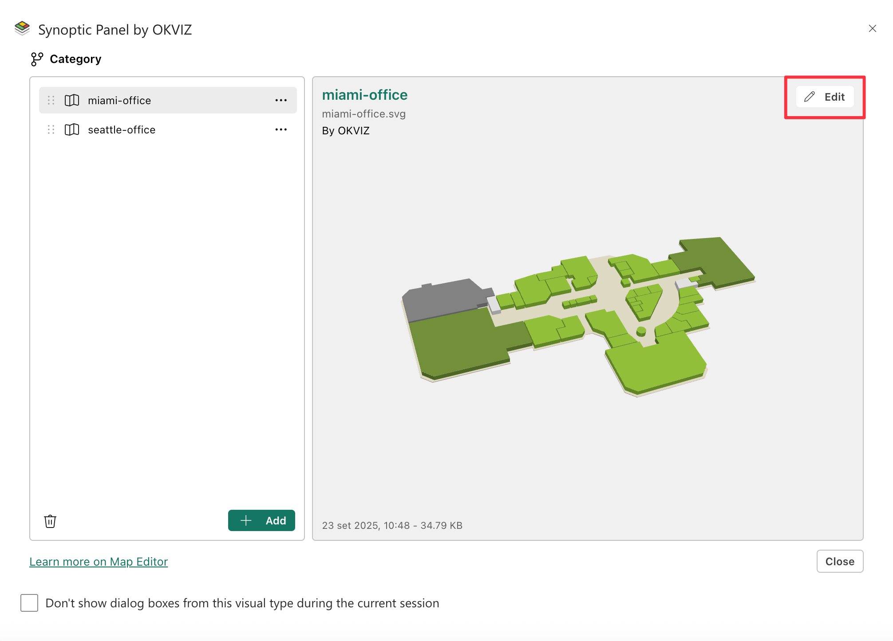
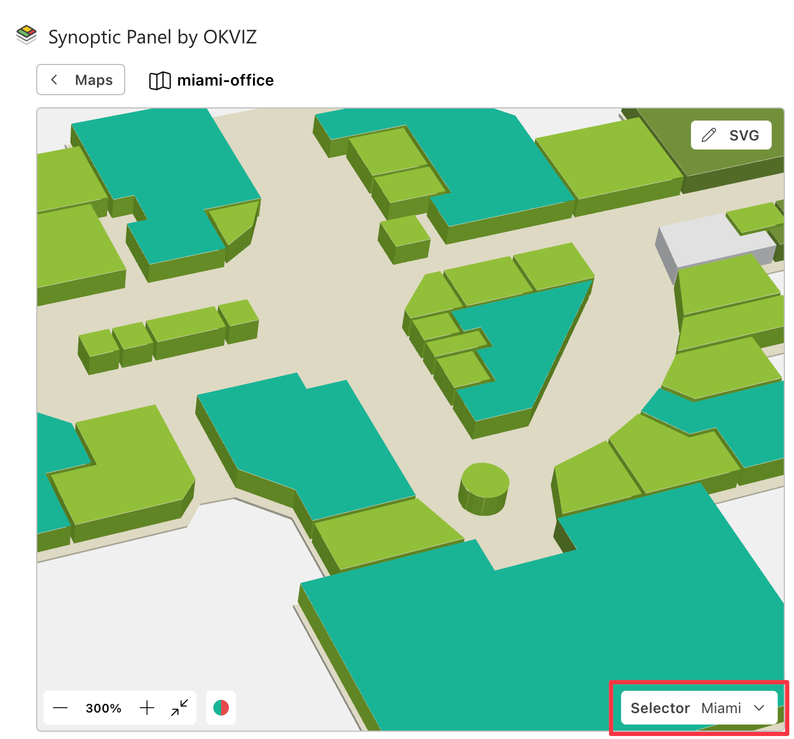
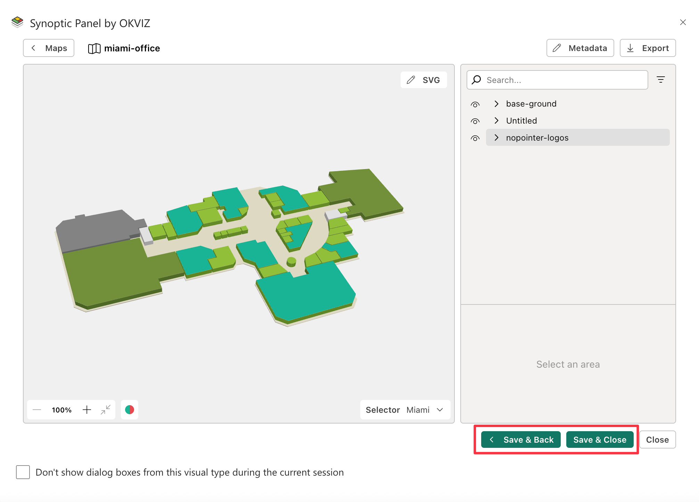

Synoptic Panel accepts a DAX measure in the **Map Selector** field well.



This measure should return a string consisting in the concatenation of reference values that will be associated to the maps you want to display. Internally, this string is split into individual references, using a [separator character](../../options/advanced-options/map-selector.md#separator) as defined in the visual settings.

For each map imported into Synoptic Panel, you can assign one of the references from the map selector using the [Map Editor](../../features/map-editor/edit-map.md#map), or directly in the JSON file when [importing multiple remote maps](../importing/index.md#adding-multiple-maps-from-a-json-file).

When the map selector measure returns a reference that matches one of the references assigned to the maps, the visual will display the corresponding map. If the measure returns a reference that doesn't match any of the maps, the visual will display a warning message.

In case of multiple matching maps, the visual will also display the dropdown list to let the user switch between them.

## Selector Measure

The map selector measure must be a DAX expression that returns a string. This string should contain the reference values that will be associated to the maps you want to display.

Assuming you have a table with the following columns and values:

<table>
    <tr><th colspan="3">OfficesTable</th></tr>
    <tr>
        <th>Office</th>
        <th>...</th>
        <th>...</th>
    </tr>
    <tr>
        <td>Miami</td>
        <td>...</td>
        <td>...</td>
    </tr>
    <tr>
        <td>New York</td>
        <td>...</td>
        <td>...</td>
    </tr>
    <tr>
        <td>Seattle</td>
        <td>...</td>
        <td>...</td>
    </tr>
</table>

The map selector measure could be defined as follows:

```dax
SelectedOffices = 
    CONCATENATEX(
        ALLSELECTED('OfficesTable'[Office]),
        'OfficesTable'[Office],
        "✄" // Separator character
    )
```

In this example, the measure returns a string with the names of the offices currently selected, separated by the character <span style="font-size:20px">✄</span>. Depending on your needs, you can replace the `ALLSELECTED` function with others, such as `VALUES`, to adjust how the map selector measure interacts with the context.

Remember to modify the table and column names according to your dataset.
>> **IMPORTANT**: The separator character must be the same as the one defined in the visual setting [Map Selector Separator](../../options/advanced-options/map-selector.md#separator).

### Add Default View

Synoptic Panel can show a default map when no specific item is selected. You can set this up by building a DAX measure that provides a "surrogate" value to the **Map Selector** field.

Create a measure with this pattern:

```dax
SelectedOffices =
    VAR vSelector =
        CONCATENATEX(
            ALLSELECTED('OfficesTable'[Office]),
            'OfficesTable'[Office],
            "✄" // Separator character
        )
    VAR vDefaultView = "Default view"
    Return
    IF( COUNTROWS(ALLSELECTED('OfficesTable'[Office])) = 1, vSelector, vDefaultView)
```

This measure ignores filters coming from Synoptic Panel itself. It uses `ALLSELECTED` to accomplish this. `ALLSELECTED` considers only the filter context *outside* the visual, such as from a slicer.

The measure checks the current external filter selection:

- **One item selected:** If `COUNTROWS(ALLSELECTED('OfficesTable'[Office]))` equals 1, the user has filtered for a single office. The measure returns that office's name.
- **Zero or many items selected:** If the count is greater than 1, the measure returns the hardcoded text "Default view".

Synoptic Panel receives the result of this measure in its **Map Selector** data field. The text "Default view" is treated just like any other value from your column.

The **Map Selector** setting will only display one reference value at a time.

- When no selection is active (or multiple are active), the measure feeds "Default view" to the visual.
- When a single selection is active, the measure feeds that specific value (e.g., "Main Office") to the visual.

This logic ensures Synoptic Panel always has a single, valid map name to display.

Please note that only one reference value will be displayed in the map selector section at a time.



## Assigning References to Maps

To assign a reference to a map, follow these steps:

1. Create the map selector measure as described above.

2. Bind the measure to the [Map Selector field well](../../fields/map-selector.md).

    

3. Load a map into Synoptic Panel, if you haven't already.

4. Open the **Map Editor** by clicking the pencil button in the visual toolbar (proceed to the next step if you have just uploaded a map).
    

5. Select a map and click the ***Edit*** button.
    

6. In the Map Editor, choose the reference value that will be associated with the map from the dropdown list in the **Map Selector** section.
    

7. Click ***Save*** to apply the changes.
    

Repeat these steps for each map you want to associate with a reference.

After assigning the references, the visual will display the corresponding map when the map selector measure returns a matching reference.
