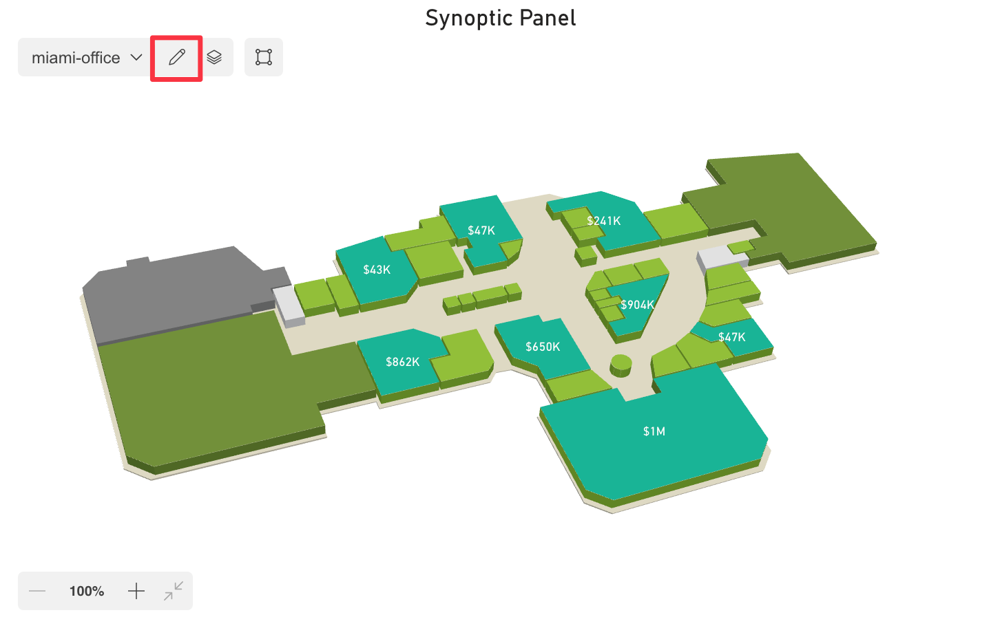

Synoptic Panel accepts a DAX measure in the **Map Selector** field well.


This measure should return a string consisting in the concatenation of reference values that will be associated to the maps you want to display. Internally, this string is split into individual references, using a [separator character](../../options/advanced-options/map-selector.md#separator) as defined in the visual settings.

For each map imported into Synoptic Panel, you can assign one of the references from the map selector using the [Map Editor](../../features/map-editor/edit-map.md#map), or directly in the JSON file when [importing multiple remote maps](../importing/index.md#adding-multiple-maps-from-a-json-file).

When the map selector measure returns a reference that matches one of the references assigned to the maps, the visual will display the corresponding map. If the measure returns a reference that doesn't match any of the maps, the visual will display a warning message.

In case of multiple matching maps, the visual will also display the dropdown list to let the user switch between them.

## Selector Measure

The map selector measure must be a DAX expression that returns a string. This string should contain the reference values that will be associated to the maps you want to display.

Assuming you have a table with the following columns and values:

<table>
    <tr><th colspan="3">OfficesTable</th></tr>
    <tr>
        <th>Office</th>
        <th>...</th>
        <th>...</th>
    </tr>
    <tr>
        <td>Miami</td>
        <td>...</td>
        <td>...</td>
    </tr>
    <tr>
        <td>New York</td>
        <td>...</td>
        <td>...</td>
    </tr>
    <tr>
        <td>Seattle</td>
        <td>...</td>
        <td>...</td>
    </tr>
</table>

The map selector measure could be defined as follows:

```dax
SelectedOffices = 
    CONCATENATEX(
        ALLSELECTED('OfficesTable'[Office]),
        'OfficesTable'[Office],
        "✄" // Separator character
    )
```

In this example, the measure returns a string with the names of the offices currently selected, separated by the character <span style="font-size:20px">✄</span>. Depending on your needs, you can replace the `ALLSELECTED` function with others, such as `VALUES`, to adjust how the map selector measure interacts with the context.

Remember to modify the table and column names according to your dataset.
>> **IMPORTANT**: The separator character must be the same as the one defined in the visual setting [Map Selector Separator](../../options/advanced-options/map-selector.md#separator).

### Add Default View

To visualize a default map when no selection has been made, create an artificial surrogate level directly in the map selection measure.

```dax
SelectedOffices = 
    VAR vSelector =    
        CONCATENATEX(
            ALLSELECTED('OfficesTable'[Office]),
            'OfficesTable'[Office],
            "✄" // Separator character
        )
    VAR vDefaultView = "Default view"
    Return
    IF( ISFILTERED('OfficesTable'[Office]), vSelector, vDefaultView)
```

When `ISFILTERED` evaluates to ***False***, Synoptic Panel receives the text *“Default view”*. Then, in the Map Selector section, *“Default view”* will appear as any other physical value from the column.


Please note that only one reference value will be displayed in the map selector section at a time. When there is no selection made (for example, when no slicer selection is active), “Default view” will be shown. Once a selection is made, the corresponding reference value will appear in the map selector section. This change is due to the selector measure, which will display “Default view” when there are no selections, rather than showing all reference values.

## Assigning References to Maps

To assign a reference to a map, follow these steps:

1. Create the map selector measure as described above.

2. Bind the measure to the [Map Selector field well](../../fields/map-selector.md).

    

3. Load a map into Synoptic Panel, if you haven't already.

4. Open the **Map Editor** by clicking the pencil button in the visual toolbar (proceed to the next step if you have just uploaded a map).
    

5. Select a map and click the ***Edit*** button.
    

6. In the Map Editor, choose the reference value that will be associated with the map from the dropdown list in the **Map Selector** section.
    

7. Click ***Save*** to apply the changes.
    

Repeat these steps for each map you want to associate with a reference.

After assigning the references, the visual will display the corresponding map when the map selector measure returns a matching reference.
