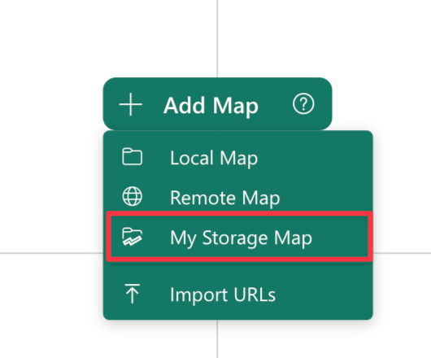
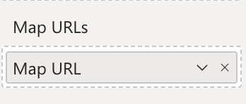

You can import various type of maps in Synoptic Panel. Depending on map type, the import process — whether for a single map or multiple maps — may vary slightly. However, in each case, the procedure is straightforward.

> Remember that we call ***maps*** the SVG files that you import into Synoptic Panel and they are not limited to geographical representations; they can be any kind of design that you want to use to visualize your data.

There are different sources from which you can import maps:

- [Local Maps](#local-maps): maps from your computer
- [Remote Maps](#remote-maps): maps from remote websites
- [My Storage Maps](#my-storage-maps): maps stored in your My Storage
- [Map URLs Column](#map-urls-column): maps from a column containing URLs

>> **NOTE**: Only [Synoptic Panel with an OKVIZ license](../../../licensing/index.md) supports remote maps, My Storage maps, and map URLs from a column. Synoptic Panel Lite supports local maps only.

## Before Importing

First of all, connect the visual to the report if you have not done so already. Then connect a field to the [Categories](../../fields/categories.md) field well. This is essential because each map is linked to a specific column (or hierarchical level) identifier, referred to as the [Drill Path](../../features/drill-mode.md#the-drill-path).

> Refer to the [Getting Started](../../get-started/index.md) section for detailed instructions.

There are two ways to load maps into Synoptic Panel, depending on the current condition of the visual:

- **If the visual has no maps or there are no maps on the current drill path**.

    You can directly click the ***Add Map*** button within the visual and choose the type of map you want to import. When no maps are connected, the button is located at the center of the visual, otherwise it is in the top-left corner.

    

- **If the current drill path already has a map connected**.

    You need to click on ***Edit icon*** in the visual toolbar, which will open the [Map Editor](../map-editor/index.md). In the Map Editor, you can click the ***+ Add*** button and choose the type of map you want to import.

    

## Importing Maps

Once you have setup the visual, you can proceed with the import process. The following sections provide detailed instructions for each type of map.

### Local Maps

To import maps located on your computer into Synoptic Panel, follow these steps:

1. Click ***+ Add Map*** and select the ***Local Map*** element.

    

    If you have already loaded a map, you can click the ***+ Add*** button in the [Map Editor](../map-editor/index.md) dialog or drag and drop the files directly into the map list there.

2. Select one or more files from your local machine.

### Remote Maps

To load a remote map into Synoptic Panel, follow these steps:

1. Click ***+ Add Map*** and select the ***Remote Map*** element.

    

    If you have already loaded a map, you can click the ***+ Add*** button in the [Map Editor](../map-editor/index.md) dialog.

2. Enter the URL of the map and click ***Ok***.

    

>> **IMPORTANT**: Remote maps must satisfy specific requirements to be imported into Synoptic Panel. Check the [Hosting Requirements](./hosting-requirements.md) section for more information.

#### Adding Multiple Maps from a JSON File

For adding multiple URLs at once, you can import a JSON file containing a list of maps along with their properties.

1. Click ***+ Add Map*** and select the ***Import URLs*** element.

    

    If you have already loaded a map, you can click the ***+ Add*** button in the [Map Editor](../map-editor/index.md) dialog.

2. Select the JSON file containing the list of maps you want to import.

    The JSON file must contains a similar structure:

    ```json
    [
        {
            "url": "https://example.com/map1.svg",
            "name": "Map 1",
            "mapSelector": "Store1",
            "drillPath": ["Category"]
        },
        {
            "url": "https://example.com/map2.svg",
            "name": "Map 2",
            "mapSelector": "Store2",
            "drillPath": ["Category", "Sector"]
        },
        ... // Other maps
    ]
    ```

    Here is a description of the fields:

    - **url**: The URL of the map file.
    - **name**: *(Optional)* The name of the map. This is the name that will be displayed in the visual. If not provided, the name of the file will be used.
    - **mapSelector**: *(Optional)* The value of the column bound as map selector. This is the column that will be used to switch between the maps. See more in the [Filtering Maps](../../features/filtering-maps/index.md) section.
    - **drillPath**: *(Optional)* This is an array of values used to build the **Drill Path**, which represent the drill level of the visual. This is a useful way to quickly assign different maps to different levels, but requires to know the exact values of the drill path components. See how the drill path is built in the [Drill Mode](../drill-mode.md#the-drill-path) section.
    If not provided, each imported URL will be assigned to the current drill level.

        > Note the Drill Path is displayed as a breadcrumb in the visual header. To define the `drillPath` value for the import file, you need to concatenate the single elements of the breadcrumb in the same order as they appear in the visual.  
        E.g. `Category > Sector` becomes `["Category", "Sector"]`.

### My Storage Maps

My Storage is a feature that gives a limited amount of storage space on OKIVIZ servers to store maps that can be used in Synoptic Panel. For more information, see the [My Storage](../../features/my-storage.md) section.

To load a map from My Storage, follow these steps:

1. Click ***+ Add Map*** and select the ***My Storage Map*** element.

      

    If you have already loaded a map, you can click the ***+ Add*** button in the [Map Editor](../map-editor/index.md) dialog.

2. [Connect one or more maps](../../features/my-storage.md#connecting-maps-to-the-visual) to the visual.

### Map URLs Column

Maps can also be loaded from a remote hosting using a column containing the URLs of the maps. This is useful when you want to switch between maps based on a specific column value, as specified in the [Filtering Maps](../../features/filtering-maps/index.md#map-urls-column) section.

To load maps from a column, follow these steps:

1. Prepare a dataset with a column containing the URLs of SVG files, or the URLs of the maps stored in My Storage ([see more here](./maps-from-my-storage.md)).

2. Bind the column to the ***Map URLs*** field well.

    

> **IMPORTANT**: Map URLs must satisfy specific requirements to be loaded into Synoptic Panel. Check the [Hosting Requirements](./hosting-requirements.md) section for more information.

## Replace a Map

In Synoptic Panel, you can update an SVG map file while preserving the [manual data binding](../../concepts/data-binding.md) already established. This can be useful when modifying a design, adding elements, or updating shapes.


When replacing a map, there are some considerations to keep in mind to avoid potential issues:

- **ID Attribute and Data Binding**

    Synoptic Panel relies on its [Auto Id Assignment](../../concepts/auto-id-assignment.md) system to ensure unique IDs to areas of the map that lack predefined `<id>` attributes. If you replace the map with an updated SVG, issues may arise only when the following conditions occur:

    - **Original SVG without predefined Ids**: If the previous map had areas without predefined `<id>` attributes, Synoptic Panel generated IDs automatically for those areas.

    - **New SVG without redefined Ids**: If the updated SVG also has areas without predefined `<id>`  attributes, the Auto Id Assignment process may assign new IDs in a different order, especially if areas are added, removed, or reordered in the new file.

    This could result in a mismatch between the existing data binding and the updated map because the assigned Ids in the new SVG may no longer align with the original ones.

- **Best Practices**

    To ensure smooth replacements and maintain data bindings:

    - **Assign Ids in the SVG**: Whenever possible, define `<id>` attributes for all areas in the SVG before uploading it to Synoptic Panel. This prevents the Auto Id Assignment process from running and ensures that Ids remain consistent across updates.
    - **Avoid Auto Id Dependency**: If your original map relied on Auto Ids, be cautious when updating the SVG. Removing or reordering shapes can disrupt the Id sequence and cause bindings to break.
    - **Incremental Changes**: When modifying an SVG, avoid introducing or removing shapes that could shift the order of automatically generated Ids. Instead, preserve the structure and sequence of the original map.

## Memory Considerations

Memory usage should be considered when importing maps into Synoptic Panel:

- When importing a local map, the file is embedded within the Power BI report, increasing the report's size and potentially affecting performance.

- Remote maps and My Storage maps, instead, are loaded dynamically from the web the first time they are accessed, but they still consume the browser memory, so having maps with large file sizes can slow down the report.

To avoid performance issues, there are some limitations on the size of the maps that can be imported into Synoptic Panel - check [Maps Limits](../../concepts/best-practices.md#performance--limits) for more information.
