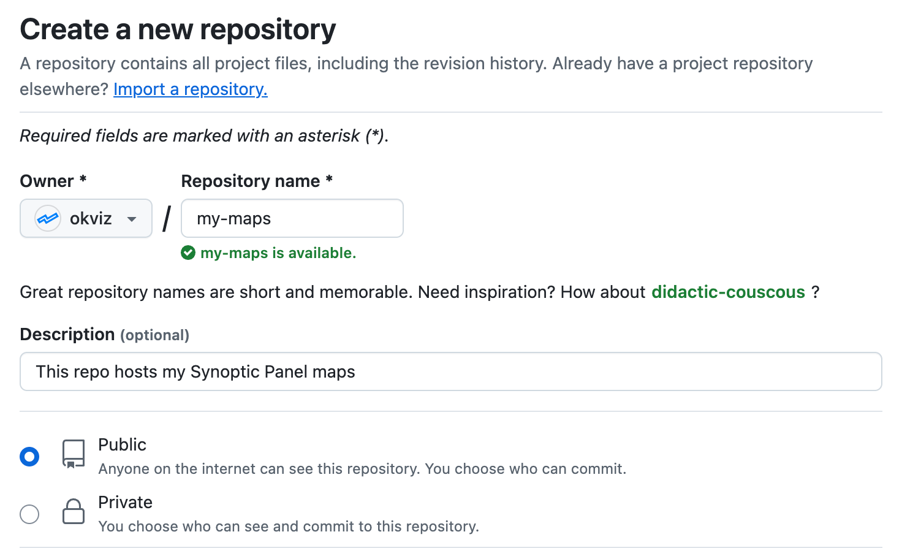
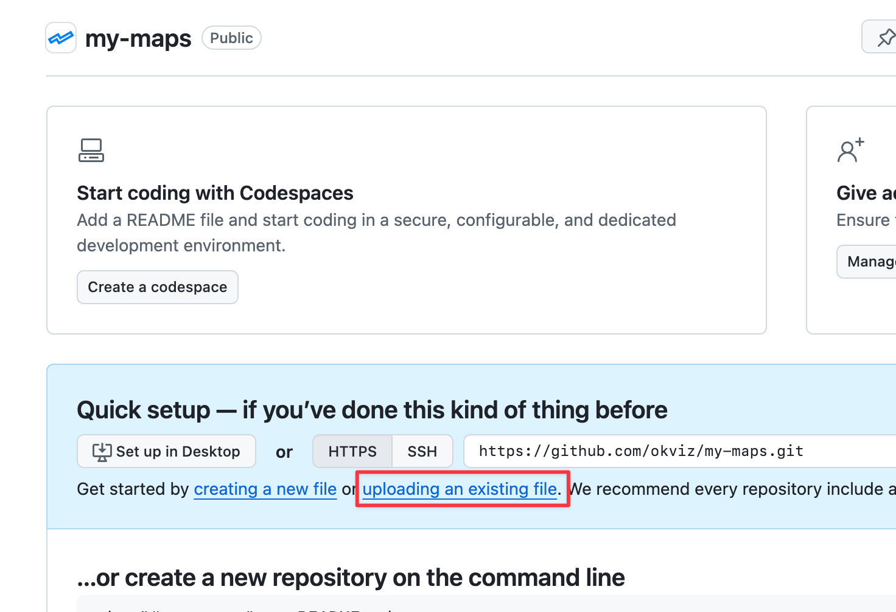
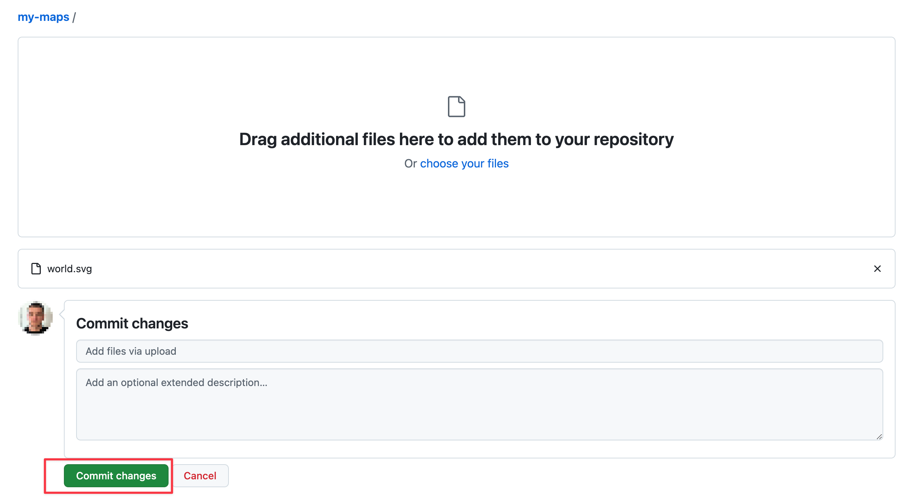
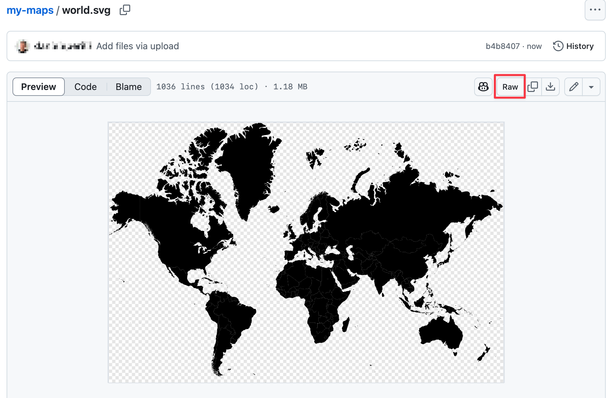

Synoptic Panel allows you to load custom maps hosted on the web, but with an important requirement: the hosting service must allow [cross-origin requests from any origin](./hosting-requirements.md#what-is-cors). This requirement is a stopper for most cloud services, but **GitHub** is an exception as it supports it by default.

Also, GitHub provides a **free hosting service for static files up to 1GB**, which makes it a perfect choice for hosting your maps.

Follow the steps below to setup a new repository and use it with Synoptic Panel.

## 1. Create a GitHub Repository

First, you need to [create a new account on GitHub](https://github.com/signup) if you don't have one. Then, [create a new **public** repository](https://github.com/new) to host your maps.

>> **ATTENTION:** Private GitHub repositories are not supported by Synoptic Panel, so your maps can only be hosted in a public repository, accessible to everyone.

## 2. Upload Your Maps to GitHub

Now you need to upload your SVG map files to the repository. Follow these steps:

1. Go to the repository start page and click on the ***uploading an existing file*** link.

    

2. Drag and drop your SVG map files to the upload area or click on the ***choose your files*** link, then click on the ***Commit changes*** button.

    

> If you are familiar with Git, you can also clone the repository to your local machine and use VS Code or any other Git client to upload the files easily.

## 3. Get the URLs

After uploading your files, you can navigate the repository to get the URLs of each map. To do this, click on a SVG file to open it, and then click on the ***Raw*** button to get the URL of the file.

Example URL:

    https://raw.githubusercontent.com/okviz/my-maps/refs/heads/main/geo/world.svg

## 4. Add the URLs to Synoptic Panel

Now that you have the URLs of your maps, you can add them to Synoptic Panel in two ways:

- **Add the URLs to your dataset**: Create a new column in your dataset and paste the URLs of the maps. Then, bind this column to the [Map URLs field well](../../fields/map-urls.md) in Synoptic Panel.

- **Add the remote maps directly**: Add each map directly using the [Add Remote Map](../importing/index.md#remote-maps) feature or [import multiple maps from a JSON file](../importing/index.md#adding-multiple-maps-from-a-json-file).

&nbsp;

*That's it* – Now you can use your maps hosted on GitHub in Synoptic Panel.
