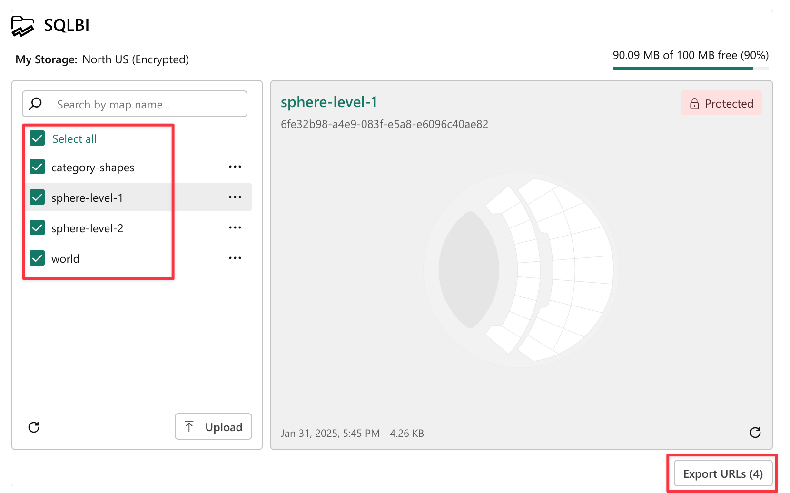

Every map stored in [My Storage](../my-storage.md) has a unique URL that can be added to a data column and bind it to the [Map URLs field well](../filtering-maps/index.md#map-urls-column) of Synoptic Panel to display the maps according to the current filters.

This guide will show you how to add these URLs to your dataset and use them to make your reports more interactive.

## 1. Get the URLs

To get the URL of a map stored in My Storage, follow these steps:

1. Open the My Storage dialog by clicking on the dedicated button in the visual interface or by pressing the ***Add Map*** button and then selecting ***My Storage***.

     

2. Select the maps you want to use or press ***Select All***, then click on the ***Export URLs*** button at the bottom of the dialog.

    

3. Save the CSV file that contains the URLs to your computer.

    Here is an example of the content of the file:

    ```csv
    URL
    https://us.synopticpanel-api.okviz.com/v1/my/{UUID_STORAGE_ID}/map/{UUID_MAP_ID}?key=rk_xxx&name=category-shapes
    https://us.synopticpanel-api.okviz.com/v1/my/{UUID_STORAGE_ID}/map/{UUID_MAP_ID}?key=rk_xxx&name=sphere-level-1
    https://us.synopticpanel-api.okviz.com/v1/my/{UUID_STORAGE_ID}/map/{UUID_MAP_ID}?key=rk_xxx&name=sphere-level-2
    https://us.synopticpanel-api.okviz.com/v1/my/{UUID_STORAGE_ID}/map/{UUID_MAP_ID}?key=rk_xxx&name=world
    ```

## 2. Create a Column with the URLs

Now that you have the URLs, you need to add them to your dataset. You can do this by creating a new column in your dataset and pasting the URLs from the CSV file.

There are several guides available online that you can follow; you can find some of them below:

- [(Microsoft) Get data from comma separated value files](https://learn.microsoft.com/en-us/power-bi/connect-data/service-comma-separated-value-files)
- [(PowerBI.tips) Import CSV file to Power BI](https://powerbi.tips/2016/04/01/import-csv-file-to-power-bi/)
- [(Video) Importing CSV data inside Power BI Desktop](https://www.youtube.com/watch?v=B6joIrnWY7Q)

## 3. Bind the URLs to Synoptic Panel

After creating the column, you can bind it to the **Map URLs** field well of Synoptic Panel.


 

*That's it* – Now you can display the maps associated with the URLs in the column according to the current filters applied to the report.
