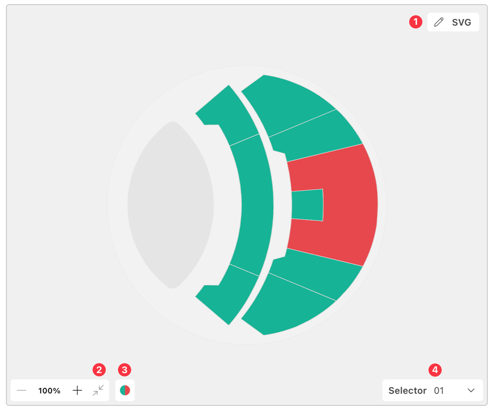
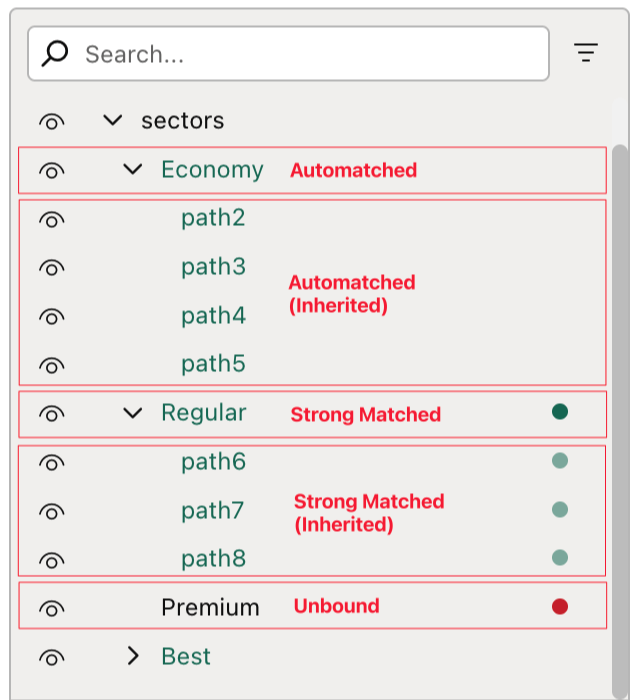
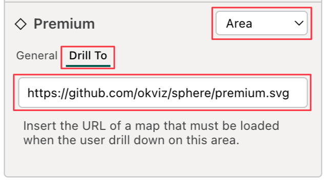

Editing a map in the [Map Editor](../map-editor/index.md) context does not mean changing the shapes, style or layout of the graphic elements, but rather it means mainly configuring the data and interactions of specific areas of the map in the visual, and some of the information on the map itself.

## Header

The header section contains the following elements:

1. **Maps button:** to go back to the Map List.
2. **Map title:** the name of the map currently edited.
3. **Metadata button:** to edit the map author and attribution information.
4. **Export button:** to export the map as SVG or JSON file. For more information, see the [Exporting](../exporting.md#exporting-maps-to-svg-or-json) section.

## Map

This section displays the selected SVG interactive map. You can click on specific area, highlighting it and automatically selecting the corresponding node in the Selection Tree. Similarly, selecting a node in the Selection Tree highlights the corresponding area in the map. 

1. **SVG button:** click the button on the top right corner to open a code editor with the SVG raw content of the map, which can be useful for advanced users who want to make manual changes to the SVG code.
2. **Zoom controls:** You can zoom in and out of the map, pan around the map, and reset the view to the default zoom level using the controls in the bottom right corner of the map.
3. **Colors button:** Change how matched areas are colored in the map
4. **Map selector:** Assign or remove the [Map Selector](../filtering-maps.md#map-selector) to the current map.

## Selection Tree

To ensure easy identification and selection of each area , the Selection Tree on the right provides a hierarchical tree view of the SVG map structure. Each node in the tree represents an area in the map, and its name corresponds to the `<id>` attribute of the respective SVG element.

> All areas will be identified with an id. Read more on [Auto Id Assignment](./../../concepts/auto-id-assignment.md).

Nodes will be styled according to the [Data Binding](../../concepts/data-binding.md#areas-status) status of the corresponding area:

- **Matched** will have green text.
- **Strong Matched** are displayed with green text and an additional green dot on the right end of the tree element. For ***Inherited*** areas (areas that are children of a <g> element with this status), both the dot and the text will appear slightly lighter green.
- **Unbound** are displayed with only a red dot on the right end of the tree element. For ***Inherited*** areas (areas that are children of a <g> element with this status), the dot will appears slightly lighter red.
- **Unmatched** will remain unchanged, as this is the default status.

You can also filter nodes by their binding status, search nodes by name, hide map areas, collapse nested nodes or just hovering them to the display binding information.

## Interaction Pane

Once you select an area in the map or a node in the Selection Tree, the Interaction Pane will display its properties.

Area name is preceded by an icon that indicates the [Shape](../../concepts/maps/svg-format.md#shapes) of the selected area. You can hover the icon to see the shape type.

In the top right dropdown, you can choose the type of **Interaction** to apply to the selected element.

<video src="images/edit-area-interaction.mp4" style="clip-path:inset(2px)" autoplay loop muted></video>

### Area

This is the default value. Selecting this option means that selected area will keep the the default behavior, it can be bound to data and it will follow all the areas' visual options (as colors, data label, positioning). In this section you will see two tabs:

- **General**: here you can configure the data binding and the display name of the selected area. It consists of two key elements:

    - **Data Point dropdown:** This dropdown enables you to link the selected area to a specific data point in your dataset. By default, the option is set to ***(Auto Bind)***, which applies the [Automatic Binding](../../concepts/data-binding.md#automatic-binding) rules.

        - You can also [manually assign a specific data point](../../concepts/data-binding.md#manual-binding) by selecting a value from the dropdown.
        - To remove the binding, select the ***(Do Not Bind)*** option, leaving the area unbound.

    - **Title input:** This allows you to customize the name of the area as it appears in category labels when the the relative [Display Value](../../options/category-labels/value-matched.md#display-value) is set to "Title" in the visual settings.
        - By default, the field is set to ***(Auto)***, meaning that if the corresponding SVG element contains a `<title>` tag, its content will automatically be used as the label.
	    - If no `<title>` tag is present, you can manually input a custom value to serve as the label for the area.

- **Drill To**: here you can insert the URL of a map that must be loaded when the user drill down on this area.
    
    

### Link

If this option is selected, the selected area will be treated as a hyperlink and will be excluded from the data binding and some visual options. This area can be used for one of the following purposes:

- **Switch to Map:** clicking on this area will bring the user to the map selected in the dropdown list.
    > Note that you can only select maps that has been added on the same [Drill Path](../../features/drill-mode.md#the-drill-path) of the current map.

- **Go to URL**: clicking on this area will open the external URL provided in the text box.

<video src="images/edit-link-to.mp4" style="clip-path:inset(0 0 0 4px)" autoplay loop muted></video>

## Save Changes

All changes made in the Map Editor are not automatically saved in the visual. To apply the changes, you need to click the ***Save & Close*** or ***Save & Back*** buttons in the bottom right corner of the visual toolbar. If you want to discard the changes, you can click the ***Close*** button. Any time you close the Map Editor with unsaved changes, a confirmation dialog will appear to prevent accidental loss of data.

If you are saving changes made to a My Storage Map you will be prompted to select:
- **Save on My Storage**: the map will updated in the My Storage and the changes will be applied to all users and reports that use this map.
- **Save as Local Copy**: My Storage map will not be updated. A local copy of this map will be created with current changes.