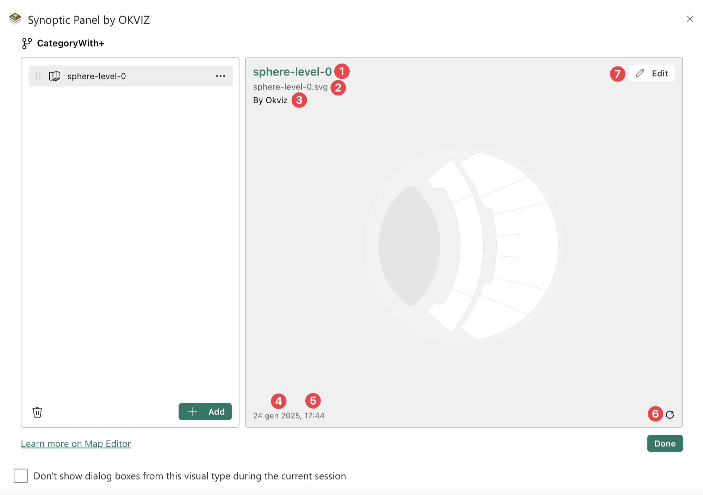

The Map Editor interface is designed for intuitive navigation and interaction, with two main sections: the ***Map List*** on the left and the ***Map Preview*** on the right.

<video src="images/map-editor-interface.mp4" autoplay loop muted></video>

## Map List

This pane displays a list of maps currently loaded in the visual and connected to the current [Drill Path](../../features/drill-mode.md#the-drill-path) (e.g., ***Category > Sector*** in the provided example). To see and manage all maps connected to the visual in other Drill Paths you can use the [Map Manager](../map-manager.md).

Each element in the list includes:

1. **Drag icon**: Allows you to reorder the maps by dragging and dropping them.
2. **Map type icon**: Indicates the type (**local**, **remote** or **My Storage**) of the map.
3. **Map title**: Displays the name of the map.
4. **Map context icon**: Allows to open the map context menu to perform action for the selected map.

Additional features:

- **Add new map(s) button**: Enables you to upload new map files either by clicking the **Add** button or by dragging and dropping files directly into the list pane (only for **Local Maps**).
- **Delete all button**: deletes all maps from the list in one action, by clicking the delete icon in the bottom left.
- **Reordering**: maps in the list can be rearranged easily.
    > Note that the order of the maps in the list will determine the order in which they are displayed in the map dropdown list in the visual.

## Map Preview

This section provides useful information and a visual preview of the currently selected map.
The map is displayed in the center of the pane while in the corners you can find some useful information and tools.

Here you can find the following information:

1. **Map title**: The name of the map currently in preview.
2. **Map source**: The source of the selected map, which varies depending on the type of map:
	- For local maps, the source displays the file name that originated the map (e.g. my-file.svg).
	- For remote maps, the source shows the URL where the map is hosted.
	- For My Storage maps, the source displays the map's unique ID in the storage system.
3. **Map author**: Displays the author of the map.
4. **Last modified date**: The date and time the map was last updated.
5. **File size**: The size of the map file (only for **Local** maps).
6. **Refresh icon**: This button allows you to reload remote maps from the server.
7. **Edit button**: It provides access to the editing tool. See the [Edit Map](edit-map.md) section for more information.
