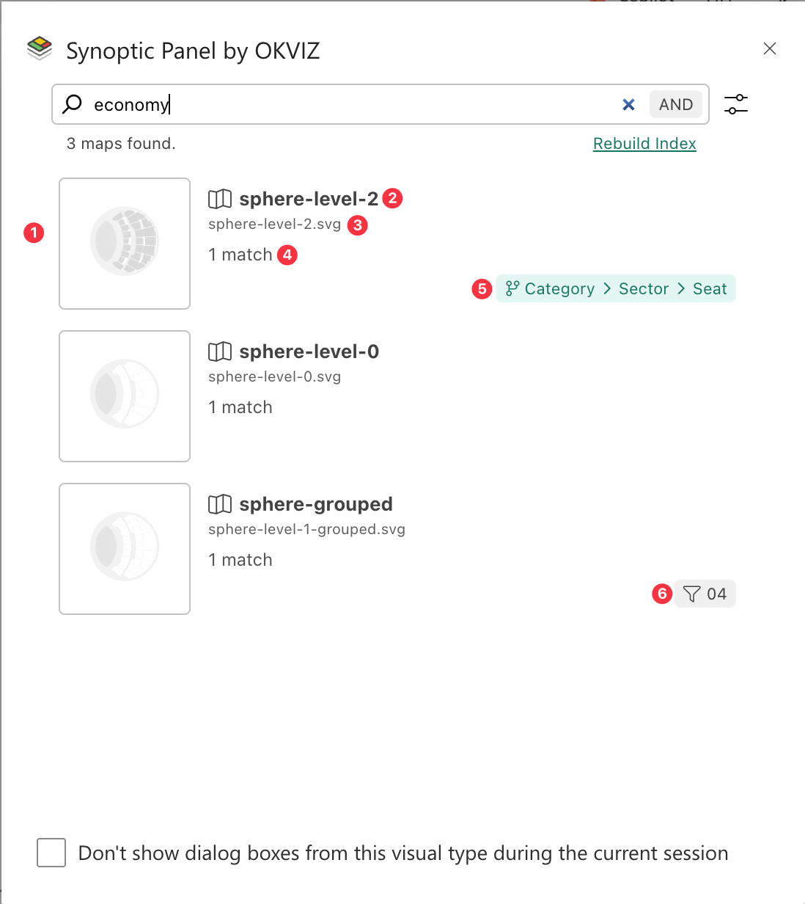
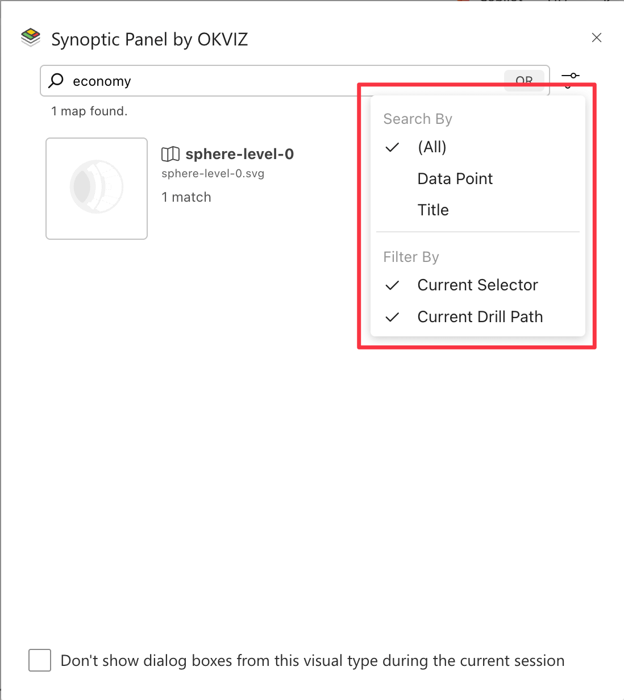

The **Map Search** feature allows you to search through all maps connected to the visual. It is especially useful when multiple maps are loaded and you want to:

- Quickly locate a map by title or by a map area with a known Id, data point or title.
- Switch to a specific map in the current [Drill Path](../features/drill-mode.md#the-drill-path).

## How to Use Map Search

- Click on the ***Search Button***  in the visual toolbar.

- The ***Map Search*** dialog will open and start creating an index of all maps connected to the visual. 

- Once the index is completed, you can start typing in the search bar. Visual's maps will be filtered according to your search criteria.

- Each map in the list will display:
    1. Map preview
    2. Map title
    3. Map source
    4. Total occurrences of the search term in the map. 
    5. Map Drill Path (if the map is not assigned to the current hierarchy level)
    6. Map Selector (if the map is not assigned to the current map selector)

- You can fine-tune your search with the [Search & Filter Settings](#search--filter-settings).

- Click on a map to select it. The dialog will close and the selected map will be displayed in the visual, according to the [On Map Selection](../options/advanced-options/map-search.md#on-map-selection) setting.

> Note that maps that are not bound to the current [Drill Path](../features/drill-mode.md#the-drill-path) or [Map Selector](../features/filtering-maps/map-selector.md) cannot be selected.

## Map Index

The index is created when you first open the **Map Search** dialog. The visual will scan all maps and areas to create a searchable index. This may take a few seconds depending on the number and complexity of maps. If the index was already created, the dialog will open immediately. 

The index is created only once per visual session, unless you make changes to the maps (delete, add or update), in which case the index will be rebuilt automatically on the next access to the search dialog. This ensures that the search results are always up to date with the current state of the visual.

You can also force the index to be rebuilt by clicking the **Rebuild Index** button in the dialog. This is useful if you want to ensure the search results are up to date.

The index can be saved in the visual settings. This allows you to have a persistent index across sessions, avoiding the need to rebuild it every time the visual is loaded. This behavior is controlled by the [Save Index](../options/advanced-options/map-search.md#save-index) option in the visual settings.

> Note that if the index is too large, the visual will not be able to save it. In this case, the visual will automatically disable this option and rebuild the index when the search dialog is opened for the first time in the session.

## Search & Filter Settings

These options allow you to customize the search behavior and results.

In the search bar, you can switch between **AND** and **OR** search modes, just clicking on the button. **AND** mode will return results that match all search terms, while **OR** mode will return results that match any of the search terms.

By clicking on the ***Settings button***  you can choose to:

- **Search By**: This option allows you to filter the search results by the type of data you want to search for. The options are:
    1. **(All)**: Search for areas' ids, data points or titles in your maps.
    2. **Datapoint**: Just search for areas' ids and data points in your maps.
    3. **Title**: Include only areas' titles in your search.

> Note that map title is always included in the search, regardless of the selected option and it will not be counted in the total occurrences of the search term.

- **Filter By**: This option allows you to filter maps by their type. The options are:
    4. **Current Selector**: Includes only maps that are assigned to the current map selector.
    5. **Current Drill Path**: Includes only maps that are assigned to the current drill path.
