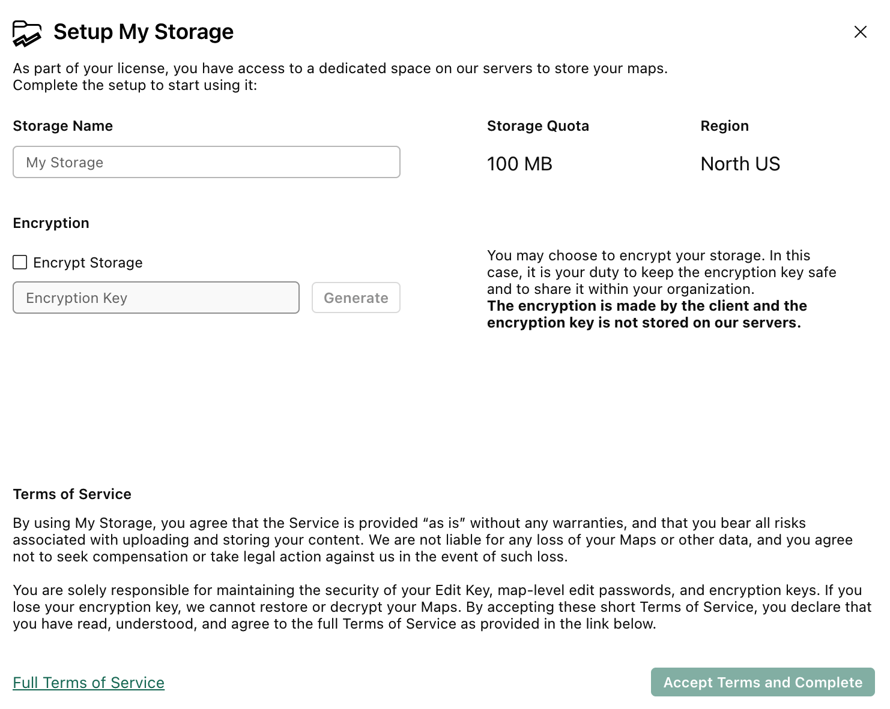
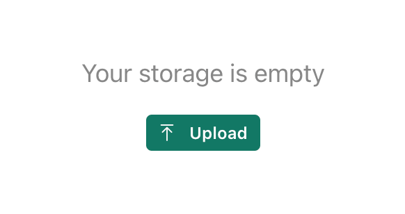

My Storage is an exclusive feature of Synoptic Panel that provides an online storage space to upload, store, and manage SVG maps for use within Synoptic Panel.

>> This feature is **not available** with:
- Synoptic Panel with an AppSource license
- Synoptic Panel Lite

My Storage offers several benefits:

- **Centralized Storage**: All maps are stored in a single location, accessible to all users within your organization. Each Synoptic Panel license **includes 100 MB of storage** space for maps.
- **Report Performance**: Maps are not stored in the visual, reducing the size of your report and improving performance.
- **Map Management**: Maps can be renamed, replaced, protected, and deleted directly from the visual interface.
- **Security**: Maps can be browsed only with a specific Edit Key, ensuring only authorized users can manage them. Also, maps can be protected with a password, ensuring only authorized users can edit or delete them.
- **Encryption**: Maps can be encrypted for additional security, ensuring they are stored in an encrypted format on the server.

For more information on the security measures in place, please read [My Storage Security](./../security/my-storage.md).

## Displaying My Storage Maps

To display a map stored in My Storage in Synoptic Panel, you must first:

1. [Setup My Storage](#setup-my-storage) for your organization (just once)
2. [Upload a map](#uploading-maps) to My Storage (if not already available)
3. [Connect the map](#connecting-a-my-storage-map) to the visual

>> **IMPORTANT**: To complete these steps you need an additional [Edit Key](#edit-key), provided to the users who purchased the Synoptic Panel license.

After a map has been connected to the visual, it is available to all users of the report, without any additional authentication required.

## Setup My Storage

The first time you access My Storage, you will be prompted to set up your storage space. This process involves defining a unique name for your storage and, optionally, an encryption key to secure your maps.

### Encryption (Optional)

My Storage offers an optional encryption feature to enhance the security of your maps. When enabled, all maps uploaded to My Storage are encrypted using a single encryption key.

Note that:

- The encryption can be only set during the initial setup of My Storage. If you choose not to enable encryption at this stage, you cannot enable it later automatically unless you contact support.
- The encryption key is not stored on the server, so it must be provided each time you access the maps in the visual, but you can save it in the [Encryption Key property](../options/my-storage/keys.md#encryption-key) for convenience.
- If you lose the encryption key, **you will not be able to decrypt the maps and we are not able to recover it**. Make sure to store it securely within your organization.

## Browsing My Storage

To access and browse My Storage, click the ***+ Add Map*** button and select the ***My Storage Map*** element.

In case you are using the [Map URLs](../features/filtering-maps.md#map-urls-column) feature, you can access My Storage by clicking the dedicated button next to the map selection dropdown.

### Edit Key

When browsing My Storage, you will be prompted to enter the Edit Key, a unique code that allows you to manage maps stored there. This key is provided when you purchase a Synoptic Panel license and can be retrieved from your [account dashboard](https://okviz.com/account/).

You can choose one of the following options for convenience:

1. **Remember key for 29 days**:
Temporarily saves the Edit Key in your browser’s local storage, allowing you to reuse it for future sessions for 29 days. This option is useful if you frequently access My Storage from the same device and browser.

2. **Make key available for all users of this report**:
Stores the Edit Key directly in the report. This ensures it is available whenever the report is opened, but it is tied to that specific report.

> If you choose not to save the Edit Key, you will need to re-enter it each time you access My Storage. If you selected one of the save options, you can change it at any time by toggling the [Save Edit Key](../options/my-storage/keys.md#save-edit-key) setting in the visual properties.

### My Storage Browser

My Storage browser interface is divided into tree main sections:

<video src="images/my-storage-layout.mp4" autoplay loop muted></video>

- **Map List** (Left Pane):

    This section displays the list of all maps stored. You can browse through the list and select one or more maps to be associated with the current [Drill Path](./drill-mode.md#the-drill-path). Each map can be previewed, renamed, replaced, protected or deleted directly from the list.

    

- **Map Preview** (Right Pane):

    The right panel shows a preview of the map selected from the list, allowing you to verify its content before adding it to the visual. The map is displayed in the center of the pane while in the corners you can find some useful information.

    

    - ***Map Title***(1): the name of the map currently in preview.
    - ***Map Id***(2): unique ID in the storage system.
    - ***Map Author***(3) - if available: the author of the map.
    - ***Protected Marker***(4): indicates if the map is protected with a password.
    - ***Last Modified Date***(5): the date and time the map was last updated.
    - ***File Size***(6): the size of the map file on the server.
    - ***Refresh Icon***(7): allows you to reload the map to ensure it is up to date.

- **Header**:

    In the header you will find the current ***Region*** and ***Storage Available Quota***. The region indicates the location where your storage is hosted (which is defined when purchasing the license), while the quota shows the remaining space available in your storage out of the total space.

## Uploading Maps

Uploading maps means selecting one or more local files from your machine and saving it to My Storage. Once a map is uploaded, it becomes available to all users of My Storage within your organization. However, uploading a map does not automatically connect it to the visual.

Upload maps as follows:

1. Access My Storage as explained in the [previous section](#browsing-my-storage).

2. If My Storage is empty (i.e., no maps have been uploaded yet), click the ***Upload*** button in the center of the screen, otherwise, the button is located at the bottom of the ***Map List*** pane.

    

3. Select the local files you want to upload from your machine.

### Size Considerations

When uploading maps to My Storage, consider the following size limitations:

- **Storage Space**: Each license has 100 MB of storage included, so the total file size of all maps cannot exceed this limit.
    > Note that the actual size of a file on My Storage is shorter than the size of the files on your local disk due to automatic GZIP compression. It depends to the content of the file, but **it can be up to 70% smaller.**
- **File Size Limit**: Each file must not exceed 10 MB.
- **Total Upload Limit**: A maximum of 20 MB can be uploaded in a single operation.
- **Image Optimization**: Eventual bitmap images embedded in SVG maps will be compressed to reduce their sized based on the [Image Quality](./../options/advanced-options/performance.md#image-quality) setting.

## Protecting Maps

Each map in My Storage can be protected with a password. This feature ensures that unauthorized users **cannot edit or delete the map without the correct password**.

You can protect a map as follows:

1. Open the My Storage window and select the map you wish to protect.
2. Click the ***Protect*** option from the map's contextual menu (accessible via the three-dot menu).
3. Enter and confirm the desired password.

It is possible to update or remove the password at any time. To do so, just select ***Unprotect*** or ***Change Password*** from the map's contextual menu and confirm the action, providing the current password.

<video src="images/my-storage-add-protection.mp4" autoplay loop muted></video>

> **NOTE:**
- Users must provide the password to edit, replace or delete the map; without the password, these actions are not allowed. **Password protection does not restrict the ability to view the map in the visual.**
- Users can open the map in the Map Editor even without the password. However, they cannot save changes directly to the original My Storage map.
- Users can save a local copy of a protected map and eventually upload it to My Storage as a new map.

## Connecting a My Storage Map

To connect a map from My Storage to the current [Drill Path](./drill-mode.md#the-drill-path) within the visual:

1. Use the checkbox next to the map name in the list to select the map you want to connect.

    - Multiple maps can be selected by checking multiple checkboxes.
    - To select all maps in the list, use the ***Select All*** element at the top of the list.

2. Click the ***Add Selected*** button to connect the selected maps to the visual.

<video src="images/my-storage-connect-maps.mp4" style="clip-path:inset(0 0 2px 0)" autoplay loop muted></video>

> Maps that are already connected to the current Drill Path will appear grayed out and cannot be selected again.

## URLs of My Storage Maps

Maps stored in My Storage are accessible via unique URLs. These URLs can be exported as a CSV file for use with the [Map URLs feature](../features/importing/maps-from-my-storage.md) in Synoptic Panel.

>> **IMPORTANT**: The URLs of My Storage maps are not predictable and cannot be directly accessed via the browser's address bar. They are intended for use exclusively within Synoptic Panel. However, this is not a security feature—since the URLs are not encrypted, a determined user might still find a way to access them. Use caution when sharing these URLs.

To export the URLs of maps stored in My Storage you can:

- **Copy a Single Map URL**

    - Click the context menu of the desired map.
    - Select ***Copy URL*** to copy it to the clipboard.
    - You can then manually paste it into your URLs dataset column.

    

- **Export Multiple Map URLs as a CSV File**

    - Select the maps by checking the checkboxes next to their names.
    - Click the ***Export URLs*** button. This will close the dialog and download a CSV file containing the exported URLs.

    

Read more about using these URLs here: [Use Map URLs from My Storage](../features/importing/maps-from-my-storage.md)
