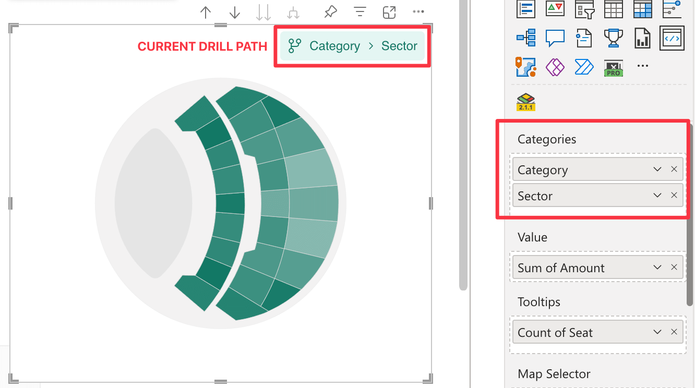

In this field it is possible to bind a column of the dataset representing the data category to be displayed. You can bind more columns or a hierarchy, thus enabling [Drill Mode](./../features/drill-mode.md).

By binding a column to the Category field well, the visual can dynamically load and display the appropriate map based on the selected [Drill Path](./../features/drill-mode.md#the-drill-path) level. This ensures that each map aligns with the relevant data point, enabling accurate data visualization and interaction.

