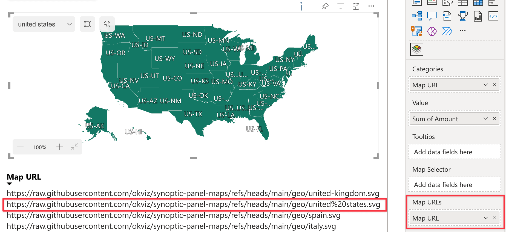

In the Map URLs field well you can bind one column to add multiple remote URLs maps to the visual. When the column is bound, the visual will display the map associated with the URL in the column according to the current filter.

Read more about this feature in the [Map URLs](./../features/filtering-maps.md#map-urls-column) section.

