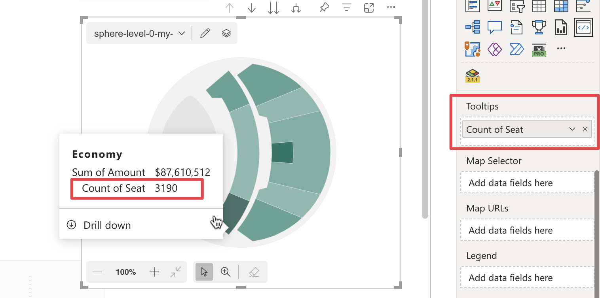

In the Tooltips field well you can bind one or more measures to add value in the tooltips. Tooltips are information labels that appears when the mouse cursor is placed over a map area, useful for providing users with additional information without interrupting their navigation or requiring further clicks.

