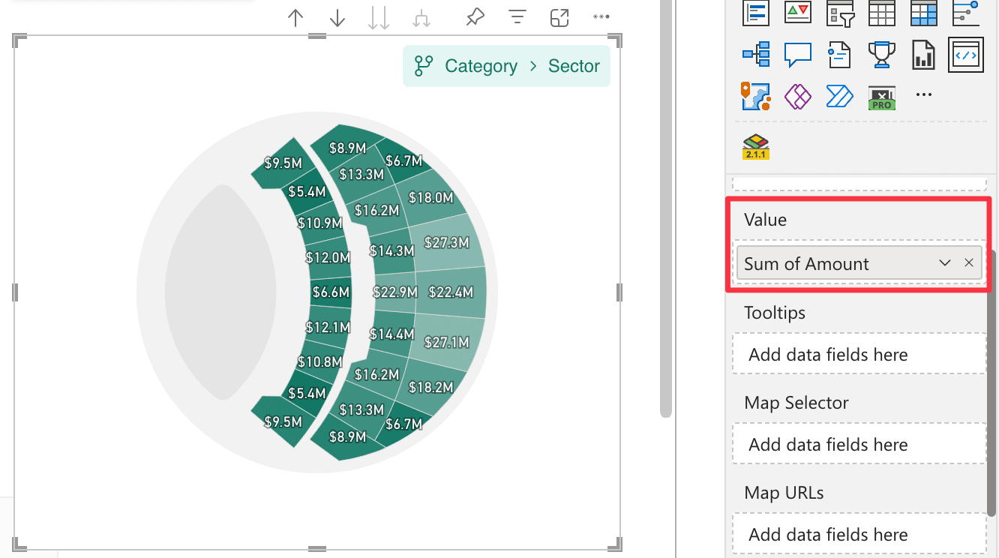

In the ***Value*** field well you can bind one column or measure in your dataset to represent the numeric value of the map areas. The value can be used to determine colors, display data labels, append values to category labels, show tooltips, and drive other value-based behavior.

If you need custom text for category labels, use the [***Labels***](labels.md) field well. This keeps the displayed label text separate from the numeric value used for calculations and formatting.

