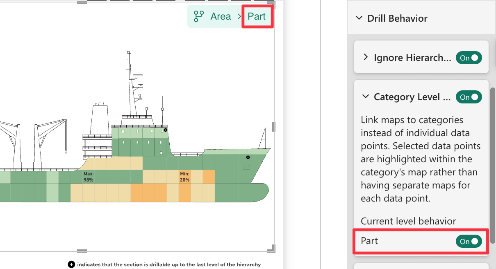
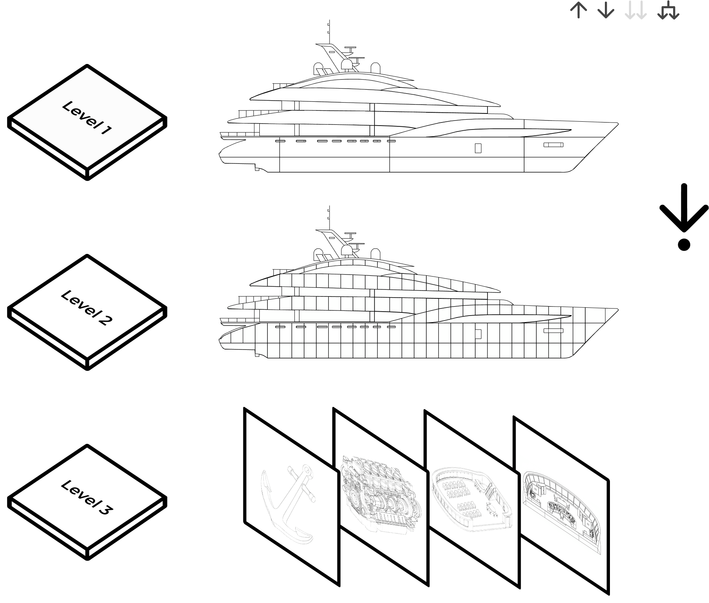

**Default value:** Off

This option determines which maps are displayed when performing a drill-down on a single data point (i.e., clicking on an individual area of the map). Since maps are linked to [Drill Paths](./../../features/drill-mode.md#the-drill-path), this setting controls whether the drill-down reaches a category-level maps or a data point-specific maps.

When you create a multi-level hierarchy in Synoptic Panel, you can control how maps are loaded for each level. By default, drilling down from a parent shape requires you to load a new, unique map for its children. However, you can change this behavior for specific levels to use a single, filterable map for an entire category.

This granular control is managed by the **Current Level Behavior** setting, which appears for each level in a hierarchy under the **Drill Behavior** menu. This setting allows you to switch between two distinct map-loading behaviors.

## Current Level Behavior: On (Category Level Maps)

In this mode, you only need to load one map for the entire level. This single map should contain all possible child shapes for that category. When a user drills down into a parent shape, Synoptic Panel automatically filters this map to display only the relevant children.

**Use this mode when:**

- The child elements across different parent shapes are structurally similar.
- You want to improve efficiency by creating and managing fewer maps.

## Current Level Behavior: Off (Data Point Specific Maps)

Setting **Current Level Behavior** to **Off** reverts to the default behavior for that specific hierarchy level.

In this mode, you must assign a unique map to each parent shape to display its children. This gives you the flexibility to show completely different diagrams or schematics depending on the user's drill-down path.

**Use this mode when:**

- The child elements for different parent shapes are visually distinct and require their own unique maps.
- You need to display custom schematics or detailed views for specific components.

## **Example: A Multi-Level Manufacturing Report**

Imagine you are building a report to track the assembly of a complex product, like a ship. The report has a three-level hierarchy: **Section** → **Part** → **Single Element**.

1. **Top Level: Section**
This level uses a single map of the entire ship, with each section defined as a shape.

2. **Second Level: Part**
Within each ship section are various parts. While the arrangement of parts is different in each section, the parts themselves are drawn from a common library. To simplify the report, you can use a single SVG map that contains every possible part.
For the **Part** level in the hierarchy, you would set **Current Level Behavior** to **On**. Now, when a user drills down on "Section A1," the single comprehensive parts map is automatically filtered to show only the parts belonging to that section.

    <video src="images/category-level-maps-level-part.mp4" width="700" autoplay loop muted></video>

3. **Third Level: Single Element**
Within the parts, some are simple components, while others are complex systems like an engine or a navigation console. For these complex systems, you want to show a detailed engineering schematic, not just a shape on a larger map.
For the **Single Element** level, you would set **Current Level Behavior** to **Off**. This restores the default behavior, allowing you to link a unique "Engine Schematic" map to the "Engine" part and a different "Navigation System Diagram" to the "Bridge Console" part. For other simple parts where no further detail is needed, you simply do not assign a map.

    <video src="images/category-level-maps-level-single-element.mp4" width="700" autoplay loop muted></video>

By mixing these behaviors, you can build a highly efficient and deeply detailed report, using filterable category-level maps for consistency and individual maps for custom, in-depth views, all within a single Synoptic Panel visual.
