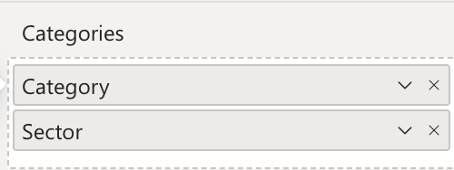
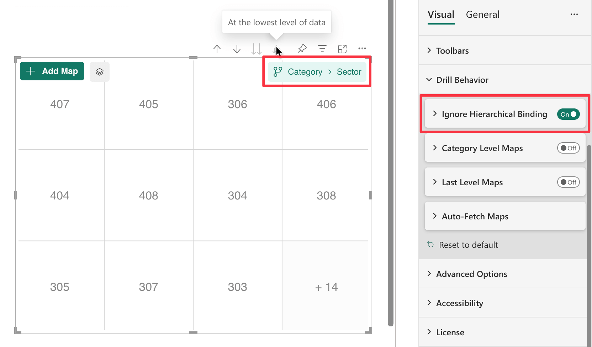
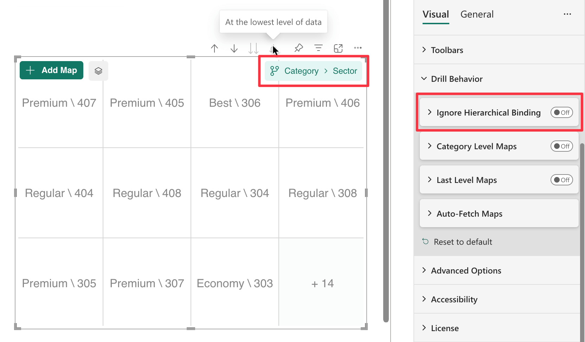

**Default value:** On

The ***Ignore Hierarchical Binding*** option controls how data points are matched to areas when using ***Expand all down one level in the hierarchy***.

> Read more on how this impacts [Automatic Binding](./../../concepts/data-binding.md#automatic-binding-when-hierarchy-is-expanded)

Consider the following dataset with a hierarchy of ***Category → Sector***:

    <table width="50%">
    <tr><th colspan="3">Hierarchy</th></tr>
    <tr>
        <th>Category</th>
        <th>Sector</th>
    </tr>
    <tr>
        <td>Economy</td>
        <td>202</td>
    </tr>
    <tr>
        <td>Economy</td>
        <td>203</td>
    </tr>
    <tr>
        <td>Premium</td>
        <td>305</td>
    </tr>
    <tr>
        <td>Premium</td>
        <td>307</td>
    </tr>
    <tr>
        <td>Regular</td>
        <td>204</td>
    </tr>
    <tr>
        <td>Regular</td>
        <td>205</td>
    </tr>
        <tr>
        <td>Best</td>
        <td>306</td>
    </tr>
    <tr>
        <td colspan="2" style="text-align:center;" >......</td>
    </tr>
</table>
 

When **Ignore Hierarchical Binding** is **enabled**, only the **last level of the hierarchy** is used to build the data point.  
In this example, when expanding the hierarchy to the ***Sector*** level, the areas are matched using only the sector values (e.g., `202`, `305`, `306`, etc.).  
This means your SVG should contain flat IDs like `202`, `305`, and so on.

<figure>
    
    <figcaption>
        Data Points: 306; 202; 203; 305; 307; 204; 205 ...
    </figcaption>
</figure>

When disabled, the full hierarchical path is used to construct the data point.  
This results in IDs like `Economy\202`, `Premium\305`, etc.  
Your SVG must reflect this hierarchy, meaning nested groups for each category (e.g., `Economy` group containing `202` and `203`, etc.).

<figure>
    
    <figcaption>
        Data Points: Best \ 306; Economy \ 202; Economy \ 203; Premium \ 305; Premium \ 307; Regular \ 204; Regular \ 205 ...
    </figcaption>
</figure>